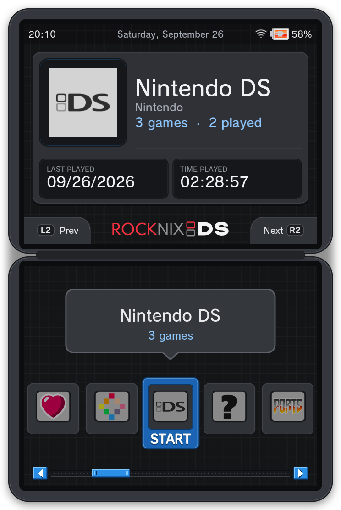
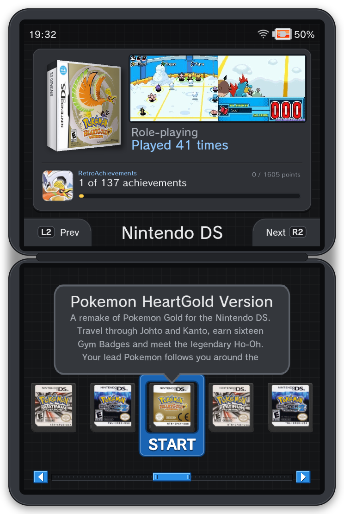
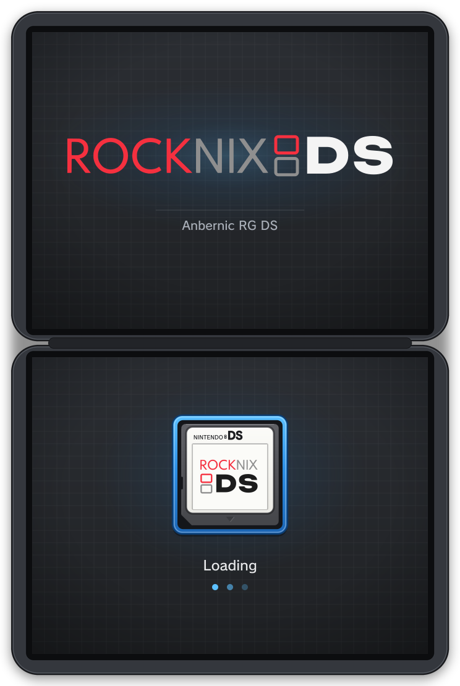

<p align="center">
  <picture>
    <source media="(prefers-color-scheme: dark)" srcset="docs/img/rocknixds-logo.svg">
    
  </picture>
</p>

<p align="center"><b>Full-speed 2× DraStic and a DSi-style dual-screen frontend for the Anbernic RG DS on ROCKNIX.</b></p>

<p align="center">
  
  
  
</p>
<p align="center"><sub>The main menu, the game list, and Pokémon HeartGold at 2× internal resolution (captured from the panels' scanout buffers).</sub></p>

The Anbernic RG DS is a clamshell handheld with two 640×480 touch panels and an RK3566 (4× Cortex-A55,
Mali-G52). ROCKNIXDS (formerly `rgds-rocknix`) is everything I changed on its [ROCKNIX](https://rocknix.org) install:

- **`libdsflip`**, a replacement display path for DraStic. It sends each DS screen straight to its own panel,
  so 2× internal resolution runs at full speed, with frame pacing that doesn't stutter. It also adds
  shaders, the microphone and RetroAchievements to standalone DraStic.
- **`dii-ess-aye`**, a DSi-style EmulationStation theme spread across both screens, with real DS cartridges,
  3D boxes and RetroAchievements progress, and a patched ES build.
- The **panel timing fix**, the older **vsync pacing shim**, and the measurement tools (including a DS
  stress-test ROM) behind all the numbers below.

### New in 1.2

- **Shaders at full speed at 2×.** The old stutter came from DraStic's audio timing, not the GPU. A real-time
  audio pump fixed it: under 0.1 dropped frames per second with a shader on.
- **Sharp DS shaders:** ds-crisp and ds-grid, each also with the DS screen's colors, plus ds-grid-2x for
  pixel-perfect 2×. They appear in ES's DraStic shader menu.
- **Microphone** in libdsflip: blow or speak into the mic for games that use it, with an echo gate so the
  speaker doesn't trigger it (turn on *microphone sensitivity* in ES's DS options).
- **Theme redesign:** real DS cartridge scans on the carousel, a game list top screen with a 3D box,
  screenshot and RetroAchievements progress, a DSi-style home screen with clock and calendar, the DSi font
  throughout, a new boot splash and the ROCKNIXDS logo.
- **Smoother menus:** the selection frame no longer splits two items while the carousel scrolls, and short
  game lists fill the row.

<p align="center">
  
  
</p>
<p align="center"><sub>Left: the boot splash while ES loads. Right: <code>dsstress</code>, the stress ROM used for the benchmarks.</sub></p>

---

## Install

On an Anbernic RG DS running ROCKNIX, ssh in as `root` (default password
`rocknix`) and run:

```sh
curl -fsSL https://raw.githubusercontent.com/JorreFog/ROCKNIXDS/main/install.sh | sh
```

It installs the dii-ess-aye theme (downloaded from [upstream](https://github.com/beebono/dii-ess-aye) at the pinned
commit, then this repo's overlay), the patched EmulationStation, `libdsflip` as the default DraStic launcher, and
switches on 2× resolution for DS. It also adds the ds-* shaders to ES's shader menu, and keeps them there when a
ROCKNIX update changes that menu. Everything it replaces is backed up first under `/storage/rgds-rocknix-backup/`
(the folder keeps its old name so earlier installs can still be undone).
Running it again upgrades an earlier version in place.

Cartridge scans, 3D boxes, screenshots and the RetroAchievements strip are per-game media that the installer
doesn't download. One command from a PC fetches and pushes all of it, no scraper account needed:

```sh
python3 dii-ess-aye/scrape/rocknixds-media.py --device <RG DS ip>
```

See [`dii-ess-aye/scrape/`](dii-ess-aye/scrape) for what it does and where the art comes from. Until a game has
its art, the theme draws a card with the game's name or box art.

| Option | |
|---|---|
| `--with-60hz` | also retune both panels to 60.000 Hz (edits the device tree in `/flash`, backed up; needs a reboot) |
| `--no-theme` / `--no-dsflip` / `--no-hires` | skip that part |
| `--uninstall` | undo what the installer changed; settings you made since the install are kept. Add `--restore-files` to put back the whole config files from the install-time backups instead |
| `--version` | print the installed ROCKNIXDS version (also in `/storage/.config/rocknixds-version`) |

Pass options like this: `curl -fsSL …/install.sh | sh -s -- --with-60hz`.
To go back to the stock DraStic display path without uninstalling: `touch /storage/.config/drastic/nodsflip`.

---

## What was achieved

| | Before | After |
|---|---|---|
| DraStic at 2× internal resolution, heavy 3D (stress ROM, 1920 polygons) | 39.0 fps | **50.4 fps (+29%)** |
| Heaviest load that still holds 60 fps at 2× | ~576 polygons | **~1344 polygons** |
| Display cost per frame on DraStic's main thread | ~3.6 ms (texture upload + GL + sway) | **0.07–0.29 ms** |
| Frame pacing at 60 fps (HeartGold at 2×, walking) | 1550 dropped frames in 5 min (next-vblank presentation) | **~0.13 dropped frames/s (about 1 every 8 s); both screens always flip in the same refresh** |
| Touch in DraStic | stock sway mapping lands on the wrong area | **calibrated to the pixel** |
| Frontend | single-screen stock theme | **dual-screen DSi-style theme, patched ES, boot splash** |
| RetroAchievements in standalone DraStic | not supported | **supported (softcore), pop-ups on the top screen** |

<p align="center"></p>

---

## `dsflip/`: DraStic straight to the panels

### Why stock was slow

DraStic's 3D is rendered **on the CPU**. On stock ROCKNIX every frame then takes a long way to the screens:

```
DraStic → 2× ARGB8888 textures → SDL_UnlockTexture (GL upload, ~1.6 ms) → SDL_RenderCopy + shader
        → eglSwapBuffers → sway composites one 1284×482 window across both outputs (GL again) → KMS
```

All of that runs on the same four A55 cores as the emulator's raster threads. Sway alone used 15–23% of a core.
The idea came from GammaOS Nano's "DraStic Nano": remove everything around the emulator. The full plan and
its measure-first phases are in [`docs/drastic-2x-plan.md`](docs/drastic-2x-plan.md).

### What libdsflip does

`libdsflip.so` is an `LD_PRELOAD` library for the Linux DraStic binary (`drastic-sa`):

- **Zero copy.** When DraStic locks a screen texture, it gets a DRM dumb buffer instead of SDL's memory.
  XRGB8888 has the same memory layout as SDL's ARGB8888, so DraStic renders straight into scanout memory:
  no upload, no GL, no compositor.
- **Hardware scaling.** The VOP2 display controller scales 512×384 (or 256×192) to 640×480 on the
  primary planes, for free.
- **Both screens in one atomic commit.** The top and bottom frames always change together. The panels are
  phase-locked, with the bottom panel's vblank **2.05 ms before** the top's (measured).
- **Latch pacing.** DraStic runs on its own 60.000 Hz clock, which slowly drifts through the panels' refresh
  cycle (one full sweep every ~3 min). Committing at the next vblank makes the vblank the cut-off, so jitter
  puts two frames into one refresh and none into the next. Instead, libdsflip tracks where in the cycle the
  frames arrive and commits the newest one at the opposite phase. The latch avoids a zone around *both*
  panels' vblanks: a commit must land ≥1.3 ms before the earlier (bottom) one, and the margin grows if a
  commit still misses. `DSFLIP_PACING=immediate` gives the old behaviour.
- **Presenter thread with a one-frame queue.** `SDL_RenderPresent` never blocks. At 2× DraStic's frame times
  alternate unevenly, so a frame can wait one refresh in the queue and each refresh still shows one frame; a
  third frame drops the oldest. An unchanged panel keeps its buffer. `DSFLIP_QUEUE=0` gives a plain mailbox.
- **DraStic's menu.** It's an 800×480 RGB565 texture, shown on the bottom panel with hardware scaling while
  the top panel keeps the last game frame. It takes no touch: DraStic's menu loop reads only key and joystick
  events (there is no mouse or finger handling in the binary), so it is navigated with the d-pad and buttons.
- **Touch.** Read from the bottom panel's own gt911 controller (i2c-5). DraStic ignores absolute mouse
  coordinates and moves its stylus by *relative* deltas, summed per frame and clamped. So every
  touch-down first pins the stylus to (0,0), then (next frame) moves it by exactly the target.
  No drift, pixel-exact.

### Using it

It's installed as the default DraStic launcher: start any DS game from EmulationStation as usual.

- The game runs in a detached systemd unit (`dsflip-game`). The unit stops ES and sway, which gives
  DraStic DRM master, and brings them back when you quit. The game's first frame comes about 3.5 s after you
  start it (2.3 s of that is ROCKNIX's own launch scripts), and the menu is back about 4.3 s after you quit
  (`tools/switchtime.sh <device-ip>` measures each step).
- If a game ends abnormally, ES says why once it's back: DraStic crashed, or libdsflip couldn't take over the
  screens (then the session stops at once instead of leaving them black).
- To quit, use the ROCKNIX exit hotkey or *Exit DraStic* in DraStic's menu (MODE button). Stopping the unit
  (`systemctl stop dsflip-game`) also works: the unit's stop hook always brings sway and ES back.
- `dsflip.log` in `/storage/.config/drastic/dsflip/` covers the last session, and `.1` to `.3` the three before it;
  the first line is the libdsflip version.
- To go back to the previous launcher: `touch /storage/.config/drastic/nodsflip`.
- 2× resolution is ES's per-system/per-game *hires 3D* option (`nds.hires_3d=1`).

Install from a checkout: copy `dsflip/libdsflip.so` plus `dsflip/device/{session.sh,drastic-wrapper.sh,install.sh}`
to the device and run `sh install.sh`.

**Microphone.** libdsflip captures the mic over ALSA and holds DraStic's own "fake mic" control while you blow or
speak, like ROCKNIX's `libdrastouch` does: an RMS level per block against an adaptive noise floor, with ES's DraStic
*microphone sensitivity* setting as the threshold. **That setting is off by default:** set it (medium is a good
start) under the Nintendo DS system's or the game's options, or the mic stays off, as on stock ROCKNIX. The mic also hears the speaker, so an echo gate fed by the audio
pump's output level keeps game music from pressing it (0 false presses in testing, with music playing).

Not in this mode yet: gptokeyb keyboard hotkeys. Everything DraStic maps to buttons itself works.

### Shaders

libdsflip follows ES's existing DraStic **shader** option (per system or per game), the same setting the
stock path uses:

- **default (bilinear)** keeps the zero-copy path: no GPU work, the coolest and lowest-latency mode.
- **Any other choice** (sharp-bilinear, sharp-shimmerless, quilez, scanlines, lcd3x, lcd1x+nds-color, and
  `.frag` files in `/storage/.config/drastic/shaders/`) runs that shader on the GPU.
  Each screen is drawn into a 640×480 buffer that is then scanned out, with the same inputs as stock.
- **Our shaders** ([`dsflip/shaders/`](dsflip/shaders), installed and added to ES's menu by `install.sh`):

  | Shader | Look |
  |---|---|
  | ds-crisp | sharp scaling with no blur and no shimmer, at 1× and 2× |
  | ds-crisp + NDS color | the same with the DS screen's color profile |
  | ds-grid | sharp, with an LCD pixel grid on the real DS pixels |
  | ds-grid + NDS color | ds-grid with the DS color profile |
  | ds-grid-2x | pixel-perfect at 2×, with an even DS-pixel grid |

  The NDS color profile is the one ROCKNIX's lcd1x+nds-color uses, except that very saturated blues are clamped
  (that shader's math is undefined there and bleeds red into them on this GPU).
- ROCKNIX's built-in shaders are read out of `/usr/lib/libdrastouch.so` on the device at runtime, so they
  aren't copied into this repo and stay in step with ROCKNIX updates.
- The GPU is ARM's libmali (`/dev/mali0`, no DRM render node). ROCKNIX exports `MALI_DEFAULT_DISPLAY=wayland`,
  which can't work with sway stopped, so libdsflip uses libmali's GBM display.
- **Nothing on the timing path waits for the GPU:** a worker thread uploads and shades each frame, both
  screens' GPU fence goes to the display controller with the commit (`IN_FENCE_FD`), and the presenter thread
  (real-time priority) only handles vblank events, the latch timer and commits.
- **Audio pump (`audio.c`):** DraStic paces its frames on its audio callback. SDL's pulse backend called it in
  bursts under any extra load (and drained ~1.1% slow), which made DraStic's frames uneven: that, not the
  GPU, was the shader stutter (a plain CPU spinner caused the same stutter in zero-copy mode). A real-time
  thread now calls DraStic's callback on a precise timer into a ring buffer, which our own ALSA writer drains;
  a slow rate trim locks it to the device clock. `DSFLIP_AUDIO_PUMP=0` restores SDL audio.
- **Measured** (HeartGold at 2×, scripted walking, 90 s runs): lcd1x+nds-color 0.02–0.09 dropped frames/s,
  lcd3x 0.04, zero-copy 0.00. Before these changes shaders dropped 5–30/s.
- **Cost:** with a shader the GPU stays at ROCKNIX's 800 MHz, where lcd1x+nds-color takes ~2.5 ms per screen.
  At the 200 MHz used in zero-copy mode it would take 16 ms. HeartGold at 2× with lcd3x: 4 dropped frames in
  60 s of walking, SoC ~60 °C.
- At 2× (hires) the source is 512×384, so shaders written for integer scales ≥2× (sharp-bilinear, lcd3x) scale
  unevenly (1.25×). ds-crisp is the sharp choice there.

### RetroAchievements

Standalone DraStic has no RetroAchievements support, so `libdsflip` brings its own, built on RA's official
[rcheevos](https://github.com/RetroAchievements/rcheevos) library (`dsflip/ra.c`):

- **Login** uses ROCKNIX's own settings: turn RetroAchievements on and enter your account in ES
  (*Settings → RetroAchievements*). After the first login only RA's login token is kept on the device.
- **Game detection** uses rcheevos' NDS hash of the ROM DraStic was started with.
- **Memory:** the DS keeps a copy of the cartridge header at `0x027FFE00`, so matching the ROM's header
  inside DraStic's memory finds the emulated main RAM (RA addresses `0x000000–0x3FFFFF`) exactly.
- **Pop-ups** (unlocks, game summary, offline/online) are drawn in an 8×8 pixel font (Press Start 2P) on a spare hardware
  overlay plane of the top panel, so they cost the game nothing.
- **Softcore only.** Hardcore needs savestates, cheats and fast-forward locked, which can't be enforced
  from outside DraStic.

### How it was measured

| Tool | What it does |
|---|---|
| `dsprobe.c` | `LD_PRELOAD` timing of every SDL video call. `DSPROBE_NULL=1` skips the display entirely: that's the upper bound in the chart |
| [`stressrom/`](stressrom) | **`dsstress`**, a bare-metal NDS ROM built with plain clang (no devkitPro). Each level adds a full-screen lit, textured, animated surface of 192 quads (odd levels translucent), up to 1920 polygons. The bottom screen shows the level and a per-frame step block. `dsstress-ramp.nds` steps L1→L10 every 300 frames; `dsstress-L1..L10.nds` hold one level |
| `kmstest.c` | KMS bring-up: both panels, triple-buffered flips, `TEST_ONLY` probes for plane scaling |
| `touchcal.c` | Crosshair calibration on the bare panel, listening on both touch controllers |
| `dsrun.sh`, `ramp.py`, `kmsrun.sh`, `padkey.py` | Run/benchmark harness. `padkey.py` presses buttons by writing into the gamepad's evdev node |
| `shtest.c` | Runs the shader pass outside DraStic (no DRM master): a test pattern through any shader into a PPM, plus GPU timing (`REPS=100`) |

Real games (HeartGold, Black 2, Platinum) already held 60 fps at 2× in normal play, which is why the stress ROM
exists. It's what shows the headroom.

Build (desktop, aarch64 cross):

```sh
python3 stressrom/build.py                 # stress ROMs -> stressrom/out/*.nds
dsflip/build.sh /path/to/aarch64-sysroot   # libdsflip.so (display + touch + RetroAchievements)
```

`build.sh` explains how to make the sysroot: Debian trixie arm64 `libc6`/`libc6-dev`/`linux-libc-dev`/
`libdrm-dev`/`libgcc-14-dev`, plus `libdrm.so.2` and `libgcc_s.so.1` from the device. A real aarch64 glibc
sysroot matters: rcheevos uses pthread types whose size differs from x86's.

### Clocks and temperature while playing

Logged every 10 s during real play (HeartGold at 2×, walking around, 5–6 min per run) with
`bench5.sh`, which only watches the running game and doesn't touch it:

| | CPU (4 cores) | GPU (Mali) | SoC temp, start → end (`cpu-thermal`) | DraStic main thread |
|---|---|---|---|---|
| libdsflip, GPU left at ROCKNIX's setting | 1992 MHz | **800 MHz** | → 58.9 °C | 40% of a core |
| libdsflip, GPU on `powersave` (run A) | 1992 MHz | **200 MHz** | 55.0 → 56.1 °C | 36% |
| same, heavy stretch of the game (run B) | 1992 MHz | 200 MHz | 56.1 → 57.8 °C | 41% |
| same, 6-min run (run C) | 1992 MHz | 200 MHz | 57.2 → 57.8 °C | 37% |

- **CPU:** ROCKNIX runs DraStic with the `performance` governor, so all four cores sit at their 1992 MHz
  maximum the whole time. libdsflip doesn't change that. DraStic uses roughly 70% of one core in total: the
  main (emulation) thread at 36–41%, plus 3D/helper threads at ~13–15%, ~11–13% and ~5%.
- **GPU:** with libdsflip and no shader, nothing is rendered on the GPU during play: no texture upload, no shader and no
  compositor. So `session.sh` switches the Mali's devfreq governor to `powersave` (200 MHz, its lowest step)
  while the game runs and restores the previous governor when you quit. Before that change it idled at
  800 MHz for nothing. With a shader selected it keeps ROCKNIX's clock (see *Shaders*).
- **Temperature:** it levels off around 55–58 °C during 2× play. The runs were back to back, so each started
  from the previous run's heat. The 800 MHz figure is a single end-of-run reading. Stock ROCKNIX (sway + GL)
  hasn't been logged the same way yet, so there is no measured stock-vs-libdsflip temperature number.
  In hands-on use the device clearly runs cooler.

---

## Panel timing: 60.000 Hz

DraStic runs at exactly 60.000 fps, but the stock panels ran at 60.10 Hz, which repeats a frame about
every 10 seconds. The panel timing is a text string in the device tree. Lowering its clock isn't possible:
`pll_vpll` is fixed at 126.4 MHz and the VOP only divides by an integer, so anything below ÷3 silently
drops to ÷4 (~45 Hz). Instead, the porches were retuned to 1353×519 @ 42.133 MHz = **60.0013 Hz**
(`dii-ess-aye/device/apply-60hz-dtb.sh`, checked by md5). A ROCKNIX update overwrites `/flash`, so it has to
be re-applied.

## `drastic-vsync/`: the earlier pacing shim (now the fallback)

Before `libdsflip`, `dvsync.c` was an `LD_PRELOAD` shim that stayed inside sway. It paced DraStic's
post-present sleep to the compositor's latch point (learned from `wp_presentation` feedback), warped
`gettimeofday` so DraStic saw exactly 60 fps, and resampled audio to match. It's still the fallback launcher
(`drastic.dvsync`) and keeps drastouch's touch, mic and shaders.

| HeartGold walking test, ~45 s | Stock DraStic | dvsync |
|---|---|---|
| Low res | 3 repeated frames, 21 ms latency | 4 repeated frames, 11 ms latency |
| High res | 6 *or* 194 repeated frames (phase set by chance at launch) | ~40 (in heavy map transitions), never below 55 fps |

`tools/` holds its harness: a uinput keyboard (`vkbd.py`), a launch/savestate/walk benchmark
(`bench.sh`, `go.sh`) and analysis (`fps.py`, `rep.py`).

---

## `dii-ess-aye/`: DSi-style EmulationStation across both screens

Builds on [beebono/dii-ess-aye](https://github.com/beebono/dii-ess-aye). ES runs on a 1920×480 canvas:
the top panel, the bottom panel, and an unused third.

- **Main menu.** The top screen shows the selected system on one card: its icon, name and maker, games and played
  counts, and last/time played tiles; the date sits in the status bar next to the clock. The bottom screen is the
  system carousel with a name bubble.
- **Game list.** Every game is a DS cartridge on the bottom screen: a real cart scan when it has one, otherwise a
  card drawn with its label art or name. The top screen shows the 3D game case, the screenshot, genre and play
  count, and RetroAchievements progress (badge, N of M achievements, progress bar, points).
- **Selection frame.** The pulsing START frame rides with the selected cartridge and appears once the carousel has
  stopped, so it never frames two half items mid-scroll. Short lists repeat to fill the row.
- **Dark vector skin.** Every texture is SVG, generated by `gen_skin.py`, pixel-exact and crisp. All text uses the
  DSi font from upstream.
- **ROCKNIXDS logo** between the L2/R2 tabs and on the boot splash ([`logo/`](logo), see below).
- **Patched ES** (`emulationstation-rgds`, ROCKNIX/emulationstation-next bccd715):
  - `es-rgds-uiwidth.patch`: popups, keyboard, sliders and game options sized to one 640 px screen
    (`ES_UI_WIDTH`) instead of the 1920 canvas. This fixes the hidden *Advanced Game Options*.
  - `es-rgds-bindings-clock.patch`: `{system:index}/{count}` and `{game:index}/{count}` bindings, and a
    strftime `<format>` on `clock`.
  - `es-rgds-carousel-repeat.patch`: short game lists repeat to fill the carousel, and only the centred copy of
    the selection shows its frame.
- **Boot splash** across both panels while ES loads hidden, then the menu appears placed, with no jumps.
- **Robust launcher** (`start_es_rgds.sh`): falls back to stock ES after 2 quick crashes, keeps ES floating
  at 0,0, and brings the menu back after a game. The patched ES is built for one ROCKNIX release
  (`emulationstation-rgds.rocknix`, today 20260901); on any other the launcher runs stock ES and says so once
  (`touch /storage/.config/rocknixds-any-rocknix` runs the patched one anyway). It also batches ROCKNIX's 64
  `systemctl import-environment` calls into one (1.35 s saved on every ES start) and applies the sway seat
  setup directly instead of a `swaymsg reload`, which froze the panels for over 2 s as the menu appeared.
- **Game art without an account** ([`scrape/rocknixds-media.py`](dii-ess-aye/scrape)): one command fetches covers,
  screenshots and titles from libretro-thumbnails, real cart scans from the LaunchBox Games Database, renders the
  3D boxes, label art and the RetroAchievements strip, fills empty descriptions, and pushes it all through ES's
  local HTTP API.

| File | What it is |
|---|---|
| `0001-*.patch`, `0002-*.patch` | Theme changes against upstream @9fd5eee |
| `overlay/` | Every file that differs from upstream: `theme-rgds.xml` (the layout), `scripts/start_es_rgds.sh` (launcher, bind-mounted over `/usr/bin/start_es.sh`), SVG skin, splash and fonts. The installer lays this over upstream |
| `gen_skin.py` | SVG skin and splash generator (run against a full theme copy: it reads upstream's DSi font) |
| `trace_logo.py`, `rocknix_logo.paths` | the traced stock ROCKNIX wordmark, kept for reference |
| `es-rgds-*.patch`, `emulationstation-rgds` | ES patches and the built binary (aarch64) |
| `device/autostart-dii-ess-aye`, `device/sway-config.theme` | Boot hook: redoes the bind mount and restores the theme's sway config, which ROCKNIX's `111-sway-init` overwrites on every boot |
| `scrape/` | Media tools: cart scans, 3D boxes, label art, RetroAchievements strip, HTTP-API push |

---

## `logo/`: the ROCKNIXDS logo

The ROCKNIX wordmark (the stock one, traced to vectors), the DS two-screen icon, and "DS" set in
[Unbounded](https://github.com/googlefonts/unbounded) (SIL OFL 1.1), all as plain paths. `make_logo.py` writes a
dark-background and a light-background version, a stacked version for small squares, and fragments that
`gen_skin.py` embeds in the theme's bottom bar and the boot splash. `docs/ds_frame.py` makes the clamshell screenshots from 1280×480 captures.

---

## Known issues

- **Touch in EmulationStation doesn't work** on this setup. The stock sway mapping puts both touch
  panels on the wrong outputs. Games are unaffected: `libdsflip` reads the touch panel itself.
- **RetroAchievements:** softcore only, and achievements that read the DS's DTCM (rare) don't work yet.
- **Heavy stretches at 2× can still drop frames** (up to ~10/s in one run). There, DraStic's own frame
  times vary so much that its frames arrive spread over the whole refresh cycle, and no latch position can
  separate them. Calm stretches drop about one frame every 8 s.
- `libdsflip` stops ES while a game runs, so switching takes ~3.5 s in and ~4.3 s out. Keeping ES running
  across a game is possible (see the plan).

## Credits

**DraStic at 2× / `libdsflip`**
- [DraStic](https://drastic-ds.com) by **Exophase**: the emulator itself. `libdsflip` only changes how its frames
  reach the screens.
- [GammaOS Nano](https://github.com/TheGammaSqueeze/GammaOSNext)'s **DraStic Nano** by **TheGammaSqueeze**: the core
  idea. It showed that DraStic's hires mode runs full speed on this hardware once GL and the compositor are out
  of the way (direct DRM output, frame sync).
- [DSperate](https://github.com/beebono/DSperate) by **beebono**: the RG DS measurements of SDL2's display-path cost,
  and its KMS/dmabuf presentation as a reference on this exact device.
- [ROCKNIX](https://github.com/ROCKNIX/distribution): the `drastic-sa` package, launch scripts and `libdrastouch`,
  whose touch handling showed how DraStic expects stylus input (and which the fallback launcher still uses).

**RetroAchievements**
- [RetroAchievements](https://retroachievements.org) and [rcheevos](https://github.com/RetroAchievements/rcheevos)
  (MIT): achievement logic, ROM hashing and the server API, vendored unmodified in `dsflip/third_party`.

**Frontend**
- [dii-ess-aye](https://github.com/beebono/dii-ess-aye) by **beebono**: the DSi-style dual-screen theme this reskin
  builds on. The installer downloads it from upstream; this repo only carries our overlay.
- [ROCKNIX's emulationstation-next](https://github.com/ROCKNIX/emulationstation-next): the EmulationStation the
  patched build is based on.
- **Unbounded** by **The Unbounded Project Authors**: the ROCKNIXDS logo's letters (SIL Open Font License).
- **Press Start 2P** by **CodeMan38**: the RetroAchievements pop-up font in libdsflip (SIL Open Font License).
- [LaunchBox Games Database](https://gamesdb.launchbox-app.com): the community-contributed DS cartridge scans.
- [libretro-thumbnails](https://github.com/libretro-thumbnails): covers, screenshots and title screens used for scraping.
- [RetroAchievements](https://retroachievements.org): achievement sets and badges for the game list's progress strip.

**Platform**
- [ROCKNIX](https://rocknix.org) and its contributors: the OS everything runs on. **Anbernic**: the RG DS hardware.

ROCKNIXDS is a fan project. It isn't affiliated with or endorsed by Nintendo, ROCKNIX or Anbernic. Nintendo DS is a
trademark of Nintendo.
