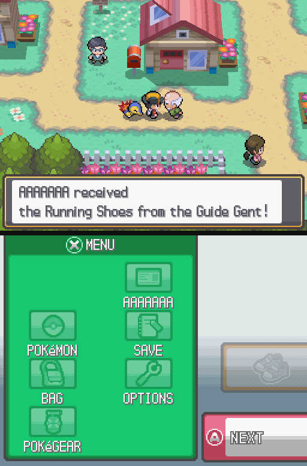
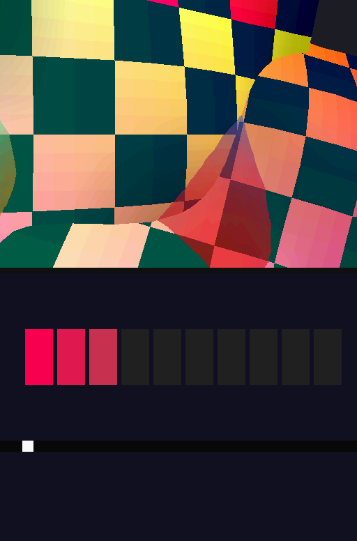
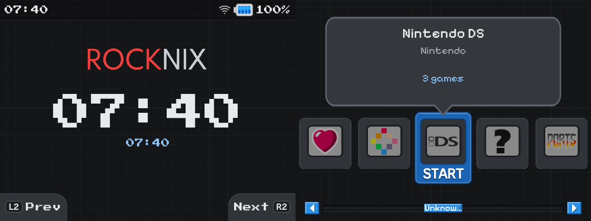

# RG DS × ROCKNIX

**Full-speed 2× DraStic and a dual-screen DSi-style frontend for the Anbernic RG DS.**

The Anbernic RG DS is a clamshell handheld with two 640×480 touch panels and an RK3566 (4× Cortex-A55,
Mali-G52). This repo holds everything I changed on its [ROCKNIX](https://rocknix.org) install:

- **`libdsflip`**, a replacement display path for DraStic. It sends each DS screen straight to its own panel,
  so 2× internal resolution runs at full speed, with frame pacing that doesn't stutter.
- **`dii-ess-aye`**, a DSi-style EmulationStation theme spread across both screens, with a patched ES build.
- The **panel timing fix**, the older **vsync pacing shim**, and the measurement tools (including a DS
  stress-test ROM) behind all the numbers below.

<p align="center">
  
  &nbsp;&nbsp;
  
</p>
<p align="center"><sub>Left: Pokémon HeartGold at 2× internal resolution, captured from the panels' scanout buffers.
Right: <code>dsstress</code>, the stress ROM used for the benchmarks.</sub></p>

<p align="center">
  
</p>
<p align="center"><sub>The dii-ess-aye theme: clock and logo on the top panel, system carousel on the bottom.</sub></p>

---

## What was achieved

| | Before | After |
|---|---|---|
| DraStic at 2× internal resolution, heavy 3D (stress ROM, 1920 polygons) | 39.0 fps | **50.4 fps (+29%)** |
| Heaviest load that still holds 60 fps at 2× | ~576 polygons | **~1344 polygons** |
| Display cost per frame on DraStic's main thread | ~3.6 ms (texture upload + GL + sway) | **0.07–0.29 ms** |
| Frame pacing at 60 fps | a repeated frame every ~10 s (60.10 Hz panels), phase set by chance at each launch | **every frame on both screens in the same refresh, 0 drops/repeats** |
| Touch in DraStic | stock sway mapping lands on the wrong area | **calibrated to the pixel** |
| Frontend | single-screen stock theme | **dual-screen DSi-style theme, patched ES, boot splash** |

<p align="center"></p>

---

## `dsflip/`: DraStic straight to the panels

### Why stock was slow

DraStic's 3D is rendered **on the CPU**. On stock ROCKNIX every frame then takes a long way to the screens:

```
DraStic → 2× ARGB8888 textures → SDL_UnlockTexture (GL upload, ~1.6 ms) → SDL_RenderCopy + shader
        → eglSwapBuffers → sway composites one 1284×482 window across both outputs (GL again) → KMS
```

All of that runs on the same four A55 cores as the emulator's raster threads. Sway alone used 15–23% of a core.
The idea came from GammaOS Nano's "DraStic Nano": remove everything around the emulator. The full plan and
its measure-first phases are in [`docs/drastic-2x-plan.md`](docs/drastic-2x-plan.md).

### What libdsflip does

`libdsflip.so` is an `LD_PRELOAD` library for the Linux DraStic binary (`drastic-sa`):

- **Zero copy.** When DraStic locks a screen texture, it gets a DRM dumb buffer instead of SDL's memory.
  XRGB8888 has the same memory layout as SDL's ARGB8888, so DraStic renders straight into scanout memory:
  no upload, no GL, no compositor.
- **Hardware scaling.** The VOP2 display controller scales 512×384 (or 256×192) to 640×480 on the
  primary planes, for free.
- **Both screens in one atomic commit.** The top and bottom frames always change together. The panels are
  phase-locked ~0.8 ms apart.
- **Mailbox presenter thread.** `SDL_RenderPresent` never blocks, a superseded frame is dropped, and an
  unchanged panel keeps its buffer.
- **DraStic's menu.** It's an 800×480 RGB565 texture, shown on the top panel with hardware scaling.
- **Touch.** Read from the bottom panel's own gt911 controller (i2c-5). DraStic ignores absolute mouse
  coordinates and moves its stylus by *relative* deltas, summed per frame and clamped. So every
  touch-down first pins the stylus to (0,0), then (next frame) moves it by exactly the target.
  No drift, pixel-exact.

### Using it

It's installed as the default DraStic launcher: start any DS game from EmulationStation as usual.

- The game runs in a detached systemd unit (`dsflip-game`). The unit stops ES and sway, which gives
  DraStic DRM master, and brings them back when you quit. Switching takes about 5 seconds each way.
- To quit, use the ROCKNIX exit hotkey or *Exit DraStic* in DraStic's menu (MODE button).
- To go back to the previous launcher: `touch /storage/.config/drastic/nodsflip`.
- 2× resolution is ES's per-system/per-game *hires 3D* option (`nds.hires_3d=1`).

Install from a checkout: copy `dsflip/libdsflip.so` plus `dsflip/device/{session.sh,drastic-wrapper.sh,install.sh}`
to the device and run `sh install.sh`.

Not in this mode yet: the microphone (it came from ROCKNIX's `libdrastouch`), an lcd3x-style sharp filter
(the hardware scaler is bilinear), and gptokeyb keyboard hotkeys. Everything DraStic maps to buttons itself works.

### How it was measured

| Tool | What it does |
|---|---|
| `dsprobe.c` | `LD_PRELOAD` timing of every SDL video call. `DSPROBE_NULL=1` skips the display entirely: that's the upper bound in the chart |
| [`stressrom/`](stressrom) | **`dsstress`**, a bare-metal NDS ROM built with plain clang (no devkitPro). Each level adds a full-screen lit, textured, animated surface of 192 quads (odd levels translucent), up to 1920 polygons. The bottom screen shows the level and a per-frame step block. `dsstress-ramp.nds` steps L1→L10 every 300 frames; `dsstress-L1..L10.nds` hold one level |
| `kmstest.c` | KMS bring-up: both panels, triple-buffered flips, `TEST_ONLY` probes for plane scaling |
| `touchcal.c` | Crosshair calibration on the bare panel, listening on both touch controllers |
| `dsrun.sh`, `ramp.py`, `kmsrun.sh`, `padkey.py` | Run/benchmark harness. `padkey.py` presses buttons by writing into the gamepad's evdev node |

Real games (HeartGold, Black 2, Platinum) already held 60 fps at 2× in normal play, which is why the stress ROM
exists. It's what shows the headroom.

Build (desktop, aarch64 cross):

```sh
# stress ROMs -> stressrom/out/*.nds
python3 stressrom/build.py
# libdsflip: libdrm headers from the host, libdrm.so.2 + libc.so.6 copied from the device into $SYSROOT
clang --target=aarch64-linux-gnu -fuse-ld=lld -shared -fPIC -O2 -nostdlib \
      '-D__float128=long double' '-D__regparm__(x)=__nothrow__' -I/usr/include/libdrm \
      -o dsflip/libdsflip.so dsflip/dsflip.c $SYSROOT/libdrm.so.2 $SYSROOT/libc.so.6
```

(The two `-D`s make the host's x86 glibc headers parse for aarch64. `pthread_mutex_t` is avoided on purpose:
its size differs between the two, so the code uses a spinlock.)

---

## Panel timing: 60.000 Hz

DraStic runs at exactly 60.000 fps, but the stock panels ran at 60.10 Hz, which repeats a frame about
every 10 seconds. The panel timing is a text string in the device tree. Lowering its clock isn't possible:
`pll_vpll` is fixed at 126.4 MHz and the VOP only divides by an integer, so anything below ÷3 silently
drops to ÷4 (~45 Hz). Instead, the porches were retuned to 1353×519 @ 42.133 MHz = **60.0013 Hz**
(`dii-ess-aye/device/apply-60hz-dtb.sh`, checked by md5). A ROCKNIX update overwrites `/flash`, so it has to
be re-applied.

## `drastic-vsync/`: the earlier pacing shim (now the fallback)

Before `libdsflip`, `dvsync.c` was an `LD_PRELOAD` shim that stayed inside sway. It paced DraStic's
post-present sleep to the compositor's latch point (learned from `wp_presentation` feedback), warped
`gettimeofday` so DraStic saw exactly 60 fps, and resampled audio to match. It's still the fallback launcher
(`drastic.dvsync`) and keeps drastouch's touch, mic and shaders.

| HeartGold walking test, ~45 s | Stock DraStic | dvsync |
|---|---|---|
| Low res | 3 repeated frames, 21 ms latency | 4 repeated frames, 11 ms latency |
| High res | 6 *or* 194 repeated frames (phase set by chance at launch) | ~40 (in heavy map transitions), never below 55 fps |

`tools/` holds its harness: a uinput keyboard (`vkbd.py`), a launch/savestate/walk benchmark
(`bench.sh`, `go.sh`) and analysis (`fps.py`, `rep.py`).

---

## `dii-ess-aye/`: DSi-style EmulationStation across both screens

Builds on [beebono/dii-ess-aye](https://github.com/beebono/dii-ess-aye). ES runs on a 1920×480 canvas:
the top panel, the bottom panel, and an unused third.

- **Dark vector reskin.** Every texture was redrawn as SVG by `gen_skin.py`, pixel-exact and crisp.
  START/L2/R2 are glyph paths, and the ROCKNIX wordmark was traced into vectors (`trace_logo.py`).
- **Top screen:** vector logo with a breathing glow, a big clock and date, and a drifting grid.
- **Bottom screen:** DSi cartridge carousel (unscraped games get carts too), a pulsing START, a retro
  pixel-art scroll bar bound to the list position with "N of M", and native 160×72 tabs.
- **Retro fonts:** Press Start 2P for the clock, status and tabs, and Pixelify Sans for titles. Descriptions
  stay readable in the DSi font.
- **Patched ES** (`emulationstation-rgds`, ROCKNIX/emulationstation-next bccd715):
  - `es-rgds-uiwidth.patch`: popups, keyboard, sliders and game options sized to one 640 px screen
    (`ES_UI_WIDTH`) instead of the 1920 canvas. This fixes the hidden *Advanced Game Options*.
  - `es-rgds-bindings-clock.patch`: `{system:index}/{count}` and `{game:index}/{count}` bindings, and a
    strftime `<format>` on `clock`.
- **Boot splash** across both panels while ES loads hidden, then the menu appears placed, with no jumps.
- **Robust launcher** (`start_es_rgds.sh`): falls back to stock ES after 2 quick crashes, keeps ES floating
  at 0,0, and brings the menu back after a game.
- **Scraping without an account** (`scrape/`): libretro-thumbnails art pushed through ES's local HTTP API.
  DS snaps are converted to side-by-side to match the device.

| File | What it is |
|---|---|
| `0001-*.patch`, `0002-*.patch` | Theme changes against upstream @9fd5eee |
| `theme-files/` | `theme-rgds.xml` (the layout), `start_es_rgds.sh` (launcher, bind-mounted over `/usr/bin/start_es.sh`), the splash |
| `gen_skin.py`, `trace_logo.py`, `rocknix_logo.paths` | SVG skin and logo generators |
| `es-rgds-*.patch`, `emulationstation-rgds` | ES patches and the built binary (aarch64) |
| `device/autostart-dii-ess-aye`, `device/sway-config.theme` | Boot hook: redoes the bind mount and restores the theme's sway config, which ROCKNIX's `111-sway-init` overwrites on every boot |
| `fonts/` | Press Start 2P and Pixelify Sans (OFL) |
| `scrape/` | The HTTP-API scraper |

---

## Known issues

- **Touch in EmulationStation doesn't work** on this setup. The stock sway mapping puts both touch
  panels on the wrong outputs. Games are unaffected: `libdsflip` reads the touch panel itself.
- **No microphone** under `libdsflip` yet. Use the `nodsflip` fallback for mic games.
- `libdsflip` stops ES while a game runs, so switching takes ~5 s each way. A Wayland backend that keeps
  ES running is possible (see the plan).

## Credits

[ROCKNIX](https://github.com/ROCKNIX/distribution) and its `drastic-sa` / `libdrastouch` ·
DraStic by Exophase · [beebono/dii-ess-aye](https://github.com/beebono/dii-ess-aye) ·
GammaOS Nano's DraStic Nano, for showing the display path is where the time goes ·
[DSperate](https://github.com/beebono/DSperate) for the RG DS measurements ·
fonts: Press Start 2P (CodeMan38), Pixelify Sans (Stefie Justprince), both OFL.
