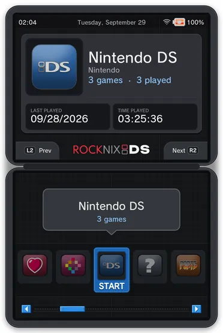
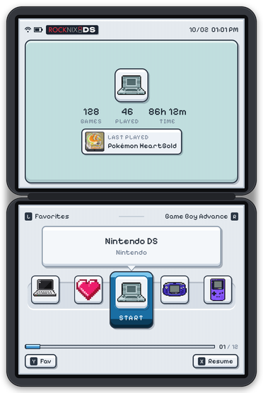
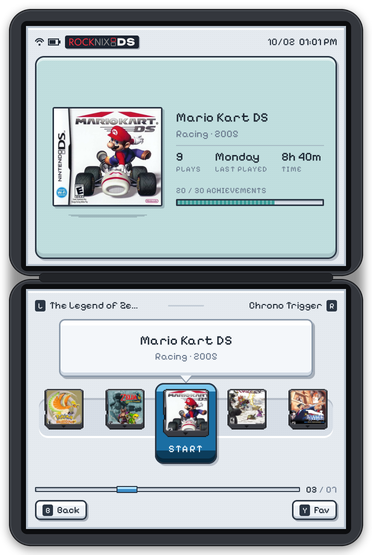
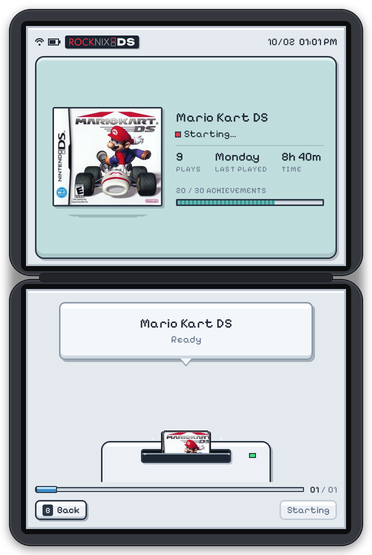
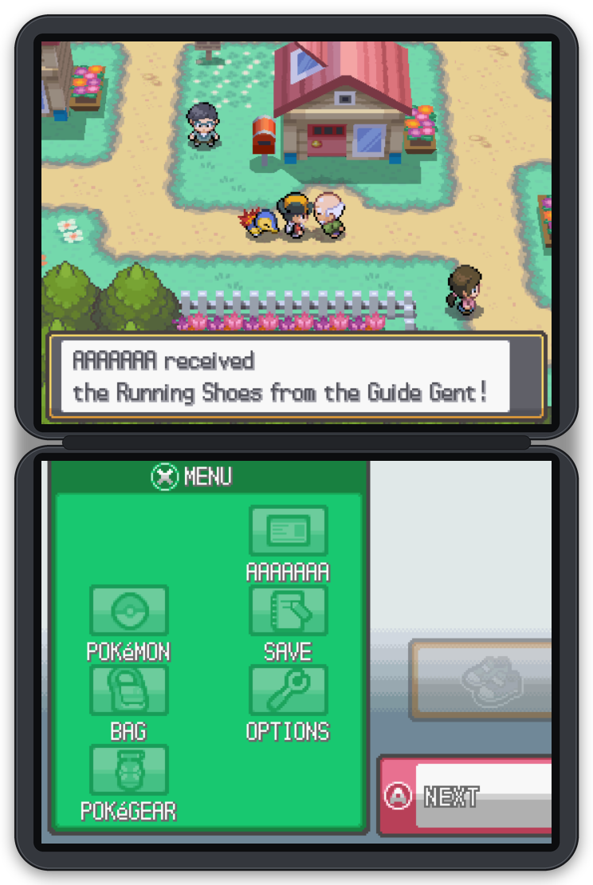
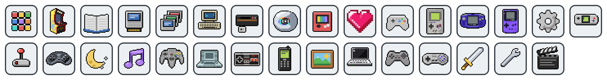
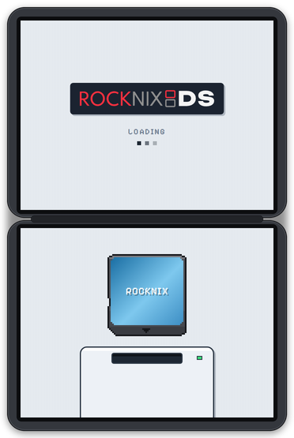
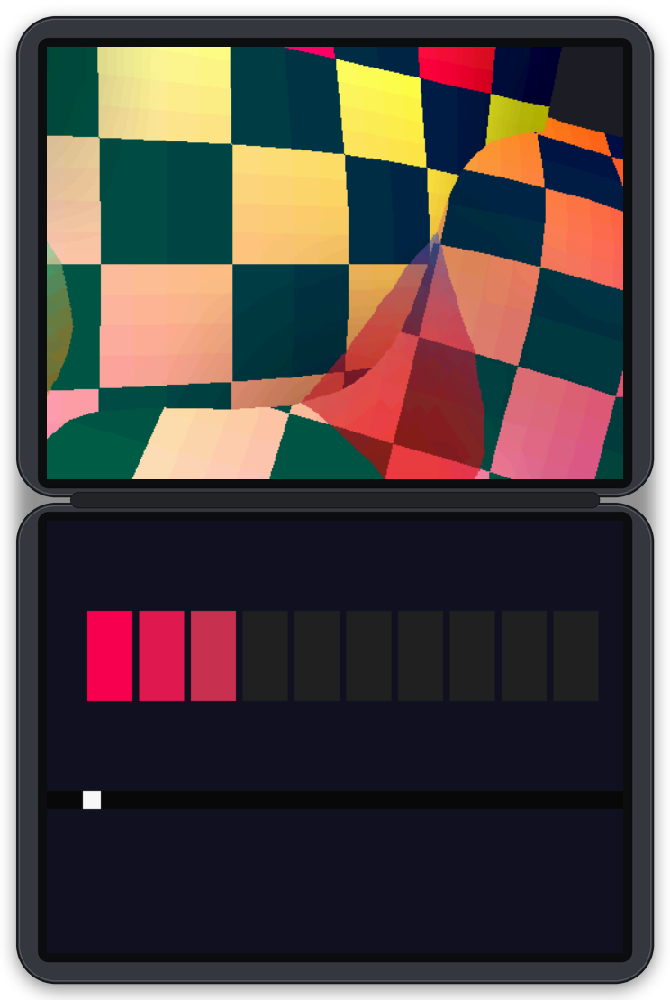
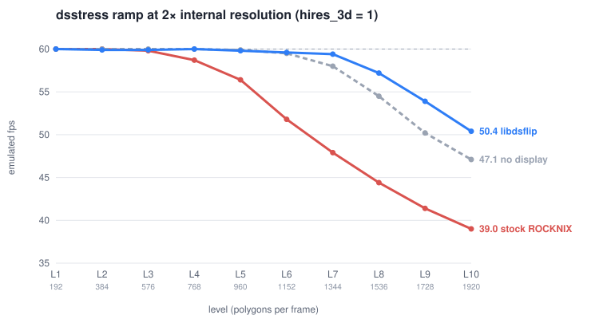

<p align="center">
  <picture>
    <source media="(prefers-color-scheme: dark)" srcset="docs/img/rocknixds-logo.svg">
    
  </picture>
</p>

<p align="center"><b>Full-speed 2× DraStic and ROCKNIXDS Pixel, a dual-screen frontend with its own engine, for the
Anbernic RG DS and RG DS Plus on ROCKNIX.</b></p>

<p align="center">
  <picture>
    <source media="(prefers-color-scheme: dark)" srcset="docs/img/demo-dark.webp">
    
  </picture>
</p>
<p align="center"><sub>ROCKNIXDS Pixel, new in 1.5: the system shelf, the DS library, and a cartridge clicking into the console as the game starts. Pixel light here, Pixel dark on a dark page.</sub></p>

<p align="center">
  <picture>
    <source media="(prefers-color-scheme: dark)" srcset="docs/img/pixel-dark-home.png">
    
  </picture>
  <picture>
    <source media="(prefers-color-scheme: dark)" srcset="docs/img/pixel-dark-games.png">
    
  </picture>
  <picture>
    <source media="(prefers-color-scheme: dark)" srcset="docs/img/pixel-dark-insert.png">
    
  </picture>
</p>
<p align="center"><sub>Home, the game list, and the ready screen (rendered by the theme engine's test harness).</sub></p>

<p align="center">
  
</p>
<p align="center"><sub>Pokémon HeartGold at 2× internal resolution (captured from the panels' scanout buffers).</sub></p>

> [!NOTE]
> ROCKNIXDS is a vibecoded — and fairly sloppily vibecoded — project. It does things great, but it also contains flaws. It is meant to push this community of retro handhelds forward by providing new ways of doing things with the help of AI. GammaOS has been a huge inspiration for this, and what the GammaOS developer is doing is probably the greatest thing that has ever happened to the retro community that we all are a part of. I think he deserves every penny he receives through his Patreon, and I myself will continue to subscribe to it. If this project can help GammaOS improve in any way, then I am very happy. I would always recommend people use software that is created by humans first and foremost. AI should not be used to replace anything; it is only a tool that can help development and make it faster. All the love to GammaOS and its creator.
>
> The area this project is focusing on the most right now is improving NDS emulation performance at the lowest clock speeds possible. This means that other functionality, minor bugs, and things like that will be prioritized a bit less. I will try to address as many of the bugs being reported as possible. But just keep this in mind when using ROCKNIXDS.
>
> The `.img` file is out: see [Get started](#get-started) below for the easiest way to install.
>
> I also have a lot of school stuff happening right now, so I will have to prioritize those things a bit more moving forward, and updates will come less frequently.
>
> Thanks to everyone who has tested this and contributed to its development.

## Get started

The easiest way: put ROCKNIXDS on a fresh microSD card. No ssh, no commands.

**You need:** an Anbernic RG DS or RG DS Plus, a microSD card of 16 GB or more (**everything on it will be
erased**), and a computer with an SD card reader.

1. **Download the image for your handheld.** Don't unzip it.
   - RG DS Plus: [rocknixds-v1.5.12-plus-rocknix-20261001.img.gz](https://github.com/JorreFog/ROCKNIXDS/releases/download/v1.5.12-plus/rocknixds-v1.5.12-plus-rocknix-20261001.img.gz)
   - RG DS: [rocknixds-v1.5.12-rocknix-20261001.img.gz](https://github.com/JorreFog/ROCKNIXDS/releases/download/v1.5.12/rocknixds-v1.5.12-rocknix-20261001.img.gz)
2. **Install [balenaEtcher](https://etcher.balena.io/)** on your computer (free, for Windows, macOS and Linux).
3. **Write the image to the card.** Put the microSD card in your computer and open balenaEtcher.
   Click *Flash from file* and pick the file you downloaded. Click *Select target* and pick the microSD card.
   Click *Flash!* and wait for *Flash Complete!*
4. **Start the handheld.** Put the card in the handheld and switch it on. The first start takes a few minutes and
   restarts once by itself: ROCKNIX sets up the card, then ROCKNIXDS installs itself. Leave it on until the
   menu appears.
5. **Add your games.** In the menu, connect to Wi-Fi (*Start > Network Settings*) and note the IP address it shows
   (like `192.168.1.23`). On your computer, open the handheld's network share: on Windows type `\\192.168.1.23` (your
   IP) in File Explorer's address bar; on a Mac use *Go > Connect to Server* with `smb://192.168.1.23`. User `root`,
   password `rocknix`. Copy your DS games (`.nds` or `.zip`) into `roms` > `nds`, then restart the handheld.

6. **Play.** The best settings are the defaults since 1.5.13: every Nintendo DS setting on *Auto* means Gengis
   Engine (the same picture as DraStic's renderer with about 12% less CPU work), the DS's own nearest texture filter,
   2× resolution with threaded 3D (the installer switches both on), the balanced power profile and ROCKNIX's bilinear
   scaling (no GPU work). They are under *Start > Game settings > Per system advanced configuration > Nintendo DS*
   if you want something else:

   | Setting | Auto means | Other choices |
   |---|---|---|
   | 3D renderer | **Gengis Engine** | *DraStic*: DraStic's own renderer, the same picture at more CPU work |
   | 3D texture filter | **nearest (DS)** | Bilinear smooths textures but doubles the 3D work |
   | 3D resolution | Gengis Engine's 2× | 3× isn't offered yet |
   | Shader | **default (bilinear)**, no GPU work | **ds-crisp** for a sharp picture; ds-fsr (smooth edges) is the heaviest and runs the GPU at full clock |
   | Power profile | **balanced**: full speed with the lowest input lag | *performance* only if a game slows down; *battery saver* |
   | Hires 3D, Threaded 3D | **on** (the installer sets them) | off: 1× resolution; the 3D on the emulation thread |

   The same settings can be changed for a single game: highlight it, press **X** for its options and choose the
   game's advanced settings.

Updates come through the menu: *Updates & downloads > ROCKNIXDS*. Already running ROCKNIX?
See [Install](#install) for the one-line install over ssh.

The Anbernic RG DS is a clamshell handheld with two 640×480 touch panels and an RK3566 (4× Cortex-A55,
Mali-G52); the RG DS Plus has two 1024×768 panels. ROCKNIXDS (formerly `rgds-rocknix`) is everything I changed on its [ROCKNIX](https://rocknix.org) install:

- **`libdsflip`**, a replacement display path for DraStic. It sends each DS screen straight to its own panel,
  so 2× internal resolution runs at full speed, with frame pacing that doesn't stutter. It also adds
  shaders, the microphone and RetroAchievements to standalone DraStic. It now also lives on its own as
  [SuperDrastic](https://github.com/JorreFog/SuperDrastic), for any Linux firmware.
- **ROCKNIXDS Pixel** (new in 1.5), a pixel-art frontend across both screens, in light and dark: a system shelf,
  DS cartridges wearing their real label art, box covers, play stats and RetroAchievements progress, drawn by its
  own engine inside a patched EmulationStation. The DSi-style **`dii-ess-aye`** theme is still there too.
- The **panel timing fix**, the older **vsync pacing shim**, and the measurement tools (including a DS
  stress-test ROM) behind all the numbers below.

### New in 1.5

1.5 comes as two releases: **v1.5** for the RG DS (this one) and **v1.5-plus** for the RG DS Plus. The installer and
the menu's updater pick the right one for the handheld they run on.

- **ROCKNIXDS Pixel, the new theme, in light and dark.** The ROCKNIXDS menu mockup on both screens, drawn by its
  own engine inside the patched ES (`es-rgds-rnds.patch`):
  - a pixel-art system shelf that glides like a conveyor, with 31 hand-drawn icons and a colour for every system;
  - games as DS cartridges wearing their real card's label art, edge to edge in the cartridge's label window
    (the scan's white header and code strip trimmed off; the box cover until a card scan exists);
  - the game list's top screen: the box cover bobbing above its shadow, with a shine that sweeps across it every
    few seconds, next to the title (balanced over two lines), genre and year, plays, last played, time played and
    the RetroAchievements progress;
  - a title bubble of fixed height, so long names never push the layout around;
  - a ready screen where the cartridge lifts, slides and clicks into the console before the game starts;
  - chiptune menu sounds for moving, opening, going back, favouriting and the cartridge's click (switched on by
    the installer; *Sound settings > Enable navigation sounds*);
  - a boot splash in the same look, and the Pixelify Sans pixel font throughout.

  L/R or the d-pad move, A opens, B goes back, X resumes the system's last game, and Y favourites the system (home)
  or the game (game list). You can also tap or swipe the bottom screen. *rocknixds-pixel-light* is the theme after
  installing or updating to 1.5; *rocknixds-pixel-dark* is in the theme menu. An idle menu draws only when an
  animation steps. The 1.5 betas' *rocknixds-dark* and *rocknixds-light* skins are gone.

  <p align="center"></p>
- **Pick up where you left off.** The exit hotkey saves your place and quits. The save is a savestate of its own,
  never one of your slots. The next start of that game resumes there, once. ES: the DS system's or game's *resume
  on quit* option (on by default). With it off, the hotkey quits as before. Quitting from DraStic's own menu doesn't
  save. A resume state older than the game's own save file is dropped.
- **Power profiles.** *Game settings > Per system advanced configuration > Nintendo DS > Power profile* (at the
  bottom of Game settings), or per game (hold A on it > *Advanced game options*):
  - *balanced* (the default): CPU 1104–1416 MHz and the shortest queue, where a full queue holds DraStic for a
    moment instead of dropping a frame (1.5.5: half the input latency of before, as smooth);
  - *performance*: CPU 1104–1992 MHz and the shortest queue without the hold, for the lowest latency;
  - *battery saver*: CPU at 1104 MHz, three frames of queue (+33 ms).

  A game that can't keep up at its profile's top clock gets more (1.5.1): the players' logs from 1.5 had heavy 3D
  games at 2x (Call of Duty, The 4 Heroes of Light, Platinum with a shader) running below full speed for much of
  their play. Measured (Black 2 at 2x, walking): 1416 MHz with balanced's queue gave 0.07 hitches/s and no dropped
  frames. That's about what performance gets, which averages ~1570 MHz and goes up to 1992.
- **The CPU clock remembers each game:** clocks that dropped frames are skipped from the start of the next session
  instead of being found again by dropping frames. Only drops that really come from the CPU count. A DS game now
  always runs on the performance CPU governor, which the clock control needs: one player's RG DS ran its games with
  the clock floating to 1992 MHz whatever the profile (see [the beta logs](docs/perf-logs-1.5-beta.md)).
- **No more stutter storms in DS games.** A pacing bug could leave libdsflip committing every frame late. After a
  while that meant a minute of dropped frames (up to 32 a second, at any CPU clock), in about one of ten two-minute
  runs. Gone: 0.01-0.02 drops/s in 200 s HeartGold runs.
- **The handheld fetches its own game art and RetroAchievements strips.** Each time the menu opens, a background job
  at idle priority scrapes the games that are missing a 3D box, screenshot or cartridge. A game with no match is
  tried again a week later, and an offline handheld tries again the next time the menu opens. The same job redraws
  the RetroAchievements strip of every game played since its strip was drawn. The strip of the game you just quit
  is redrawn while the menu starts. New games get their RetroAchievements ID on the device, with the same hash ES
  uses. Retail art comes before demos, kiosks and hacks, in the ROM's own region.
- **Updates from the menu:** *Updates & downloads > ROCKNIXDS* shows the installed version and the channel (stable
  releases or beta), and checks for and installs updates. A timer checks every 6 hours and shows a notification once
  per new update (you can switch it off there). Each handheld gets its own release (stable) or beta branch (beta),
  at exactly the version the check found, and the menu says if an update fails. ROCKNIX's own OS updates are
  hidden: a new ROCKNIX can need a new ROCKNIXDS.
- **Settings that break ROCKNIXDS are gone from the menus.** That covers the dual-screen layout options, the CPU/GPU
  governors, the GPU driver, video mode and rotation, DTB overlays, the developer options, factory reset, the
  emulator-config reset, and the DS system's emulator choice (DS games run on ROCKNIXDS's DraStic only). For
  development: `touch /storage/.config/rocknixds/unlocked` and restart the menu to see everything.
- **A second dual-screen theme, [canvas-ds](https://github.com/toniremi/canvas-ds)** by toniremi, downloaded from
  upstream at a verified version (`--no-canvas` skips the ~180 MB). Only verified themes can be picked.
- **Performance logs, if you allow them.** The first time the menu appears it asks: A uploads a log when you quit a
  game, B does not. Change it later under *Nintendo DS > Share performance logs*. The log is the same once-a-second
  record as [`tools/rgds-monitor.py`](tools/rgds-monitor.py) and lands on the
  [`device-logs`](https://github.com/JorreFog/ROCKNIXDS/tree/device-logs) branch, with no token on the device. What
  the beta logs showed: [docs/perf-logs-1.5-beta.md](docs/perf-logs-1.5-beta.md).
- **The volume rocker shows a card on the top screen during a game.** "Launch this game at startup" runs once per
  boot instead of again every time you quit. The menu is back ~0.5 s sooner after a DS game. ROCKNIX's charger
  watcher no longer starts a process every 2 s (2.2% -> 0.13% of a core).
- **The DraStic engine is its own project now: [SuperDrastic](https://github.com/JorreFog/SuperDrastic)**, for any
  Linux firmware. 1.5 shipped SuperDrastic 0.3.0-beta.3, 1.5.1 0.3.0-beta.4, 1.5.2 0.3.0-beta.5, 1.5.5 0.4.0-beta.1 with Gengis Engine, 1.5.9 ships 0.4.0-beta.2 (the version in [`SUPERDRASTIC`](SUPERDRASTIC));
  `dsflip/` keeps the ROCKNIX scripts.
- **Gengis Engine, a new 3D renderer** (1.5.5). *Nintendo DS > 3D renderer*, or per game: *Gengis Engine* draws
  DraStic's hi-res 3D with SuperDrastic's own rasterizer. It matches DraStic's picture pixel for pixel with about 20%
  less work in DraStic's 3D threads. *DraStic* (the default) keeps DraStic's own. With Gengis Engine, *3D texture
  filter* (nearest = the DS's, bilinear, sharp bilinear) smooths textures, at about twice the 3D cost.
- **Nintendo DS settings show again** (1.5.6). 1.5.5 wrote *3D renderer* inside *Share performance logs*, and the next
  time the menu started that options file no longer parsed, so DraStic's settings disappeared from the Nintendo DS
  menu (#37). They are listed again, including *3D resolution*. A handheld already on 1.5.5 gets them back the next
  time the menu starts. **1.5.7** lists that setting as *Auto* or *2×*. 3× is not in this release.
- **RetroArch games and the bottom screen** (1.5.8, #33). Games RetroArch runs (GBA, SNES, N64 and the rest) could
  open on the bottom screen behind ROCKNIX's touch menu, and a tap on that menu could leave the game paused for good.
  They open on the top screen now, *Resume Game* resumes, and taps on the bottom screen reach the menu and the touch
  menu right after a reboot. Tested on the RG DS Plus.
- **A faster Gengis Engine** (1.5.9, SuperDrastic 0.4.0-beta.2). A leaner rasterizer and a NEON compositor for the 3D
  layer: Pokémon HeartGold takes ~5% less CPU than with 1.5.5's Gengis Engine and ~12% less than with DraStic's renderer,
  and runs closer to full speed at 816 MHz (53 fps instead of 51.6). Still pixel for pixel the same picture as DraStic.
- **A fresh card opens on the DS** (1.5.13). ES drops a system with no games, so until the first DS game was copied
  the menu landed on Music Player, Tools and two empty collections, their "no entries" placeholder dressed as a
  cartridge that hung the ready screen when tapped. The patched ES keeps the DS listed and themed with no games
  (`es-rgds-emptylibrary.patch`), and its library says "No games yet: copy games to roms/nds".
- **The recommended settings are the defaults** (1.5.13). *3D renderer* on *Auto* is Gengis Engine (a player who
  picked *DraStic* keeps it), and the installer switches threaded 3D on where it was never set, as the Plus line did
  since 1.5. The README's "set the best settings" step is gone: a fresh install plays with them.
- **Wi-Fi online play, experimental and untested** (1.5.13). A *wfc dns* option (off by default) points a game at a
  community replacement for Nintendo Wi-Fi Connection (Kaeru WFC into Wiimmfi, WiiLink's DNS, AltWFC): the engine
  answers the game as an open access point and carries its traffic over the handheld's network. Not yet run on a
  handheld; see *Using it* and `docs/handoff-local.md`.
- **The microphone, ready for its test on the handheld** (1.5.13, SuperDrastic 0.4.0-beta.2-rocknixds.3). A real
  blow did nothing on an RG DS Plus (issue 26) while a bound button did. The engine now logs how DraStic's fake
  microphone is bound and presses the bound joystick button when the key is unbound, the launcher repairs an unbound
  key, a silent capture is reported, and the echo gate, a minimum hold and the debug trace are switches that need no
  rebuild (`DSFLIP_MIC_*`; `docs/handoff-local.md`). The cause is to be read off the handheld's log.
- **The menu stays up during DS games** (1.5.13). Fast switching, opt-in since 1.4, is on for everyone: the game runs on
  another console (VT) while ES and sway wait, so after a quit the menu is back about a second later, however many
  games the library holds. Before, ES was stopped and started again for every game, and its start grew with every
  game it had to load. The patched ES keeps its window for exactly those launches (`es-rgds-keepwindow.patch`), so
  other emulators keep ROCKNIX's behaviour; `fast-switch off` goes back to stopping ES.
- **ds-fsr upscales 2× to 3× on the RG DS Plus** (1.5.13, SuperDrastic 0.4.0-beta.2-rocknixds.1). On the Plus's
  1024×768 panels the FSR pass drew every panel pixel, 2.6× the RG DS's work and more than a frame of GPU time.
  It now draws 3× the DS screen (768×576; a 2× game is upscaled 1.5×, FSR's *Quality* ratio) and the display
  controller scales the rest, at 56% of the GPU time. A shader can ask for its output size with a
  `dsflip-output:` line. Not yet measured on a Plus; the RG DS is unchanged.

### New in 1.4

- **Longer battery life and a cooler handheld.** A menu left alone uses a sixth of the CPU it did in 1.3 (10% of one core instead of 57%), at under a quarter of the clock; DS games run the CPU at the
  clock the game needs instead of 1992 MHz, with the same smoothness; shaders take half or less of the GPU time;
  game audio half the CPU. Every change and every measurement is in the
  [optimization report](docs/optimization-1.4.md).
- **Two new screen modes:** `ds-fsr` (AMD FidelityFX Super Resolution 1.0, fast enough for both screens) and
  `ds-integer` (each DS screen at exactly 2× in a bezel, with touch that follows).
- **Touch works in EmulationStation's menus,** on both screens.
- **RetroAchievements:** new pop-ups in the DSi font with the achievement's badge and a progress pill;
  achievements that read the DS's DTCM memory work; the unlock sound chosen in ES plays; ES's RetroAchievements
  menu opens again (it said "Unauthenticated").
- **Play stats for DS games:** last played, play count and time played are recorded.
- **fast-switch** (experimental, opt-in; the default since 1.5.13): ES and sway stay up during DS games, and the menu is back in ~1.7 s.
- **Other themes** get stock ROCKNIX's layout, and the patched ES runs on any ROCKNIX release where it links.
- **Media tool:** RetroAchievements counts leave out RA's hidden warning achievement, and errors are shown
  instead of silently keeping old strips.
- **Fixes:** an interrupt storm that could follow a DS game (~60% of a core until the next reboot), and ROCKNIX's
  power service overriding the game's GPU clock.
- **MIT license**, and libdsflip builds on GitHub Actions.

### New in 1.3

- **RetroAchievements work again.** Sets were being disabled at load because the game loaded before libdsflip
  had found the DS's RAM; now it waits for it.
- **Faster switching:** a game's first frame comes ~3.5 s after you start it (was ~4.8 s), and the menu is back
  ~4.3 s after you quit (was ~6 s plus a 2 s freeze).
- **DraStic's menu on the bottom screen,** with the game frame kept on top.
- **Cooler shaders:** the GPU scales between 400 and 800 MHz (averaging ~500) instead of sitting at 800, with no
  extra dropped frames.
- **Game art in one command** ([`rocknixds-media.py`](dii-ess-aye/scrape)): covers, screenshots, titles, cart
  scans, 3D boxes and descriptions for every DS game, no scraper account.
- **It tells you when something goes wrong:** if a game ends abnormally, ES shows why once it's back; the patched
  ES only runs on the ROCKNIX release it's built for, and says so otherwise.
- **Theme:** new logo, redesigned main menu with modern system icons, descriptions that fade instead of cutting
  a line, and long titles that scroll.
- **Safer install and uninstall:** uninstall keeps settings you changed later, the ds-* shaders stay in ES's
  menu when ROCKNIX updates it, and touch recovers if the touchscreen resets.

### New in 1.2

- **Shaders at full speed at 2×.** The old stutter came from DraStic's audio timing, not the GPU. A real-time
  audio pump fixed it: under 0.1 dropped frames per second with a shader on.
- **Sharp DS shaders:** ds-crisp and ds-grid, each also with the DS screen's colors, plus ds-grid-2x for
  pixel-perfect 2×. They appear in ES's DraStic shader menu.
- **Microphone** in libdsflip: blow or speak into the mic for games that use it, with an echo gate so the
  speaker doesn't trigger it (turn on *microphone sensitivity* in ES's DS options).
- **Theme redesign:** real DS cartridge scans on the carousel, a game list top screen with a 3D box,
  screenshot and RetroAchievements progress, a DSi-style home screen with clock and calendar, the DSi font
  throughout, a new boot splash and the ROCKNIXDS logo.
- **Smoother menus:** the selection frame no longer splits two items while the carousel scrolls, and short
  game lists fill the row.

<p align="center">
  <picture>
    <source media="(prefers-color-scheme: dark)" srcset="docs/img/pixel-dark-splash.png">
    
  </picture>
  
</p>
<p align="center"><sub>Left: the ROCKNIXDS Pixel boot splash while ES loads. Right: <code>dsstress</code>, the stress ROM used for the benchmarks.</sub></p>

---

## Install

### A new SD card: flash the image

The easiest start. Each release from 1.5.11 has a ready-to-flash image for its handheld:
`rocknixds-v1.5.12-rocknix-20261001.img.gz` on the [RG DS release](https://github.com/JorreFog/ROCKNIXDS/releases/latest),
`rocknixds-v1.5.12-plus-rocknix-20261001.img.gz` on the
[RG DS Plus release](https://github.com/JorreFog/ROCKNIXDS/releases?q=plus&expanded=true). It is ROCKNIX's own
image (ROCKNIX 20261001), already set to boot your handheld, with ROCKNIXDS on it.

1. Flash the `.img.gz` to a microSD card with [balenaEtcher](https://etcher.balena.io/),
   [Raspberry Pi Imager](https://www.raspberrypi.com/software/) (*Use custom*) or `gzip -dc <image> | sudo dd of=/dev/sdX bs=4M`.
   This erases the card.
2. Put the card in the handheld and switch it on. ROCKNIX first grows the card to its full size and restarts, then
   ROCKNIXDS installs itself (about a minute, no network needed), and the menu comes up.

The install log is `/storage/.config/rocknixds-firstboot.log`. After that, *Updates & downloads > ROCKNIXDS* keeps
it up to date, the same as an install over ssh.

### ROCKNIX already installed: install over ssh

On an Anbernic RG DS or RG DS Plus running ROCKNIX, ssh in as `root` (default password
`rocknix`) and run:

```sh
curl -fsSL https://raw.githubusercontent.com/JorreFog/ROCKNIXDS/main/install.sh | sh
```

The same command works on both handhelds: it installs the newest release for the one it runs on (v1.5 on the RG DS,
v1.5-plus on the RG DS Plus). `RGDS_BRANCH=beta` in front of `sh` installs the beta instead (the RG DS's `beta`
branch, or `plus-beta` on a Plus), and a tag (`RGDS_BRANCH=v1.5`) installs that release. After that, *Updates &
downloads > ROCKNIXDS* in the menu keeps it up to date.

It installs the ROCKNIXDS Pixel themes (light, the default, and dark), the dii-ess-aye theme (downloaded from
[upstream](https://github.com/beebono/dii-ess-aye) at the pinned commit, then this repo's overlay), the patched
EmulationStation, `libdsflip` as the default DraStic launcher, and
switches on 2× resolution for DS and fast switching (ES stays up during DS games; `dsflip/fast-switch off` undoes
that part). It also adds the ds-* shaders to ES's shader menu, and keeps them there when a
ROCKNIX update changes that menu. Everything it replaces is backed up first under `/storage/rgds-rocknix-backup/`
(the folder keeps its old name so earlier installs can still be undone).
Running it again upgrades an earlier version in place.

Cartridge scans, 3D boxes, screenshots and the RetroAchievements strip are per-game media. The device fetches them
itself: every time the menu opens (at boot and after a game), a background job at idle priority scrapes the games
that are missing a 3D box, screenshot or cartridge (a game with no match is tried again a week later), and redraws
the RetroAchievements strip of every game played since its strip was drawn. The strip of the game you just quit is
redrawn while the menu starts, so its progress bar shows what you just unlocked. The first run downloads Pillow for
the device's Python from PyPI (~6 MB, into `/storage/.config/rocknixds/pylib`). Switch it off with
`rocknixds.automedia=0` in `system.cfg`; the last run's log is `/storage/.config/rocknixds/media.log`.

The same tool also runs from a PC, for everything at once, no scraper account needed:

```sh
python3 dii-ess-aye/scrape/rocknixds-media.py --device <RG DS ip>
```

See [`dii-ess-aye/scrape/`](dii-ess-aye/scrape) for what it does and where the art comes from. Until a game has
its art, the theme draws a card with the game's name or box art.

| Option | |
|---|---|
| `--with-60hz` | also retune both panels to 60.000 Hz (edits the device tree in `/flash`, backed up; needs a reboot) |
| `--no-theme` / `--no-dsflip` / `--no-hires` | skip that part |
| `--uninstall` | undo what the installer changed; settings you made since the install are kept. Add `--restore-files` to put back the whole config files from the install-time backups instead |
| `--version` | print the installed ROCKNIXDS version (also in `/storage/.config/rocknixds-version`) |

Pass options like this: `curl -fsSL …/install.sh | sh -s -- --with-60hz`.
To go back to the stock DraStic display path without uninstalling: `touch /storage/.config/drastic/nodsflip`.

---

## What was achieved

| | Before | After |
|---|---|---|
| DraStic at 2× internal resolution, heavy 3D (stress ROM, 1920 polygons) | 39.0 fps | **50.4 fps (+29%)** |
| Heaviest load that still holds 60 fps at 2× | ~576 polygons | **~1344 polygons** |
| Display cost per frame on DraStic's main thread | ~3.6 ms (texture upload + GL + sway) | **0.07–0.29 ms** |
| Frame pacing at 60 fps (HeartGold at 2×, walking) | 1550 dropped frames in 5 min (next-vblank presentation) | **~0.13 dropped frames/s (about 1 every 8 s); both screens always flip in the same refresh** |
| Touch in DraStic | stock sway mapping lands on the wrong area | **calibrated to the pixel** |
| Frontend | single-screen stock theme | **ROCKNIXDS Pixel (its own engine in a patched ES, light and dark) and a DSi-style theme, both dual-screen** |
| RetroAchievements in standalone DraStic | not supported | **supported (softcore), pop-ups on the top screen** |

<p align="center"></p>

---

## `dsflip/`: DraStic straight to the panels

libdsflip is built and released as [SuperDrastic](https://github.com/JorreFog/SuperDrastic) since 1.5 (its source, shaders and test tools live there);
the installer puts the release pinned in [`SUPERDRASTIC`](SUPERDRASTIC) on the device as `libdsflip.so`.
[`dsflip/device/`](dsflip/device) holds what makes it ROCKNIX's DS launcher: the game session, the way back to ES,
play stats and the power services.

### Why stock was slow

DraStic's 3D is rendered **on the CPU**. On stock ROCKNIX every frame then takes a long way to the screens:

```
DraStic → 2× ARGB8888 textures → SDL_UnlockTexture (GL upload, ~1.6 ms) → SDL_RenderCopy + shader
        → eglSwapBuffers → sway composites one 1284×482 window across both outputs (GL again) → KMS
```

All of that runs on the same four A55 cores as the emulator's raster threads. Sway alone used 15–23% of a core.
The idea came from GammaOS Nano's "DraStic Nano": remove everything around the emulator. The full plan and
its measure-first phases are in [`docs/drastic-2x-plan.md`](docs/drastic-2x-plan.md).

### What libdsflip does

`libdsflip.so` is an `LD_PRELOAD` library for the Linux DraStic binary (`drastic-sa`):

- **Zero copy.** When DraStic locks a screen texture, it gets a DRM dumb buffer instead of SDL's memory.
  XRGB8888 has the same memory layout as SDL's ARGB8888, so DraStic renders straight into scanout memory:
  no upload, no GL, no compositor.
- **Hardware scaling.** The VOP2 display controller scales 512×384 (or 256×192) to 640×480 on the
  primary planes, for free.
- **Both screens in one atomic commit.** The top and bottom frames always change together. The panels are
  phase-locked, with the bottom panel's vblank **2.05 ms before** the top's (measured).
- **Latch pacing.** DraStic runs on its own 60.000 Hz clock, which slowly drifts through the panels' refresh
  cycle (one full sweep every ~3 min). Committing at the next vblank makes the vblank the cut-off, so jitter
  puts two frames into one refresh and none into the next. Instead, libdsflip tracks where in the cycle the
  frames arrive and commits the newest one at the opposite phase. The latch avoids a zone around *both*
  panels' vblanks: a commit must land ≥1.3 ms before the earlier (bottom) one, and the margin grows if a
  commit still misses. `DSFLIP_PACING=immediate` gives the old behaviour.
- **Presenter thread with a one-frame queue.** `SDL_RenderPresent` never blocks. At 2× DraStic's frame times
  alternate unevenly, so a frame can wait one refresh in the queue and each refresh still shows one frame; a
  third frame drops the oldest. An unchanged panel keeps its buffer. `DSFLIP_QUEUE=0` gives a plain mailbox.
- **DraStic's menu.** It's an 800×480 RGB565 texture, shown on the bottom panel with hardware scaling while
  the top panel keeps the last game frame. It takes no touch: DraStic's menu loop reads only key and joystick
  events (there is no mouse or finger handling in the binary), so it is navigated with the d-pad and buttons.
- **Touch.** Read from the bottom panel's own gt911 controller (i2c-5). DraStic ignores absolute mouse
  coordinates and moves its stylus by *relative* deltas, summed per frame and clamped. So every
  touch-down first pins the stylus to (0,0), then (next frame) moves it by exactly the target.
  No drift, pixel-exact.

### Using it

It's installed as the default DraStic launcher: start any DS game from EmulationStation as usual.

- The game runs in a detached systemd unit (`dsflip-game`), and ES and sway stay up while it runs (**fast switching**,
  opt-in since 1.4, the default since 1.5.13): the session switches the console to another VT, so seatd hands DraStic
  the display (DRM master), and back afterwards; ES, which was waiting for the game, carries on. The game's first
  frame comes about 3.5 s after you start it (2.3 s of that is ROCKNIX's own launch scripts), and the menu is back
  about a second after you quit (1.4 measured 1.2 s to ES answering, 1.6–1.8 s visible), however many games the
  library holds: nothing restarts and nothing is reloaded (`tools/switchtime.sh <device-ip>` measures each step).
  For that the patched ES keeps its window and renderer during the game (`es-rgds-keepwindow.patch`: with them torn
  down, ES's GL re-init after the VT round trip failed), for exactly these launches: a DS game run by DraStic while
  `dsflip/vt-switch` exists. It tells the launcher so (`RGDS_ES_KEEPS_WINDOW`), which takes the VT path only then.
  Other emulators follow ES's *HideWindow* setting as before (up to 1.5.12 fast switching turned it off for every
  system, which could put ES's loading screen on the panel another emulator didn't use: that is why it was opt-in).
- **`/storage/.config/drastic/dsflip/fast-switch off`** goes back to the stop/start way: the unit stops ES and sway
  for the game and starts them again afterwards, and the menu is back ~4.3 s after you quit with a handful of
  games, longer with every game ES has to load again. The choice is kept across updates; `fast-switch on` turns it
  back on. Stock ES (the launcher's fallback when the patched one can't run) always takes this way.
- If a game ends abnormally, ES says why once it's back: DraStic crashed, or libdsflip couldn't take over the
  screens (then the session stops at once instead of leaving them black).
- To quit, use the ROCKNIX exit hotkey or *Exit DraStic* in DraStic's menu (MODE button). Stopping the unit
  (`systemctl stop dsflip-game`) also works: the unit's stop hook always brings sway and ES back.
- `dsflip.log` in `/storage/.config/drastic/dsflip/` covers the last session, and `.1` to `.3` the three before it;
  the first line is the libdsflip version.
- To go back to the previous launcher: `touch /storage/.config/drastic/nodsflip`.
- 2× resolution is ES's per-system/per-game *hires 3D* option (`nds.hires_3d=1`).

SuperDrastic's GitHub Actions build and release the library; this repo's checks that the pinned release downloads
and matches its checksum.

Install from a checkout: `RGDS_SRC=<checkout> sh install.sh` on the device, with
`RGDS_SUPERDRASTIC=<superdrastic-*-aarch64.tar.gz>` to use a local SuperDrastic package instead of downloading it.

**Microphone.** libdsflip captures the mic over ALSA and holds DraStic's own "fake mic" control while you blow or
speak, like ROCKNIX's `libdrastouch` does: an RMS level per block against an adaptive noise floor, with ES's DraStic
*microphone sensitivity* setting as the threshold. **That setting is off by default:** set it (medium is a good
start) under the Nintendo DS system's or the game's options, or the mic stays off, as on stock ROCKNIX. The mic also
hears the speaker, so an echo gate fed by the audio pump's output level keeps game music from pressing it (0 false
presses in testing, with music playing). If a blow does nothing (reported once, on an RG DS Plus), `dsflip.log`'s
`[mic]` lines say what the engine captured, how DraStic's fake microphone is bound and what pressed it; `DSFLIP_MIC_DEBUG=1`,
`DSFLIP_MIC_GATE=0` (gate off) and the other `DSFLIP_MIC_*` switches (`systemctl set-environment`) narrow it down
without a rebuild. The launcher binds the control (Scroll Lock) where an old `drastic.cfg` left it unbound.

**Wi-Fi online play (1.5.13, experimental, not yet tried on a handheld).** DraStic itself has no Wi-Fi: its wifi
registers are stubs. With ES's DraStic *wfc dns* option set (under the Nintendo DS system's or a game's options; off
by default), libdsflip answers the game as an open access point named `rocknixds`, hands it over DHCP the DNS server
of a community replacement for Nintendo Wi-Fi Connection, and carries the game's traffic over the handheld's own
network: **Kaeru WFC** (178.62.43.212, into Wiimmfi's 300+ DS games; the one to try first), **WiiLink's DNS**
(167.235.229.36, also Wiimmfi) or **AltWFC** (172.104.88.237, unmaintained); no patched ROM and no account. In the
game: *Nintendo WFC Setup > Connection 1 > Search for an Access Point*, pick `rocknixds`, keep *Auto-obtain IP* and
*Auto-obtain DNS*, *Test Connection*. Logins, lobbies and the GTS are what this build can reach; races and battles
between players need a full-cone NAT it does not have yet. The Wi-Fi code hooks DraStic's register handlers at fixed
offsets for the r2.5.2.2 build; with the option off nothing is hooked. What to check on the handheld and how is in
[`docs/handoff-local.md`](docs/handoff-local.md).

Not in this mode yet: gptokeyb keyboard hotkeys. Everything DraStic maps to buttons itself works.

### Shaders

libdsflip follows ES's existing DraStic **shader** option (per system or per game), the same setting the
stock path uses:

- **default (bilinear)** keeps the zero-copy path: no GPU work, the coolest and lowest-latency mode.
- **Any other choice** (sharp-bilinear, sharp-shimmerless, quilez, scanlines, lcd3x, lcd1x+nds-color, and
  `.frag` files in `/storage/.config/drastic/shaders/`) runs that shader on the GPU.
  Each screen is drawn into a 640×480 buffer that is then scanned out, with the same inputs as stock.
- **Our shaders** ([SuperDrastic's `shaders/`](https://github.com/JorreFog/SuperDrastic/tree/main/shaders), installed and added to ES's menu by `install.sh`):

  | Shader | Look |
  |---|---|
  | ds-crisp | sharp scaling with no blur and no shimmer, at 1× and 2× |
  | ds-crisp + NDS color | the same with the DS screen's color profile |
  | ds-grid | sharp, with an LCD pixel grid on the real DS pixels |
  | ds-grid + NDS color | ds-grid with the DS color profile |
  | ds-grid-2x | pixel-perfect at 2×, with an even DS-pixel grid |
  | ds-fsr | AMD FSR 1.0 (EASU): smooth, edge-aware upscaling instead of sharp pixels. Heavier: it runs the GPU at 800 MHz. On the RG DS Plus it upscales to 3× (768×576) and the display controller does the last step, see *Cost* |
  | ds-integer | pixel-perfect: each screen at exactly 2× (512×384), centred in a dark bezel. Touch follows the smaller screen |

  The NDS color profile is the one ROCKNIX's lcd1x+nds-color uses, except that very saturated blues are clamped
  (that shader's math is undefined there and bleeds red into them on this GPU).
- ROCKNIX's built-in shaders are read out of `/usr/lib/libdrastouch.so` on the device at runtime, so they
  aren't copied into this repo and stay in step with ROCKNIX updates.
- The GPU is ARM's libmali (`/dev/mali0`, no DRM render node). ROCKNIX exports `MALI_DEFAULT_DISPLAY=wayland`,
  which can't work with sway stopped, so libdsflip uses libmali's GBM display.
- **The GPU reads DraStic's frames where DraStic wrote them** (since 1.4: its buffers are imported as dma-bufs).
  Uploading each frame first was most of every shader's cost (ds-crisp 1.96 -> 0.75 ms per screen);
  `DSFLIP_SHADER_COPY=1` brings the upload back.
- **Nothing on the timing path waits for the GPU:** a worker thread shades each frame, both
  screens' GPU fence goes to the display controller with the commit (`IN_FENCE_FD`), and the presenter thread
  (real-time priority) only handles vblank events, the latch timer and commits.
- **Audio pump (`audio.c`):** DraStic paces its frames on its audio callback. SDL's pulse backend called it in
  bursts under any extra load (and drained ~1.1% slow), which made DraStic's frames uneven: that, not the
  GPU, was the shader stutter (a plain CPU spinner caused the same stutter in zero-copy mode). A real-time
  thread now calls DraStic's callback on a precise timer into a ring buffer, which our own ALSA writer drains;
  a slow rate trim locks it to the device clock. `DSFLIP_AUDIO_PUMP=0` restores SDL audio.
- **Measured** (HeartGold at 2×, scripted walking, 90 s runs): lcd1x+nds-color 0.02–0.09 dropped frames/s,
  lcd3x 0.04, zero-copy 0.00. Before these changes shaders dropped 5–30/s.
- **Cost** (1.3, with the upload; 1.4's numbers are in the [optimization report](docs/optimization-1.4.md#shaders-read-drastics-frames-directly)):
  lcd1x+nds-color takes ~2.5 ms per screen at 800 MHz. With a shader the GPU runs `simple_ondemand`
  with a 400 MHz floor, averaging ~500 MHz: in a 2× Pokémon Black 2 session that dropped 0.05 frames/s against
  0.11 with the clock pinned at 800 MHz (`DSFLIP_SHADER_GOV=performance` restores that).
  At the 200 MHz used in zero-copy mode it would take 16 ms. ds-fsr takes ~4.8 ms per screen (~9.5 ms of the
  16.7 ms frame for both), so it pins the GPU at 800 MHz; a straight port of FSR took 9.7 ms per screen and
  dropped every other frame (see the shader's header for how it was made twice as fast). HeartGold at 2× with lcd3x: 4 dropped frames in
  60 s of walking, SoC ~60 °C.
- **ds-fsr on the RG DS Plus** (1.5.13): its panels are 1024×768, 2.56× the RG DS's pixels, so a panel-sized FSR pass
  would take ~12 ms per screen, ~25 ms per frame for both: more than the refresh, every other frame dropped. The
  shader now asks for a 3× buffer (`// dsflip-output: 3x` in its source, SuperDrastic 0.4.0-beta.2-rocknixds.1):
  it draws 768×576 per screen, upscaling a 2× game 2× → 3× (1.5×, the ratio FSR calls *Quality*), and the display
  controller scales that to the panel like it scales DraStic's own frames without a shader. 56% of the pixels:
  ~7 ms per screen, ~14 ms per frame, which fits. On the RG DS (640×480) 3× doesn't fit, so nothing changes there.
  Not yet measured on a Plus: `tools/shaders.sh` in SuperDrastic with `OUT=1024x768` times it as the library runs
  it. `DSFLIP_SHADER_OUTPUT=4x` (or `panel`, `WxH`) tries other sizes without editing the shader.
- At 2× (hires) the source is 512×384, so shaders written for integer scales ≥2× (sharp-bilinear, lcd3x) scale
  unevenly (1.25×). ds-crisp is the sharp choice there.

### RetroAchievements

Standalone DraStic has no RetroAchievements support, so `libdsflip` brings its own, built on RA's official
[rcheevos](https://github.com/RetroAchievements/rcheevos) library ([`src/ra.c`](https://github.com/JorreFog/SuperDrastic/blob/main/src/ra.c) in SuperDrastic):

- **Login** uses ROCKNIX's own settings: turn RetroAchievements on and enter your account in ES
  (*Settings → RetroAchievements*). After the first login only RA's login token is kept on the device.
- **Game detection** uses rcheevos' NDS hash of the ROM DraStic was started with.
- **Memory:** the DS keeps a copy of the cartridge header at `0x027FFE00`, so matching the ROM's header
  inside DraStic's memory finds the emulated main RAM (RA addresses `0x000000–0x3FFFFF`) exactly.
- **DTCM** (the ARM9's 16 KB data memory, RA addresses `0x1000000–0x1003FFF`, used by a few sets) since 1.4:
  DraStic backs DS memory with one shared-memory file, DTCM at a fixed offset in it, and libdsflip maps its own
  read-only view of that, so it follows the game wherever it places DTCM.
- **Pop-ups** (unlocks with the achievement's badge, the game summary with its icon, offline/online) are cards in the
  theme's DSi font that drop in from the top edge and slide back up, and a small pill shows progress on tracked achievements ("3/5"). Badges and icons are
  downloaded once per game into `/storage/.config/drastic/dsflip/badges/`. [`src/ui.c`](https://github.com/JorreFog/SuperDrastic/blob/main/src/ui.c) draws them on a thread of
  its own (stb_truetype, stb_image) into a spare hardware overlay plane of the top panel, so they cost the game
  nothing. `DSFLIP_UI_DEMO=1` shows a sample unlock and progress pill after a game loads.
- **Unlock sound** (since 1.4): the one picked in ES > Game settings > RetroAchievements settings > Unlock sound
  (the same setting RetroArch uses; "none" by default), mixed into DraStic's audio. `.ogg` files in
  `/storage/roms/music/retroachievements/` show up in that list too. Decoded with stb_vorbis.
- **Softcore only.** Hardcore needs savestates, cheats and fast-forward locked, which can't be enforced
  from outside DraStic.

### Watching real play: `tools/rgds-monitor.py`

On a PC: `python3 tools/rgds-monitor.py <device ip>` (remembered after the first time; `RGDS_SSH="<ssh command>"`
for a wrapper). A live view over ssh of the game, fps and dropped frames, frame pacing, CPU and GPU clocks and load,
DraStic's own CPU use, temperatures and battery; it reconnects on its own. Everything is logged to `~/rgds-logs/`:
a file per day and one per game session with a summary at its end (`rgds-monitor.py report <file>`). `--no-ui`
logs without the live view. The device side only reads files, so it doesn't change what it measures. While it runs,
[http://localhost:8765](http://localhost:8765) shows it all live in a browser: charts of the last 5 minutes (fps with the
dropped frames, frame pacing, CPU and GPU clocks, temperatures, battery current), the events (CPU governor steps,
sessions) and the logged sessions with their summaries and logs (`--port N`, `--no-web`; it only listens on this PC).

### How it was measured

These tools are in SuperDrastic's [`tools/`](https://github.com/JorreFog/SuperDrastic/tree/main/tools) now; `stressrom/` is in both.

| Tool | What it does |
|---|---|
| `dsprobe.c` | `LD_PRELOAD` timing of every SDL video call. `DSPROBE_NULL=1` skips the display entirely: that's the upper bound in the chart |
| [`stressrom/`](stressrom) | **`dsstress`**, a bare-metal NDS ROM built with plain clang (no devkitPro). Each level adds a full-screen lit, textured, animated surface of 192 quads (odd levels translucent), up to 1920 polygons. The bottom screen shows the level and a per-frame step block. `dsstress-ramp.nds` steps L1→L10 every 300 frames; `dsstress-L1..L10.nds` hold one level |
| `kmstest.c` | KMS bring-up: both panels, triple-buffered flips, `TEST_ONLY` probes for plane scaling |
| `touchcal.c` | Crosshair calibration on the bare panel, listening on both touch controllers |
| `dsrun.sh`, `ramp.py`, `kmsrun.sh`, `padkey.py` | Run/benchmark harness. `padkey.py` presses buttons by writing into the gamepad's evdev node |
| `shtest.c` | Runs the shader pass outside DraStic (no DRM master): a test pattern through any shader into a PPM, plus GPU timing (`REPS=100`) |

Real games (HeartGold, Black 2, Platinum) already held 60 fps at 2× in normal play, which is why the stress ROM
exists. It's what shows the headroom.

Build (desktop, aarch64 cross):

```sh
python3 stressrom/build.py                 # stress ROMs -> stressrom/out/*.nds
```

The library: SuperDrastic's `build.sh /path/to/aarch64-sysroot` (-> `build/libsuperdrastic.so`). Its `build.sh` explains how to make the sysroot: Debian trixie arm64 `libc6`/`libc6-dev`/`linux-libc-dev`/
`libdrm-dev`/`libgcc-14-dev`, plus `libdrm.so.2` and `libgcc_s.so.1` from the device. A real aarch64 glibc
sysroot matters: rcheevos uses pthread types whose size differs from x86's.

### Clocks and temperature while playing

Logged every 10 s during real play (HeartGold at 2×, walking around, 5–6 min per run) with
`bench5.sh`, which only watches the running game and doesn't touch it:

| | CPU (4 cores) | GPU (Mali) | SoC temp, start → end (`cpu-thermal`) | DraStic main thread |
|---|---|---|---|---|
| libdsflip, GPU left at ROCKNIX's setting | 1992 MHz | **800 MHz** | → 58.9 °C | 40% of a core |
| libdsflip, GPU on `powersave` (run A) | 1992 MHz | **200 MHz** | 55.0 → 56.1 °C | 36% |
| same, heavy stretch of the game (run B) | 1992 MHz | 200 MHz | 56.1 → 57.8 °C | 41% |
| same, 6-min run (run C) | 1992 MHz | 200 MHz | 57.2 → 57.8 °C | 37% |

- **CPU:** ROCKNIX runs DraStic with the `performance` governor, so up to 1.3 all four cores sat at their
  1992 MHz maximum the whole time (the table above is from then). Since 1.4, libdsflip sets the clock the game
  needs and no lower: HeartGold at 2× averages ~1600–1800 MHz with the same smoothness (see the
  [optimization report](docs/optimization-1.4.md#a-cpu-governor-inside-libdsflip)). DraStic uses roughly 70% of
  one core in total at 1992 MHz: the main (emulation) thread at 36–41%, plus 3D/helper threads at ~13–15%,
  ~11–13% and ~5%.
- **GPU:** with libdsflip and no shader, nothing is rendered on the GPU during play: no texture upload, no shader and no
  compositor. So `session.sh` switches the Mali's devfreq governor to `powersave` (200 MHz, its lowest step)
  while the game runs and restores the previous governor when you quit. Before that change it idled at
  800 MHz for nothing. With a shader selected it scales between 400 and 800 MHz (see *Shaders*).
- **Temperature:** it levels off around 55–58 °C during 2× play. The runs were back to back, so each started
  from the previous run's heat. The 800 MHz figure is a single end-of-run reading. Stock ROCKNIX (sway + GL)
  hasn't been logged the same way yet, so there is no measured stock-vs-libdsflip temperature number.
  In hands-on use the device clearly runs cooler.

---

## Panel timing: 60.000 Hz

DraStic runs at exactly 60.000 fps, but the stock panels ran at 60.10 Hz, which repeats a frame about
every 10 seconds. The panel timing is a text string in the device tree. Lowering its clock isn't possible:
`pll_vpll` is fixed at 126.4 MHz and the VOP only divides by an integer, so anything below ÷3 silently
drops to ÷4 (~45 Hz). Instead, the porches were retuned to 1353×519 @ 42.133 MHz = **60.0013 Hz**
(`dii-ess-aye/device/apply-60hz-dtb.sh`, checked by md5). A ROCKNIX update overwrites `/flash`, so it has to
be re-applied.

## `drastic-vsync/`: the earlier pacing shim (now the fallback)

Before `libdsflip`, `dvsync.c` was an `LD_PRELOAD` shim that stayed inside sway. It paced DraStic's
post-present sleep to the compositor's latch point (learned from `wp_presentation` feedback), warped
`gettimeofday` so DraStic saw exactly 60 fps, and resampled audio to match. It's still the fallback launcher
(`drastic.dvsync`) and keeps drastouch's touch, mic and shaders.

| HeartGold walking test, ~45 s | Stock DraStic | dvsync |
|---|---|---|
| Low res | 3 repeated frames, 21 ms latency | 4 repeated frames, 11 ms latency |
| High res | 6 *or* 194 repeated frames (phase set by chance at launch) | ~40 (in heavy map transitions), never below 55 fps |

`tools/` holds its harness: a uinput keyboard (`vkbd.py`), a launch/savestate/walk benchmark
(`bench.sh`, `go.sh`) and analysis (`fps.py`, `rep.py`).

---

## `dii-ess-aye/`: DSi-style EmulationStation across both screens

Builds on [beebono/dii-ess-aye](https://github.com/beebono/dii-ess-aye). ES runs on a 1920×480 canvas:
the top panel, the bottom panel, and an unused third.

- **Main menu.** The top screen shows the selected system on one card: its icon, name and maker, games and played
  counts, and last/time played tiles; the date sits in the status bar next to the clock. The bottom screen is the
  system carousel with a name bubble.
- **Game list.** Every game is a DS cartridge on the bottom screen: a real cart scan when it has one, otherwise a
  card drawn with its label art or name. The top screen shows the 3D game case, the screenshot, genre and play
  count, and RetroAchievements progress (badge, N of M achievements, progress bar, points).
- **Selection frame.** The pulsing START frame rides with the selected cartridge and appears once the carousel has
  stopped, so it never frames two half items mid-scroll. Short lists repeat to fill the row.
- **ROCKNIXDS Pixel** (`themes/rocknixds-pixel-dark` and `-light`, 1.5): the ROCKNIXDS menu mockup, drawn by the **rnds engine**, a
  native renderer in the patched ES (`es-rgds-rnds.patch`, `es-app/src/rnds/`). A theme that declares
  `<view name="rnds">` hands ES's system view and game lists to it; ES keeps its lists, cursors, menus, launching,
  favourites and scraping. The engine lays everything out as the mockup's CSS does (in CSS px of a 640x480 screen,
  scaled 1.6x for the RG DS Plus): boxes are painted the way CSS paints them (borders, inset and outer shadows,
  hard-stop gradients, the dither tile), text uses Pixelify Sans with Chrome's whole-pixel glyph advances and GPOS
  kerning (flattened into a `kern` table by `rnds/gen_fonts.py`), and the animations use the mockup's timing
  (`cubic-bezier(.2,1.4,.32,1)` for the shelf, `steps()` for the rest). Box art and screenshots are decoded and
  baked on a worker thread. The status bar's wifi, battery and logo are rendered by Chromium (`rnds/gen_assets.mjs`).
  `rnds/systems.cfg` gives every system its icon and colour: the mockup's twelve, and pixel icons drawn by
  `rnds/gen_icons.py` for the rest (home consoles, handhelds, computers, fantasy consoles, phones, music, video,
  pictures, streaming, engines...). The theme's `<text name="palette">` picks dark or light; the light theme uses the
  dark one's `rnds/` folder. Cartridges show the card's label art: the real card scan's art window when the media
  tool found one, else its label art made from the cover, else the cover without its NINTENDO DS strip.
  `rnds/gen_splash.mjs` renders each theme's boot splash (`rgds-splash.png`, `rgds-splash-2048x768.png`). RetroAchievements progress comes from ES's own client for the selected
  game (cached in `rnds-achievements.cfg`). Stock ES (when the launcher has to run it) shows dii-ess-aye's layout
  instead. `rnds/test/` has the host harness that renders the engine's frames from the mockup's own data, to compare
  them with the mockup in Chromium (mean difference under 1% at 1x).
- **ROCKNIXDS logo** between the L2/R2 tabs and on the boot splash ([`logo/`](logo), see below).
- **Patched ES** (`emulationstation-rgds`, ROCKNIX/emulationstation-next bccd715):
  - `es-rgds-uiwidth.patch`: popups, keyboard, sliders and game options sized to one 640 px screen
    (`ES_UI_WIDTH`) instead of the 1920 canvas. This fixes the hidden *Advanced Game Options*.
  - `es-rgds-bindings-clock.patch`: `{system:index}/{count}` and `{game:index}/{count}` bindings, and a
    strftime `<format>` on `clock`.
  - `es-rgds-carousel-repeat.patch`: short game lists repeat to fill the carousel, and only the centred copy of
    the selection shows its frame.
  - `es-rgds-devkeys.patch` (1.4): the build carries no RetroAchievements or ScreenScraper developer keys. It reads
    them at run time from ROCKNIX's own ES (`/usr/bin/emulationstation`), so the RetroAchievements menu and the
    ScreenScraper scraper work as in stock ES (1.3's menu showed "Unauthenticated", 401).
  - `es-rgds-firstview.patch` (1.5): writes `$RGDS_ES_DRAWN` once ES's first view is complete (three frames drawn, no
    texture still loading), so the launcher shows ES's window then, instead of a fixed second after ES answers.
  - `es-rgds-rnds.patch` (1.5): the rnds engine for ROCKNIXDS Pixel (above), the `rnds` theme view, instant view
    transitions and a launch without splash or fade for it (its ready screen stays up until the game takes over),
    standby wake-ups when its looping animations step, and `<include rndsFallback="true">` (skipped by this ES).
  - `es-rgds-lockdown.patch` (1.5): leaves out the settings that break ROCKNIXDS, offers only the themes in
    `/storage/.config/rocknixds/themes.allow`, and replaces ROCKNIX's OS updater with ROCKNIXDS's (UPDATES &
    DOWNLOADS > ROCKNIXDS). `touch /storage/.config/rocknixds/unlocked` shows everything again.
  - `es-rgds-powersaver.patch` (1.4): with the power saver on "enhanced" (the installer sets it), an idle menu
    draws nothing; this wakes ES once a minute so the clock and battery stay current, and polls input once per
    frame instead of every millisecond while idle (SDL can't block with a gamepad open: ~760 wake-ups/s -> ~66),
    and closes the audio device after a minute without input (open, SDL streams silence to PipeWire nonstop and the
    speaker amplifier stays on; reopening takes 60-100 ms, so quick browsing never waits for it).
    It also wakes ES for work posted to its main thread (a launch from the HTTP API waited up to a minute in
    standby, in stock ES's "enhanced" mode until the screensaver).
    Under the black/dim screensaver ES waited 100 ms at a time (for lightguns) with the same millisecond polling and
    drew 10 frames a second of a static screen (6.75% of a core); now it wakes once a minute (0.9%), and the audio
    closes under the screensaver too.
    The theme's looping animations now stop after a few cycles. Idle menu: ~101% -> ~13% CPU (of 400), average clock
    ~1390 -> ~530 MHz, GPU at its lowest clock.
- **Other themes** (since 1.4): pick any theme that is not `dii-ess-aye`, `canvas-ds`, `rocknixds-pixel-light` or
  `rocknixds-pixel-dark` and ES restarts in stock ROCKNIX's layout, the top panel at 640x480 with the bottom panel off.
  Pick one of those four again and it spans both panels. Switching between dark and light does not restart ES:
  they share a canvas. 1.3 stretched every theme across both screens. (`theme-changed.sh` does the restart when
  the canvas has to change.)
- **Boot splash** across both panels while ES loads hidden, then the menu appears placed, with no jumps.
- **Touch in ES** (since 1.4): swipe to scroll the carousels, tap to open the selection, tap menu rows. ROCKNIX's
  sway config left ES with no touch events; `sway-config.theme` attaches the touchscreens to ES's seat too.
- **Robust launcher** (`start_es_rgds.sh`): falls back to stock ES after 2 quick crashes, keeps ES floating
  at 0,0, and brings the menu back after a game. The patched ES is built for one ROCKNIX release
  (`emulationstation-rgds.rocknix`, today 20260901); on any other it runs if its libraries and symbols all resolve
  (the dynamic loader checks), otherwise stock ES runs and the launcher says so once. 1.3 ran stock ES on every
  other release, whose keyboard and menus stretch across both screens. `touch /storage/.config/rocknixds-stock-es`
  always runs stock ES. It also batches ROCKNIX's 64
  `systemctl import-environment` calls into one (1.35 s saved on every ES start) and applies the sway seat
  setup directly instead of a `swaymsg reload`, which froze the panels for over 2 s as the menu appeared.
- **Game art without an account** ([`scrape/rocknixds-media.py`](dii-ess-aye/scrape)): one command fetches covers,
  screenshots and titles from libretro-thumbnails, real cart scans from the LaunchBox Games Database, renders the
  3D boxes, label art and the RetroAchievements strip, fills empty descriptions, and pushes it all through ES's
  local HTTP API.

| File | What it is |
|---|---|
| `0001-*.patch`, `0002-*.patch` | Theme changes against upstream @9fd5eee |
| `overlay/` | Every file that differs from upstream: `theme-rgds.xml` (the layout), `scripts/start_es_rgds.sh` (launcher, bind-mounted over `/usr/bin/start_es.sh`), SVG skin, splash and fonts. The installer lays this over upstream |
| `gen_skin.py` | SVG skin and splash generator (run against a full theme copy: it reads upstream's DSi font) |
| `trace_logo.py`, `rocknix_logo.paths` | the traced stock ROCKNIX wordmark, kept for reference |
| `es-rgds-*.patch`, `emulationstation-rgds` | ES patches and the built binary (aarch64); [`tools/build-es.sh`](tools/build-es.sh) builds it without ROCKNIX's build system |
| `themes/rocknixds-pixel-dark`, `themes/rocknixds-pixel-light`, `rnds/` | ROCKNIXDS Pixel and the tools that make its fonts, icons and status-bar pictures; `rnds/test/` the engine's host harness |
| `device/autostart-dii-ess-aye`, `device/sway-config.theme` | Boot hook: redoes the bind mount and restores the theme's sway config, which ROCKNIX's `111-sway-init` overwrites on every boot |
| `scrape/` | Media tools: cart scans, 3D boxes, label art, RetroAchievements strip, HTTP-API push |

---

## `logo/`: the ROCKNIXDS logo

The ROCKNIX wordmark (the stock one, traced to vectors), the DS two-screen icon, and "DS" set in
[Unbounded](https://github.com/googlefonts/unbounded) (SIL OFL 1.1), all as plain paths. `make_logo.py` writes a
dark-background and a light-background version, a stacked version for small squares, and fragments that
`gen_skin.py` embeds in the theme's bottom bar and the boot splash. `docs/ds_frame.py` makes the clamshell screenshots from 1280×480 captures.

---

## Known issues

- **No DS games yet** (fixed in 1.5.13, not yet seen on a handheld): with an empty `roms/nds` ES dropped the DS
  system, so a fresh card opened on Music Player and two empty collections whose placeholder was drawn as a cartridge
  (and a tap on it hung the ready screen). The patched ES keeps the DS listed and shows "No games yet".
- **A real blow did nothing on an RG DS Plus** (issue 26; a button bound to DraStic's *Fake Microphone* works).
  1.5.13 ships the engine's microphone with logs and switches to find the cause on the handheld (`docs/handoff-local.md`,
  section 3); the shipped defaults are unchanged until a device run settles them.
- **RetroAchievements:** softcore only.
- **Heavy stretches at 2× can still drop frames** (up to ~10/s in one run). There, DraStic's own frame
  times vary so much that its frames arrive spread over the whole refresh cycle, and no latch position can
  separate them. Calm stretches drop about one frame every 8 s.
- Starting a DS game takes ~3.5 s, 2.3 s of them in ROCKNIX's own launch scripts. (Quitting used to restart ES, ~4.3 s
  plus every game it had to load again; since 1.5.13 ES stays up and the menu is back about a second after a quit.)

## Credits

**DraStic at 2× / `libdsflip`**
- [DraStic](https://drastic-ds.com) by **Exophase**: the emulator itself. `libdsflip` only changes how its frames
  reach the screens.
- [GammaOS Nano](https://github.com/TheGammaSqueeze/GammaOSNext)'s **DraStic Nano** by **TheGammaSqueeze**: the core
  idea. It showed that DraStic's hires mode runs full speed on this hardware once GL and the compositor are out
  of the way (direct DRM output, frame sync).
- [DSperate](https://github.com/beebono/DSperate) by **beebono**: the RG DS measurements of SDL2's display-path cost,
  and its KMS/dmabuf presentation as a reference on this exact device.
- [ROCKNIX](https://github.com/ROCKNIX/distribution): the `drastic-sa` package, launch scripts and `libdrastouch`,
  whose touch handling showed how DraStic expects stylus input (and which the fallback launcher still uses).

**RetroAchievements**
- [RetroAchievements](https://retroachievements.org) and [rcheevos](https://github.com/RetroAchievements/rcheevos)
  (MIT): achievement logic, ROM hashing and the server API, vendored unmodified in SuperDrastic's `src/third_party`.

**Frontend**
- [dii-ess-aye](https://github.com/beebono/dii-ess-aye) by **beebono**: the DSi-style dual-screen theme this reskin
  builds on. The installer downloads it from upstream; this repo only carries our overlay.
- [ROCKNIX's emulationstation-next](https://github.com/ROCKNIX/emulationstation-next): the EmulationStation the
  patched build is based on.
- **Unbounded** by **The Unbounded Project Authors**: the ROCKNIXDS logo's letters (SIL Open Font License).
- **Press Start 2P** by **CodeMan38**: the RetroAchievements pop-up font in libdsflip (SIL Open Font License).
- [**Pixelify Sans**](https://github.com/eifetx/Pixelify-Sans) by **Stefie Justprince**: ROCKNIXDS Pixel's font (SIL
  Open Font License; static Regular and Medium instances with the kerning in a `kern` table, the licence alongside).
- [**Console Icon Pack**](https://benjelter.itch.io/console-icon-pack) by **BenJelter**: ROCKNIXDS Pixel's ten console
  icons (DS, GBA, GBC, Game Boy, SNES, NES, N64, PlayStation, Mega Drive, arcade).
- [LaunchBox Games Database](https://gamesdb.launchbox-app.com): the community-contributed DS cartridge scans.
- [libretro-thumbnails](https://github.com/libretro-thumbnails): covers, screenshots and title screens used for scraping.
- [RetroAchievements](https://retroachievements.org): achievement sets and badges for the game list's progress strip.

**Platform**
- [ROCKNIX](https://rocknix.org) and its contributors: the OS everything runs on. **Anbernic**: the RG DS hardware.

ROCKNIXDS is a fan project. It isn't affiliated with or endorsed by Nintendo, ROCKNIX or Anbernic. Nintendo DS is a
trademark of Nintendo.

## License

[MIT](LICENSE): free for anyone to use, change and ship in their own projects, firmwares and forks. The parts that
come from others keep their own terms (the upstream dii-ess-aye theme, rcheevos, stb, AMD FSR, the fonts); `LICENSE`
lists them.
