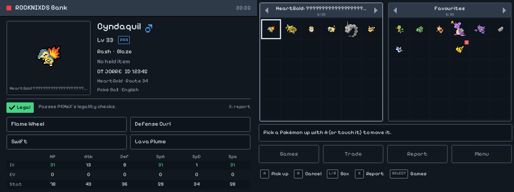
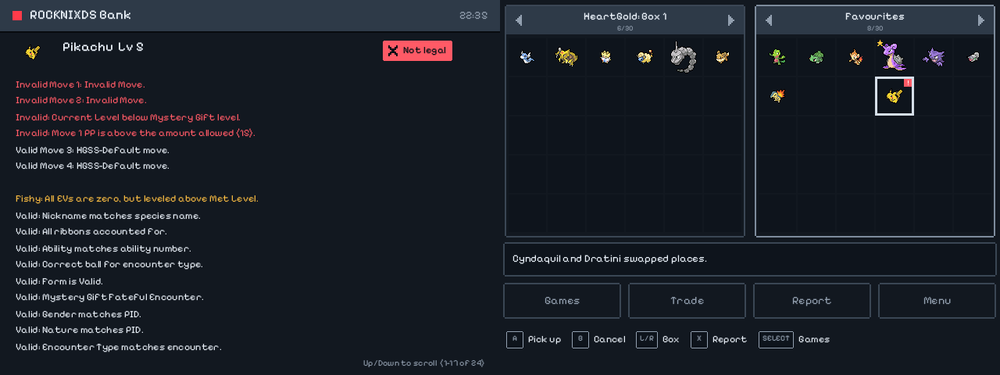
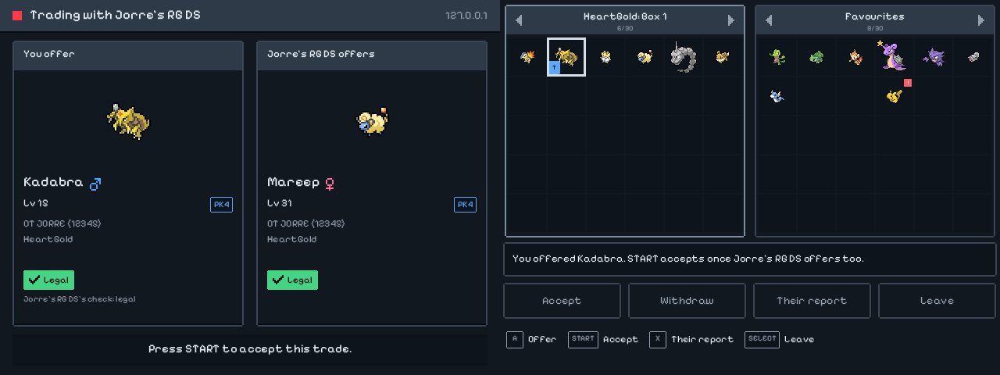
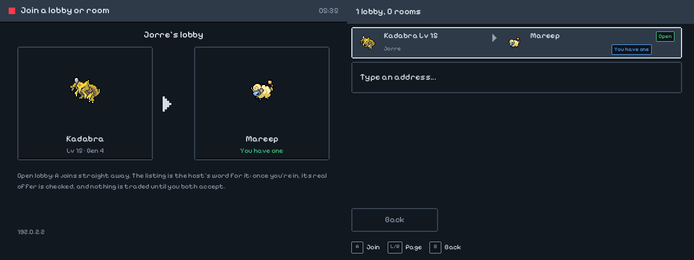

# ROCKNIXDS Bank & Trade

**A Pokémon bank, legality checker and trading app for the RG DS and RG DS Plus**, on both screens, built on
[PKHeX.Core](https://github.com/kwsch/PKHeX), the open-source library behind PKHeX: the same save reading and writing,
the same conversions between generations and the same legality analysis.

<p align="center">
  
</p>
<p align="center"><sub>The game's box on the left, the bank on the right, the Pokémon under the cursor on the top screen.</sub></p>

- **Reads your game saves** from the card: DraStic's `.dsv` next to the DS game (the DeSmuME footer is kept), `.sav`
  from melonDS and the GBA emulators, `.srm` from RetroArch. Generation 1 to 5 are what this handheld plays; PKHeX
  reads the later ones too.
- **Stores Pokémon in a bank** of 40 boxes (configurable), as plain PKHeX files (`.pk3`, `.pk4`, `.pk5`...), so they
  can be copied off over the network, opened in PKHeX on a PC, or dropped in from it.
- **Moves Pokémon from one game to another** through the bank. They change format only when they move up a
  generation, the way Pal Park (3 → 4) and Poké Transfer (4 → 5) did, and never back down. A Pokémon the destination
  can't hold (a species, move, item or form it doesn't have) is refused, with the reason.
- **Checks legality** with PKHeX's legality analysis: every Pokémon in sight is checked in the background; an illegal
  one gets a red mark, and its full report (the same one PKHeX shows) is one button away. Putting one that fails into a
  game asks first, or is refused altogether (a setting).
- **Trades between two handhelds** over Wi-Fi, peer to peer. A host can open a **lobby**: it lists a Pokémon to trade
  away and the species wanted for it, and every handheld on the network sees it in its Join list (an open lobby is
  joined with one tap). Or a **private room**: the host shows its address and a 6-character code, the partner types
  it. Both see each other's offer checked for legality before they accept. Trade evolutions happen on arrival
  (Kadabra, Haunter, Onix with a Metal Coat, Karrablast for Shelmet...), and an Everstone stops them, as in the games.

<p align="center">
  
</p>

<p align="center">
  
</p>

## Install

On the handheld, as root over ssh (password `rocknix`), with Wi-Fi on:

```sh
curl -fsSL https://raw.githubusercontent.com/JorreFog/ROCKNIXDS/main/bank/device/install-bank.sh | sh
```

It downloads the newest `bank-v*` release (about 24 MB, the .NET runtime included: nothing else to install), puts the
app in `/storage/.config/rocknixds/bank` and its entry in **Ports > ROCKNIXDS Bank**. The same command updates it;
`sh install-bank.sh --uninstall` removes it (the bank itself stays). Without network:
`BANK_TARBALL=/path/to/rocknixds-bank-<version>-aarch64.tar.gz sh install-bank.sh`.

## Use

**Close the game first.** Emulators write their own copy of the save when they quit, over whatever changed meanwhile.
And don't load a savestate made before moving Pokémon: it brings the old save back with it. (ROCKNIXDS's resume point
is dropped by itself, as it is whenever the save is newer.)

| | |
|---|---|
| **A** (or touch) | pick a Pokémon up, put it down (moving or swapping). Drag it with a finger. |
| **B** | put it back / take a trade offer back |
| **L / R**, d-pad on the box name | change box |
| **X** | the full legality report |
| **Y** | options: report, export a copy, rename a bank box |
| **SELECT** | choose the game save shown on the left |
| **START** | menu; in a trade, accept |
| **SELECT + START** | quit |

Every change is written straight away. The first change to a save in a session makes a backup of it, and every move
and trade is written to `history.log`. All of that is in the data folder, which is in the roms share so it can be
reached over the network like the games:

```
/storage/roms/rocknixds-bank/
  bank/01/07 - Pikachu.pk4   the bank: box 1, slot 8 (boxes.json: the box names)
  backups/<save file>/       the saves as they were (the newest 10 of each)
  import/                    PKHeX files put here go into free bank slots at the next start (Menu > Import)
  export/                    copies exported from the bank (Y > Export)
  history.log                every move and trade
```

Settings are in the app (Menu > Settings) and in `/storage/.config/rocknixds/bank.json`: the folders searched for saves
(`saveFolders`, `/storage/roms` by default), the number of bank boxes, the trade port (47900, and 47901 for finding
rooms), the name partners see, and the language of species, move and item names.

### Trading

<p align="center">
  
</p>

Both handhelds on the same network. There are two ways to meet:

- **Lobbies.** **Trade > Open a lobby**: choose the Pokémon to trade away, then the species you want for it (type the start
  of its name; or *Any Pokémon* to take offers), then who can join: anyone (*open*) or only with a code. The lobby is
  listed on every handheld on the network that opens **Trade > Join**, with both Pokémon, *Open* or *Code*, and *You have
  one* when you own the wanted species. An open lobby is joined with A, no code. Once in, the lobby's Pokémon is already
  offered; the Pokémon of yours it wants are framed in green; both screens say whether the offers match the lobby (what
  it asked for, and whether the host's real offer is the one it listed). The lobby stays open for the next visitor until
  its Pokémon has been traded.
- **Private rooms.** **Trade > Open a private room**: it shows the code and its address. The partner picks it in
  **Trade > Join** (or types the address) and types the code.

Then each side picks the Pokémon to offer with A, from the bank or the open game, and presses START to accept. The
Pokémon you receive goes into your bank; the one you gave leaves its box (the bank, or the game, which is written
straight away).

A lobby's listing is the host's word for it: anyone on the network can broadcast one. So what counts is the real offer
once you're in, which is checked like every offer (and against the listing), and nothing changes hands until both
accept. An open lobby's code travels with its listing: that's what makes it open, so its encryption keeps out
listeners but not other players, and it has no limit on attempts. A lobby with a code keeps it secret (it is never in
the listing) and closes after 5 wrong ones, like a private room.

How it's kept safe (`tests/Bank.Tests/SecurityTests.cs` attacks most of these):
- **The code proves the partner.** The handhelds turn it into a session key with SPAKE2, a password-authenticated key
  exchange: someone listening on the network can't work the code out from what they see. Every connection that gets
  as far as being able to test a guess counts, however it ends (a wrong answer, hanging up, or going quiet), and the
  room closes after 5. Everything after that is encrypted and authenticated (AES-256-GCM, a key per direction).
- **Only the local network.** A room takes connections from private, link-local and VPN (100.64/10, Tailscale)
  addresses only, never from the internet (a public IPv6 address, a forwarded port), unless `tradeAllowAnyAddress` is
  set in the settings file. A room is open only while its screen is, and room discovery listens only while the join screen is: otherwise
  the app listens on nothing.
- **Hard to block.** Handshakes run side by side, at most 2 per address and 8 in all, 10 seconds each, and frames
  before the code is proven are at most 4 KB: someone connecting and saying nothing (or a lot) can't keep the partner
  out. Room announcements on the network are capped and cleaned up, so made-up ones can't flood the list.
- **A partner can't hurt your handheld.** Messages are capped (64 KB, and a flood closes the connection); one legality
  check runs at a time; a Pokémon that isn't structurally sound (bad checksum, a species, form, move or item that
  doesn't exist in its format: glitch data that can corrupt an old game's save) is refused before anything else
  looks at it; whatever arrives, the worst that happens is that the trade closes. The partner's name and messages are
  shown and logged as one short line of printable text, the name is fixed at the start, and error details stay on the
  handheld.
- **Nothing is lost if the connection drops or the partner stalls.** Each side gives its Pokémon away only after the
  other has said it has it, so a dropped connection can at worst leave a copy on both sides; an exchange that doesn't
  finish within 30 seconds is given up the same way. Both accept the exact pair of Pokémon on the screens, and after
  the partner changes its offer, accepting waits 3 seconds: no swapping a Pokémon under a thumb already on START.
- **Legality is checked on the side that receives.** A partner's Pokémon that fails asks before you accept, or is
  refused altogether (a setting). Your own offer shows what the partner's check said.

What it can't do: a modified app on the other side can keep a copy of what it gives (that is its own Pokémon), or
lie about having received yours (then you still got theirs). And anyone on the network can close a private room (or a lobby with a code) by
using up its 5 guesses; open a new one for a new code. An open lobby can be joined by anyone on the network, by design.

## How it's built

| | |
|---|---|
| `src/Bank.Core` | saves (`Saves.cs`), the bank (`BankStore.cs`), moves and conversions (`Mover.cs`), legality, trade evolutions, the trade protocol (`Trade/`: SPAKE2, the encrypted channel, the trade's state machine, the host/join/LAN discovery) |
| `src/Bank.App` | the dual-screen app on SDL2: one window over both panels (as the ROCKNIXDS menu's), drawn at each panel's resolution (1× on the RG DS, 1.6× on the Plus) in ROCKNIXDS Pixel's colours and font; the pad read from its evdev node, touch on the bottom panel |
| `tests/Bank.Tests` | xUnit: saves made from scratch for each generation (no game data in the repository), the `.dsv` footer, the bank, conversions, legality, trade evolutions, SPAKE2, whole trades over loopback including dropped connections |
| `device/` | the launcher, the Ports entry, the installer |
| `build.sh` | the handheld's package: self-contained linux-arm64, ReadyToRun, the runtime trimmed |

Build and test on a PC with the .NET 10 SDK:

```sh
dotnet test bank/tests/Bank.Tests
sh bank/build.sh                                  # dist/rocknixds-bank-<version>-aarch64.tar.gz
sh bank/tools/fetch-assets.sh                     # the font and PKHeX's sprites, for running from the source
dotnet run --project bank/src/Bank.App -- --demo /tmp/bank-demo   # a sandbox with made-up saves, in a window
```

`--layout stack|side|plus` picks the window's shape on a PC; on the handheld it follows sway's outputs. Keyboard: arrows,
Z = A, X = B, S = X, A = Y, Q/W = L/R, Backspace = SELECT, Space = START. `--script FILE --shots DIR` runs without a display
and takes screenshots (the pictures above were made that way, and two app instances traded with each other for the
second one).

A release is a `bank-v<version>` tag matching `VERSION`: `.github/workflows/bank.yml` tests, builds and publishes it as a
pre-release (never "latest", so ROCKNIXDS's own updater doesn't take it for a ROCKNIXDS release).

## Limits

- Pokémon in the party stay where they are: deposit them in a box in the game first.
- The bank keeps any format; a game takes what it can hold. Gen 1/2 Pokémon go between Gen 1 and Gen 2 games (and the
  bank), not up to Gen 3-5, as in the real games.
- Trading needs both handhelds on one network that lets them reach each other (some guest Wi-Fi networks don't).
  Discovery uses UDP broadcast; typing the address works where broadcast doesn't (a VPN, another subnet).
- The legality check is PKHeX's: it is very thorough, and like PKHeX it can't prove that a Pokémon wasn't edited into
  something the game could have made.

## License

GPL-3.0 (`LICENSE`), because it links PKHeX.Core; the rest of ROCKNIXDS stays MIT. `THIRD_PARTY.md` lists the parts from
others. Pokémon and its names are trademarks of Nintendo, Creatures and GAME FREAK: this is a fan-made tool for your
own saves, not affiliated with them.
