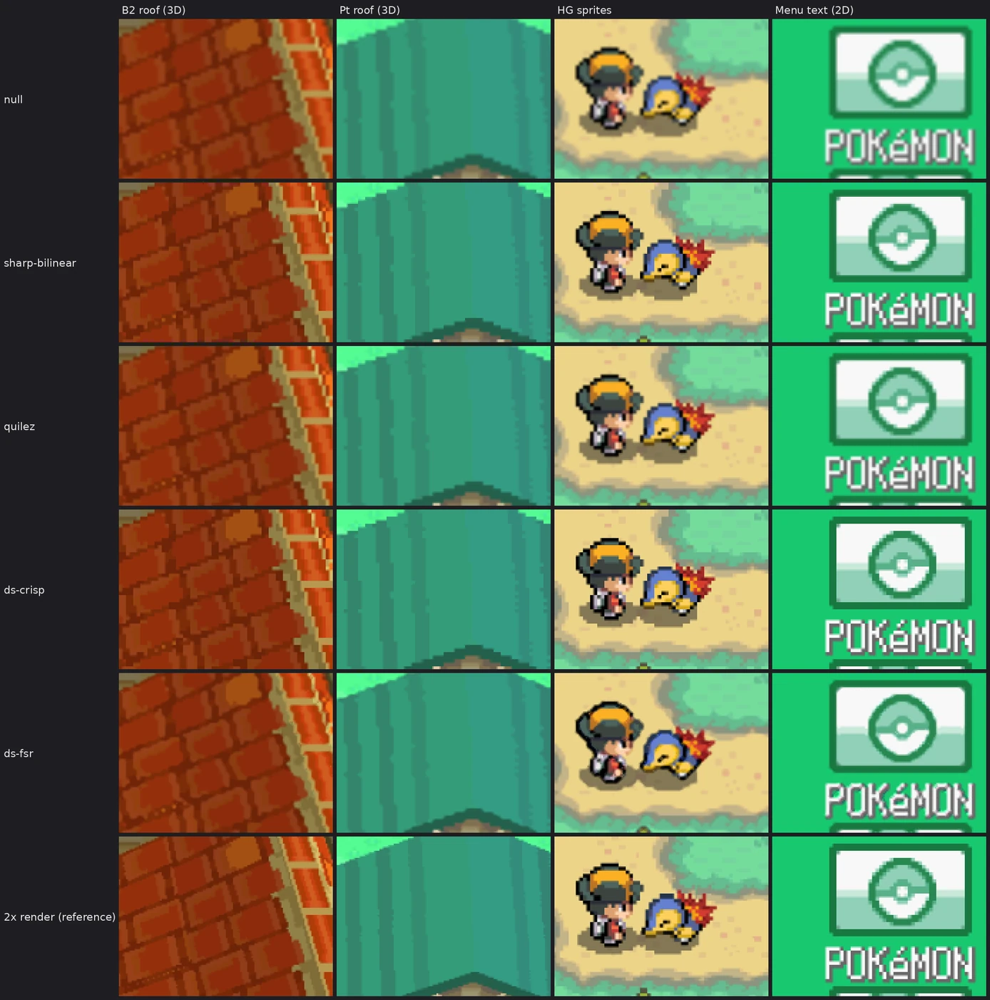
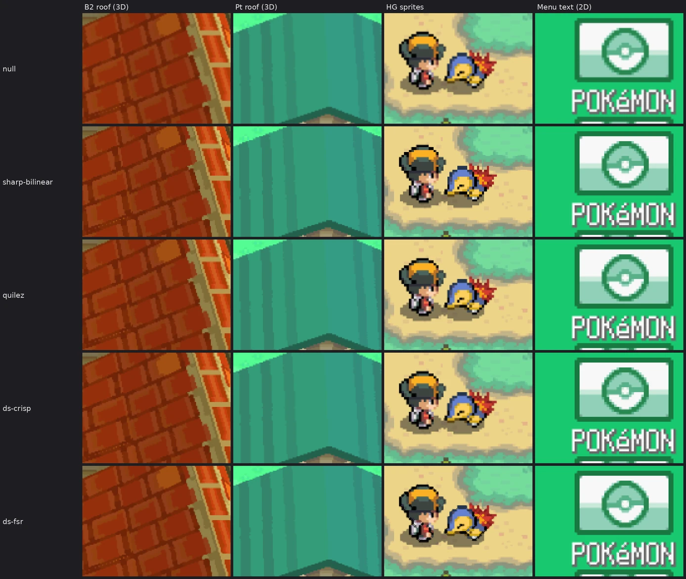

# Does ds-fsr look better? A comparison of the DraStic filters

Measured 2026-09-29 on the RG DS. Short answer: **at 2× (hires 3D, the default) no, and it costs 8-9× the GPU time
of ds-crisp. At 1× it does something real: 3D edges come out smoother and closer to what the 2× render shows,
at the price of slightly rounded pixel art.**

## How

- **Frames:** Pokémon HeartGold, Black 2 and Platinum, each loaded from the same savestate at 1× and at 2×, and
  DraStic's own frames dumped with no shader (isolated copies of the ROM, save and state). Top screens are 3D scenes;
  bottom screens are 2D menus (at 2× DraStic just doubles 2D pixels).
- **Filters:** every shader rendered on the device's GPU with `shtest` from those exact frames, 640×480 per panel.
  `null` is a pass-through sampled bilinearly: what the default mode's hardware scaler does.
- **Two references:**
  - *Faithful*: each DS pixel drawn as an exact square of 2.5×2.5 (or 1.25×1.25) panel pixels, antialiased by coverage.
    What the game drew, nothing invented. ds-crisp computes exactly this, so it scores perfectly here by design;
    it is the yardstick for "true to the source", not for "looks best".
  - *Real detail* (1× top screens only): the same moment rendered by DraStic at 2×. The fairest test of an
    upscaler: how much of the missing detail does it get back from the 1× frame?
- **Measures:** PSNR and SSIM (luma) against the references; *sharpness* = edge strength relative to the faithful
  squares (1.00 = as crisp as the source, lower = blurred, higher = sharpened); *overshoot* = how far output colours
  go outside the 2×2 source pixels around them (halos, 0-255); *round trip* = PSNR of the output shrunk back to the
  source size against the source. Averages of the three games. Data and scripts: [`data/filters/`](data/filters).

## 1× input: the 3D top screen

| filter | vs 2× render: PSNR | SSIM | vs faithful: PSNR | SSIM | sharpness | overshoot | round trip |
|---|---|---|---|---|---|---|---|
| bilinear (default) | **26.24** | **0.865** | 32.41 | 0.956 | 0.91 | 0.00 | 31.45 |
| sharp-bilinear | 25.51 | 0.849 | 41.60 | 0.995 | 0.99 | 0.02 | 35.76 |
| sharp-shimmerless | 25.29 | 0.842 | 52.15 | 1.000 | 0.99 | 0.03 | 36.67 |
| quilez | 25.86 | 0.857 | 37.83 | 0.988 | 0.97 | 0.01 | 34.49 |
| ds-crisp | 25.24 | 0.841 | 73.81 | 1.000 | 1.00 | 0.00 | 37.13 |
| **ds-fsr** | 25.59 | 0.855 | 33.53 | 0.971 | **1.06** | 0.00 | 33.90 |

- Against the real 2× render all of them are within **1 dB**: none of them recovers the detail a 2× render has.
  Rendering at 2× is worth far more than any filter.
- ds-fsr lands between the soft and the sharp filters: closer to the 2× render than ds-crisp (SSIM 0.855 vs 0.841),
  while being the only one that is *sharper* than the source (1.06). Plain bilinear is closer still (0.865), but
  it gets there by blurring, which these measures forgive.
- No halos from any of the scalers (overshoot 0.00-0.03): ds-fsr's clamp works.

What the eye sees (3× zoom): ds-fsr turns the stair-steps on the roofs' diagonal edges into smooth lines, the one
place it clearly beats ds-crisp and looks most like the 2× render. On sprites and text it rounds corners and thins
single-pixel details (the Cyndaquil outline, the letters), where ds-crisp keeps the pixel art exact.

## 2× input (hires 3D): what you play with

| filter | vs faithful: PSNR | SSIM | sharpness | overshoot | round trip |
|---|---|---|---|---|---|
| bilinear (default) | 44.04 | 0.997 | 0.98 | 0.00 | 33.46 |
| sharp-bilinear | 39.00 | 0.992 | 1.02 | 0.04 | 34.20 |
| sharp-shimmerless | 49.26 | 0.999 | 1.00 | 0.02 | 34.00 |
| quilez | 45.04 | 0.998 | 1.01 | 0.02 | 34.37 |
| ds-crisp | 70.53 | 1.000 | 1.00 | 0.00 | 34.21 |
| **ds-fsr** | 38.66 | 0.992 | 1.05 | 0.00 | 33.83 |

At 2× the panel is only 1.25× the source, so there is almost nothing to reconstruct: every scaler is within SSIM
0.992-1.000 of the faithful image, and the zoomed crops are practically indistinguishable. ds-fsr changes the image
the most (it sharpens edges by ~5%), which is not a visible gain at this scale.

## Pixel art (the 2D bottom screen)

At 1× ds-crisp is exact (by definition), sharp-shimmerless next (59.9 dB), ds-fsr 50.5 dB with the rounded corners
seen above, bilinear 44.5 dB (soft). At 2× the 2D is already doubled pixels and every scaler is effectively exact.

## Cost

GPU time per 640×480 panel (1.4 report, 800 MHz): ds-crisp 0.57 ms, ds-fsr 4.3-5.3 ms, and the session runs the GPU
at its full clock for ds-fsr. That is 8-9× the GPU work (and battery) for the 2× case, where it buys nothing visible.

## Verdict

- **Hires 3D on (default):** use ds-crisp (or the default bilinear for zero GPU work). ds-fsr costs a lot and
  changes nothing you can see.
- **Hires 3D off (1×, e.g. for a game that can't hold 60 at 2×):** ds-fsr is the best-looking choice for 3D-heavy
  scenes (smooth edges without the blur of bilinear); ds-crisp for 2D-heavy games and pixel-exact text.
- The *-color*, grid, LCD and scanline shaders are looks, not scalers; they score low on these measures by design.

Follow-up worth doing: have ds-fsr fall back to the ds-crisp path when its input is 2× (same picture, a ninth of the
GPU time), and say "for 1×" in its ES label.
