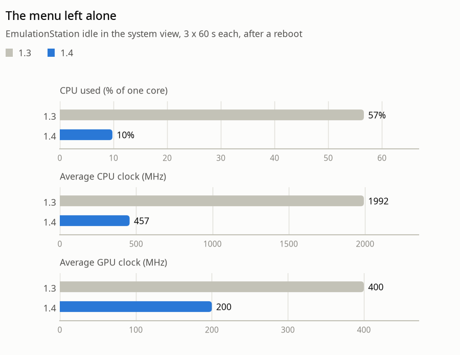
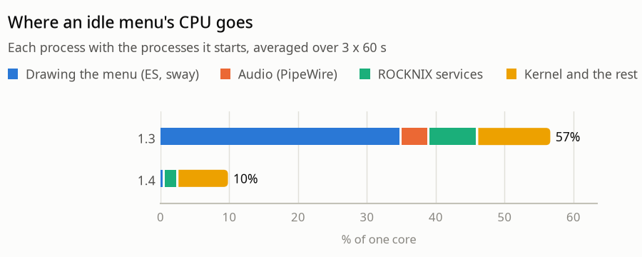
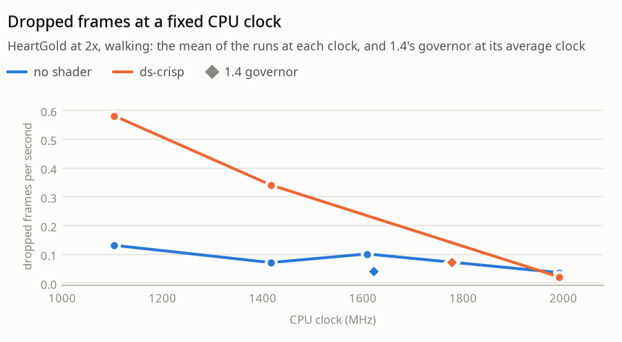
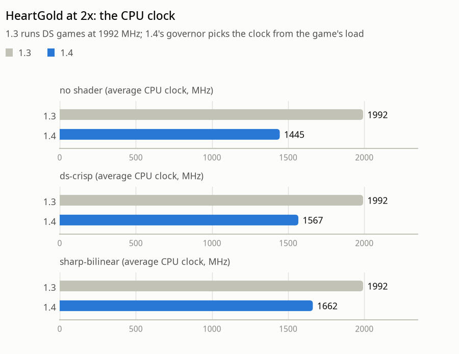
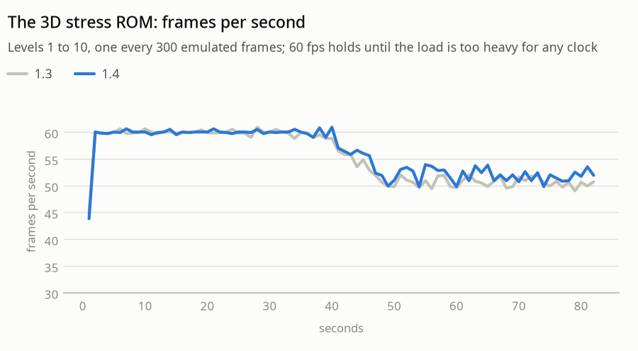
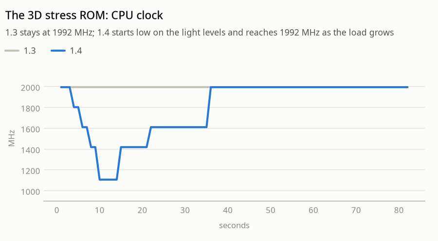
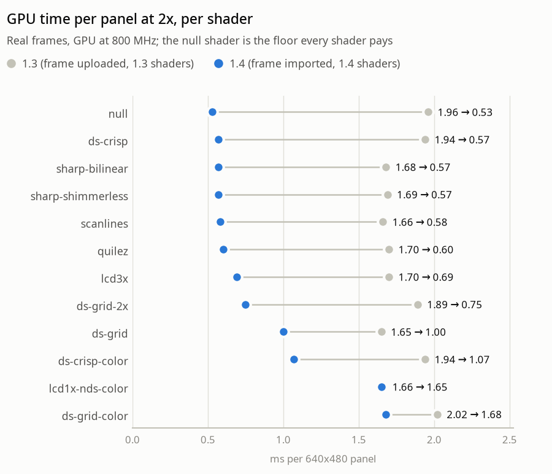
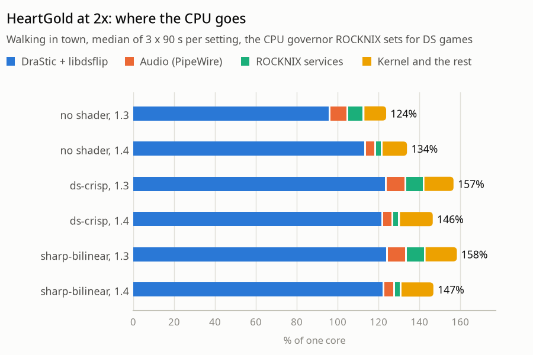

# ROCKNIXDS 1.4: the optimization work

1.4 set out to make the same games and menus cost less: less CPU, a cooler handheld and longer battery life, without
dropping a frame more than 1.3 did. This document collects every change that went into that, how each one was
measured on the RG DS, and what didn't work. The headline comparison was measured the same way for both releases:
each version installed with its public install command, the device rebooted, and the same measurement suite run
(details in [How it was measured](#how-it-was-measured)).

## At a glance

| Measured on the RG DS | 1.3 | 1.4 |
|---|---|---|
| Menu left alone: CPU used | 57% of one core | **10%** |
| Menu left alone: CPU clock (average) | 1992 MHz | **457 MHz** |
| Menu left alone: GPU clock | 400 MHz | **200 MHz** (its lowest) |
| Menu left alone: processes started | 18.6 a second | **3.4** |
| HeartGold 2x: CPU clock (no shader / ds-crisp / sharp-bilinear) | 1992 / 1992 / 1992 MHz | **1445 / 1567 / 1662 MHz** |
| HeartGold 2x: dropped frames per second (same three, median of 3 runs) | 0.02 / 0.07 / 0.09 | 0.02 / 0.04 / 0.11 |
| HeartGold 2x with a shader: battery current (ds-crisp / sharp-bilinear) | -414 / -417 mA | **-308 / -315 mA** |
| GPU time per panel, ds-crisp at 2x | 1.94 ms | **0.57 ms** |
| Game audio | 8.4% of one core | **4.8%** |
| ROCKNIX's services during a game | 8.1% of one core | **3.2%** |
| Starting a game (first frame) | 3.44 s | 3.47 s |
| Quitting to a visible menu | 4.47 s | 5.26 s (see [Still open](#still-open)) |

Smoothness didn't change: 1.3 and 1.4 drop the same few frames. The biggest single change is the menu, where the
device spends a lot of its time: a menu that nobody touches now costs a sixth of the CPU it did, at less than a
quarter of the clock, and the battery charges on a supply where 1.3 drained it (+82 mA against -101 mA).

**Contents:** [How it was measured](#how-it-was-measured) · [The menu](#the-menu) · [DS games](#ds-games) ·
[Bugs found on the way](#bugs-found-on-the-way) · [Tried and not kept](#tried-and-not-kept) ·
[Still open](#still-open) · [Reproducing the numbers](#reproducing-the-numbers)

## How it was measured

Everything was measured on the device itself: an Anbernic RG DS (RK3566, 4x Cortex-A55 up to 1992 MHz, Mali-G52 up
to 800 MHz) on ROCKNIX 20260901. The tools are in [`tools/`](../tools):

- **`powerprobe.py`** measures a window of time on the device: CPU use (`/proc/stat`), the time at each CPU clock
  (cpufreq stats) and GPU clock (devfreq `trans_stat`), the SoC temperature, the battery current, every thread's CPU,
  and every process's CPU *including the processes it starts* (a polling script that starts `cat` or `awk` every
  second hides most of its cost in those short-lived children).
- **`power.sh` / `hgpower.sh`** run one measured DS session: Pokémon HeartGold at 2x internal resolution, loaded from
  a savestate and walking around town by injected d-pad presses, through the installed libdsflip, with the GPU
  clock set the way the game session sets it. The run uses a separate copy of the ROM, the savestate and the save
  file, so the real save is never written.
- **`shaders.sh` / `shbench.sh`** time each shader on the GPU at a fixed clock with real frames from a game.
- **`stressgov.sh`** runs `dsstress`, the 3D stress ROM in [`stressrom/`](../stressrom), whose load steps up from
  level 1 to 10.
- **`switchtime.sh`** times starting and quitting a game.
- **`opt-suite.sh`** runs all of the above for the installed version, and **`opt-charts.py`** draws this document's
  charts and tables from the results in [`docs/data/opt-1.4/`](data/opt-1.4).

Things to keep in mind when reading the numbers:

- **CPU is given in "% of one core"**: 100% is one core fully busy, 400% all four.
- **Dropped frames vary a lot from launch to launch**, so every game setting was run three times and the tables
  give the median, with each run listed.
- **The device warms up over a suite** (about 51 °C at the start, mid-60s after the game runs). Both versions were
  started from the same temperature and measured in the same order.
- **Battery current is indicative only.** The device stayed on a weak USB supply during all tests, so the battery
  current is what the charger delivered minus what the device used. A change in use shows up in it, but so does
  the battery's own charge state; CPU, clocks and temperature are the cleaner measures.

## The menu

In 1.3, an EmulationStation menu that nobody touched kept more than half a core busy, with all four cores held at
1992 MHz. Nothing on screen changed, so nearly all of it was waste, and it came from many places at once:

1. **Animations that never stopped.** The theme had four looping animations: the background grid's slow drift,
   the START frame's pulse (in two places) and the logo's glow. While anything animates, ES draws 60 frames a
   second and sway composites every one of them. Each one now runs a few cycles and starts again when you move:
   the drift twice, the START frames four pulses, the glow three. About 12 seconds after the last button press,
   the menu is still.
2. **ES's power saver.** Its default mode still draws 25 frames a second once the menu is idle. The installer now
   sets it to *enhanced* (only if it was on ES's default, and uninstall puts it back), where an idle menu draws
   nothing at all.
3. **Checking for input a thousand times a second.** With a gamepad open, SDL can't sleep in
   `SDL_WaitEventTimeout`; it checks for input every millisecond instead. ES woke up ~760 times a second while
   "idle". The patched ES (`es-rgds-powersaver.patch`) checks once per frame instead (~66 times a second), so the
   first press after idling is still answered within a frame.
4. **A clock that froze.** With ES asleep, the theme's clock and battery display stopped updating. The patch wakes
   ES at each full minute, once.
5. **Audio streaming silence.** ES keeps its audio device open, and SDL streams silence into PipeWire nonstop: ~13%
   of a core, with the speaker amplifier powered. The patch closes it after a minute without input and under the
   screensaver, and opens it again with the next input. Reopening takes 60-100 ms, which is why it waits a minute
   instead of closing at every short pause.
6. **The screensaver.** Under the black or dim screensaver, ES woke every 100 ms (to poll lightguns, which the RG DS
   doesn't have) and drew a frame each time: 6.75% of a core. It now wakes once a minute: 0.9%.
7. **All cores at full clock.** ROCKNIX runs the menus with the `performance` governor: its boot applies the
   `system.cpugovernor` setting (which is also the default for games) and its launcher switches back to performance
   after every game. `menu-power.sh` puts the menus on `schedutil`, which follows the load, from ES's start scripts
   and after every game. Games still get ROCKNIX's per-system setting when they start.
8. **ROCKNIX's battery LED monitor.** A shell loop that starts about 12 processes a second (`cat` for two files,
   `awk` twice for one setting, subshells and `sleep`): 6.5% of a core including those processes. 1.4 replaces it with
   `battery-led-status`, which does the same job with shell built-ins: 0.4%, most of which is the kernel reading the
   fuel gauge. A systemd drop-in points ROCKNIX's service at it, and it hands back to ROCKNIX's own script whenever
   that script isn't the exact version it was copied from, so a ROCKNIX update is never masked.

<picture>
  <source media="(prefers-color-scheme: dark)" srcset="img/opt-1.4/idle-dark.png">
  
</picture>

<picture>
  <source media="(prefers-color-scheme: dark)" srcset="img/opt-1.4/idle-split-dark.png">
  
</picture>

| The menu left alone (3 x 60 s after a reboot) | 1.3 | 1.4 |
|---|---|---|
| CPU used (% of one core) | 56.6 | 9.8 |
| Average CPU clock (MHz) | 1992 | 457 |
| Average GPU clock (MHz) | 400 | 200 |
| SoC temperature at the end (°C) | 52.1 | 47.8 |
| Processes started per second | 18.6 | 3.4 |
| Battery current (mA, on the charger; + = charging) | -101 | +82 |
| Of the CPU: drawing the menu (ES, sway) | 35.0 | 0.6 |
| Of the CPU: audio (PipeWire) | 4.0 | 0.0 |
| Of the CPU: ROCKNIX services (LED monitor, powerstate, touchscreen keyboard) | 7.1 | 2.0 |
| Of the CPU: kernel and the rest | 10.5 | 7.2 |

What's left in 1.4 is mostly the kernel's own work and ROCKNIX's `powerstate` service, which gets the same
treatment as the LED monitor in a later release.

One regression turned up on the way and was fixed before release: in the power saver's standby, work posted to ES's
main thread by its HTTP API (a game launch, a message box) waited for the next wake-up, up to a minute. Stock ES's
*enhanced* mode has the same gap (it waits for the screensaver instead). The patch now wakes ES for it.

## DS games

### A CPU governor inside libdsflip

ROCKNIX runs DS games with the `performance` governor: all cores at 1992 MHz for the whole session. HeartGold at 2x
needs much less most of the time; its busiest thread is about 46% busy at that clock.

A fixed lower clock isn't the answer, though. Lower clocks drop frames: not because DraStic runs out of time on
average, but because its frame timing (paced by the audio) gets more uneven, and a frame that arrives late makes
DraStic catch up with a burst, which the display queue has to drop from. With the `ds-crisp` shader, 1416 MHz
dropped 0.24-0.44 frames a second instead of 0.00-0.04. The kernel's own `schedutil` governor isn't the answer
either: DraStic's several busy threads keep it at an average of 1771 MHz.

<picture>
  <source media="(prefers-color-scheme: dark)" srcset="img/opt-1.4/clock-sweep-dark.png">
  
</picture>

| Setting (development runs, HeartGold 2x) | CPU clock (MHz) | Dropped frames/s, each run |
|---|---|---|
| no shader, fixed clock | 1104 / 1416 / 1608 / 1992 | 0.13 / 0.07 / 0.10 / 0.00 and 0.07 |
| ds-crisp, fixed clock | 1104 / 1416 / 1992 | 0.90 and 0.26 / 0.44 and 0.24 / 0.00 and 0.04 |
| no shader, `schedutil` | 1771 average | 0.10 |
| no shader, 1.4's governor | 1622 average | 0.04 |
| ds-crisp, 1.4's governor | 1778 average | 0.07 |

So libdsflip picks the clock itself (`dsflip/cpugov.c`). Every 250 ms it looks at the busiest DraStic thread's load,
the heaviest single frame's CPU time on DraStic's main thread, the frame rate over the last second and the frames the
display queue dropped:

- **Up at once** when a window needs it: a thread over 85% busy, a frame over 95% of a refresh, any dropped frame,
  or the game below full speed.
- **Down one step** only after two seconds in which every window would have fit lower, never while the game runs
  below full speed, and never back to a clock that dropped a frame in the last 30 seconds (60, 120 ... up to 10
  minutes if it drops again there).
- Between **1104 MHz** (816 MHz dropped frames even in a still scene) and the top clock. `DSFLIP_CPUGOV=0` turns it
  off; the game session saves the clock limit and puts it back afterwards.

Average load alone wasn't enough: at 816 MHz a still HeartGold scene dropped frames with its heaviest frame at only
40% of a refresh. That's why every dropped frame moves the clock up.

<picture>
  <source media="(prefers-color-scheme: dark)" srcset="img/opt-1.4/game-clock-dark.png">
  
</picture>

| HeartGold 2x (median of 3 x 90 s) | Version | Avg CPU clock (MHz) | Avg GPU clock (MHz) | Dropped frames/s | Battery (mA) |
|---|---|---|---|---|---|
| no shader | 1.3 | 1992 | 200 (idle) | 0.02 | -258 |
| no shader | 1.4 | 1445 | 200 (idle) | 0.02 | -240 |
| ds-crisp | 1.3 | 1992 | 400 | 0.07 | -414 |
| ds-crisp | 1.4 | 1567 | 400 | 0.04 | -308 |
| sharp-bilinear | 1.3 | 1992 | 400 | 0.09 | -417 |
| sharp-bilinear | 1.4 | 1662 | 400 | 0.11 | -315 |

Dropped frames in each run: no shader 1.3 0.02, 3.76, 0.00 and 1.4 0.04, 0.02, 0.00; ds-crisp 1.3 0.07, 0.09, 0.02
and 1.4 0.04, 0.04, 0.07; sharp-bilinear 1.3 0.09, 0.04, 0.16 and 1.4 0.00, 0.11, 0.15. The 3.76 was all display
queue drops through one 1.3 run at full clock: a launch where DraStic's timing happened to sit badly against the
panels' refresh, which happens now and then with any version.

The governor finds its level in the first minute of a session by trying lower clocks. A clock that turns out too
low costs 2-4 frames once, and is then avoided for longer each time. In a short session that shows as a few more
dropped frames than at full clock; over 90 s it evens out. Smarter probing is on the list for the next update.

With no shader the battery current barely changes: without a shader, 1.3 already had the GPU at its lowest clock
and the CPU's saving is partly used up by the same work taking longer at a lower clock (the CPU is busy a larger
share of the time: 135% of one core against 124%). With a shader both clocks drop and ~100 mA is saved.

<picture>
  <source media="(prefers-color-scheme: dark)" srcset="img/opt-1.4/stress-fps-dark.png">
  
</picture>

<picture>
  <source media="(prefers-color-scheme: dark)" srcset="img/opt-1.4/stress-clock-dark.png">
  
</picture>

On the stress ROM's heaviest levels, which no clock can run at full speed, 1.4 matches 1.3 (51.9 against 50.6 fps
over the last 30 s): the governor goes to the top clock and stays there. On the light levels it runs at 1104-1600
MHz. Averaged over the ramp: 1795 MHz against 1992.

### Shaders read DraStic's frames directly

Timing every shader on the GPU gave a surprise: almost all of them cost the same as a shader that does nothing. The
time went into *uploading* DraStic's frame into a GPU texture (glTexSubImage2D, about 1 ms per panel at 2x) and into
writing the panel, not into the shader's math. libdsflip already had a mode that imports DraStic's buffers as
dma-bufs instead (the GPU reads them where DraStic wrote them); it now is the default. In a game with `ds-crisp`, the
shader thread went from 17% to 5.5% of a core, with the same dropped frames (0.04 and 0.02 per second in two runs,
against 0.04 and 0.00 with the upload). `DSFLIP_SHADER_COPY=1` brings the upload back.

<picture>
  <source media="(prefers-color-scheme: dark)" srcset="img/opt-1.4/shaders-dark.png">
  
</picture>

| Shader (ms per panel, GPU at 800 MHz) | 1.3, 2x | 1.4, 2x | 1.3, 1x | 1.4, 1x |
|---|---|---|---|---|
| null (reads the frame, no filtering) | 1.96 | 0.53 | 1.05 | 0.45 |
| ds-crisp | 1.94 | 0.57 | 1.11 | 0.49 |
| sharp-bilinear | 1.68 | 0.57 | 0.89 | 0.47 |
| sharp-shimmerless | 1.69 | 0.57 | 0.88 | 0.50 |
| scanlines | 1.66 | 0.58 | 0.92 | 0.53 |
| quilez | 1.70 | 0.60 | 0.90 | 0.52 |
| lcd3x | 1.70 | 0.69 | 0.91 | 0.69 |
| ds-integer (new in 1.4) | | 0.70 | | 0.66 |
| ds-grid-2x | 1.89 | 0.75 | 0.90 | 0.75 |
| ds-grid | 1.65 | 1.00 | 1.12 | 1.00 |
| ds-crisp-color | 1.94 | 1.07 | 1.66 | 1.07 |
| lcd1x-nds-color | 1.66 | 1.65 | 1.64 | 1.64 |
| ds-grid-color | 2.02 | 1.68 | 2.01 | 1.68 |
| ds-fsr (new in 1.4) | | 4.28 | | 4.28 |

The 1.3 column is 1.3's shader files with the frame uploaded, the 1.4 column 1.4's files with the frame imported,
measured one after the other on real HeartGold frames. Absolute times vary by up to ~20% between sessions (the
device's temperature), so compare within a column pair, not with other sessions' numbers. `lcd1x-nds-color`
(ROCKNIX's shader) is the exception: its math keeps the GPU busy for longer than the upload took, so taking the
upload away doesn't shorten it.

### Cheaper shader math

With the upload gone, the real per-shader costs showed:

- **ds-grid**'s LCD grid decides, for each output pixel, whether a DS pixel boundary falls inside it. The old code
  snapped to the nearest boundary with eight operations per line and four lines per pixel. "The first boundary at or
  after this pixel is before the next pixel" (`ceil(p / scale) * scale < p + 1`) is the same decision, and all four
  lines fit in one vec4. The output is bit-identical (checked on real frames, and for every pixel at scales from
  2.5 to 7.5, also with the division done as a slightly rounded reciprocal), and the shader is 11% faster.
- **ds-crisp-color** and **ds-grid-color** apply the DS screen's colours (two gamma curves around a 3x3 channel
  mix). They were limited by 32-bit arithmetic, not by `pow()`: a 32-bit version with polynomials instead of `pow()`
  took just as long. In 16-bit precision with both curves as polynomials, ds-crisp-color went from 1.33 to 1.06 ms
  per panel (measured in the same run). This one isn't bit-identical: on real frames up to 20% of pixels differ by
  1 level of 255 and 0.007% by 2, which can't be seen. The two files are now generated from ds-crisp.frag and
  ds-grid.frag by `tools/gen-color-shaders.py`.

### Game audio at 44.1 kHz

PipeWire ran its graph at 48 kHz in cycles of 256 samples (DraStic's 7.5 ms ALSA periods set that) and resampled
DraStic's 44.1 kHz stream in every cycle: 9.3% of a core at 1608 MHz. ROCKNIX's volume keys change PipeWire's volume,
so the audio has to keep going through PipeWire. But the game session now switches PipeWire's graph to 44.1 kHz for
the session (`clock.force-rate`), and back afterwards: 4.9%, with the audio as steady as before. It's set before
DraStic opens its audio; switching in the middle of a session left the audio timing uneven for the rest of it.

| Game audio (HeartGold, 1608 MHz, 90 s) | Audio threads (% of one core) | Dropped frames/s | Audio buffer range |
|---|---|---|---|
| 48 kHz (1.3) | 9.3 | 0.00 | 1280-1792 samples |
| **44.1 kHz (1.4)** | **4.9** | 0.04 | 1280-1792 samples |
| 48 kHz, 60 ms ALSA buffer | ~5.5 | 0.18 | 1024-2048 samples |
| 44.1 kHz, 60 ms ALSA buffer | ~2.6 | 0.18 | 1024-2048 samples |

### Where the CPU goes in a game

<picture>
  <source media="(prefers-color-scheme: dark)" srcset="img/opt-1.4/game-split-dark.png">
  
</picture>

DraStic's own share rises when the clock falls (the same work takes a larger share of a slower clock), while audio
and ROCKNIX's services shrink: audio from 8.4-9.5% to 4.8-5.1% of a core, the services from 8.1-9.0% to 3.2%. The
bars add up the medians of each part, so their totals can differ by a percent from the table above, which takes
the median of each run's total.

## Bugs found on the way

- **An interrupt storm after DS games.** Stopping sway for a game while its buffers were still being shown let the
  display controller read memory that had just been freed (an IOMMU page fault). One video port then looped on
  `POST_BUF_EMPTY` errors: about 84,000 interrupts a second on one core, roughly 60% of a core in games *and* in the
  menus, until the next reboot. It happened once in about 40 game starts during testing. The game session now
  switches the panels off through sway before stopping it, and after every game the session checks the display
  controller's interrupt rate and power-cycles the panels if it is storming (that cleared it: 84,618 -> 93 per
  second).
- **ROCKNIX's `powerstate` service overrode the game's GPU clock.** It re-applies a GPU profile whenever the battery
  status flips between charging and discharging, which happens when you plug in or unplug during a game, and
  constantly on a weak charger. A game without a shader could end up with the GPU pinned at 800 MHz doing nothing.
  The session now checks every 2 seconds (the same interval) and puts its own setting back.
- **The menu governor at boot.** A first version set the menus' governor from an autostart hook, but ROCKNIX's
  autostart applies its own governor as its very last step, after the hooks. It now runs when ES starts.

## Tried and not kept

- **A lower GPU clock floor with shaders.** Light shaders were as smooth at 200 MHz as at 400, but `ds-grid-color`
  dropped more frames in one run, the heavy shaders average 530-600 MHz whatever the floor, and at these clocks the
  GPU most likely runs at its lowest voltage anyway. The 400 MHz floor stays.
- **Bigger audio buffers.** Fewer wake-ups, but a burstier drain that DraStic's timing follows (0.18 dropped
  frames a second) and more audio latency.
- **Bypassing PipeWire for game audio.** It would save a few percent more, but ROCKNIX's volume keys set PipeWire's
  volume, so they would stop working in games.
- **A fixed lower CPU clock, or `schedutil`, for DS games.** See [the governor](#a-cpu-governor-inside-libdsflip).
- **16-bit `pow()` in the colour shaders.** Slower than 32-bit (1.72 against 1.65 ms): the math wasn't the part
  that 16-bit made faster, the polynomials were.

## Still open

- **Quitting a game is ~0.8 s slower than in 1.3** before the menu shows (5.26 s against 4.47 s; ES answers 3.51 s
  after the game ends against 2.65 s). Starting a game is as fast as in 1.3 (first frame 3.47 against 3.44 s).
  Startup and shutdown speed are the next update's first item.

| Switching (median of 3 cycles, seconds) | 1.3 | 1.4 |
|---|---|---|
| Launch: libdsflip has the display | 2.83 | 2.85 |
| Launch: first frame | 3.44 | 3.47 |
| Quit: the menu answers | 2.65 | 3.51 |
| Quit: the menu is visible | 4.47 | 5.26 |

- **ROCKNIX's `powerstate` service** is a shell loop of the same kind as the LED monitor: ~3% of a core, more on
  battery. It gets the same treatment in a later release.
- **Skipping frames that didn't change** when a shader is on. DraStic's buffers are uncached memory, so reading them
  back to compare costs more CPU than shading them costs GPU.
- **ds-fsr** still takes 5.3 ms per panel. A two-pass version that analyses each source pixel once, instead of once
  per output pixel, could roughly halve that.
- **Other systems** (RetroArch cores and the rest) keep ROCKNIX's own settings; the test device has no games for
  them to measure with. The menu changes help every system, since you spend time in the menus either way.

## Reproducing the numbers

With the device reachable over ssh (`RGDS_SSH` can name an ssh wrapper) and ES idle:

```sh
tools/opt-suite.sh v1.4 docs/data/opt-1.4/v1.4        # ~30 min: idle menu, HeartGold runs, stress ROM, switch times
FRAMES=<dir with top/bot 1x/2x frame dumps> tools/shaders.sh          # GPU time per shader
python3 tools/opt-charts.py                             # charts into docs/img/opt-1.4/, tables into docs/data/opt-1.4/summary.md
```

The frame dumps for `shaders.sh` are game pictures, so they aren't in the repository: dump your own with
`kill -USR2 $(pidof drastic.real)` during a game with no shader (libdsflip writes both panels' scanout buffers to
`/storage/dsflip/logs/`, and without a shader those are DraStic's own 512x384 or 256x192 frames).
