# Döda Kvarter

**A zombie roguelike for both screens of the Anbernic RG DS, set in a Swedish suburb at night.** The top screen is
the game, seen from above; the bottom screen is your inventory: health and armour, the gun in your hand and its
ammo, perks, the bag, and a map of the town. It plays like Call of Duty Zombies (rounds that never end, kronor for
every hit, barricades to buy your way through, a Mystery Box, perks, the power and the Pack-a-Punch), and every run
is a new town with loot that gets better as the rounds get harder.

<p align="center">
  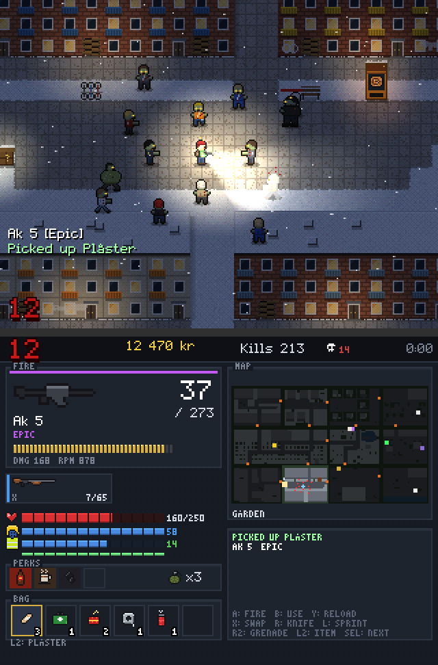
  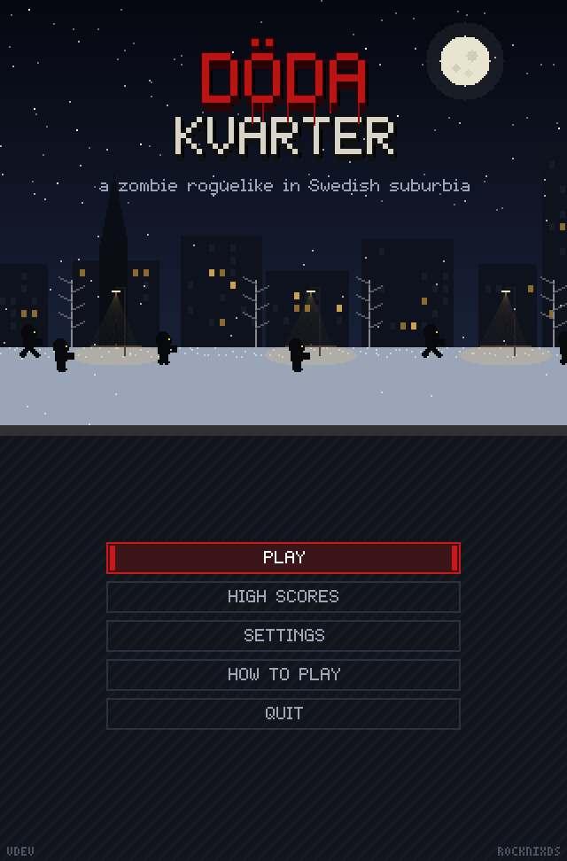
</p>
<p align="center">
  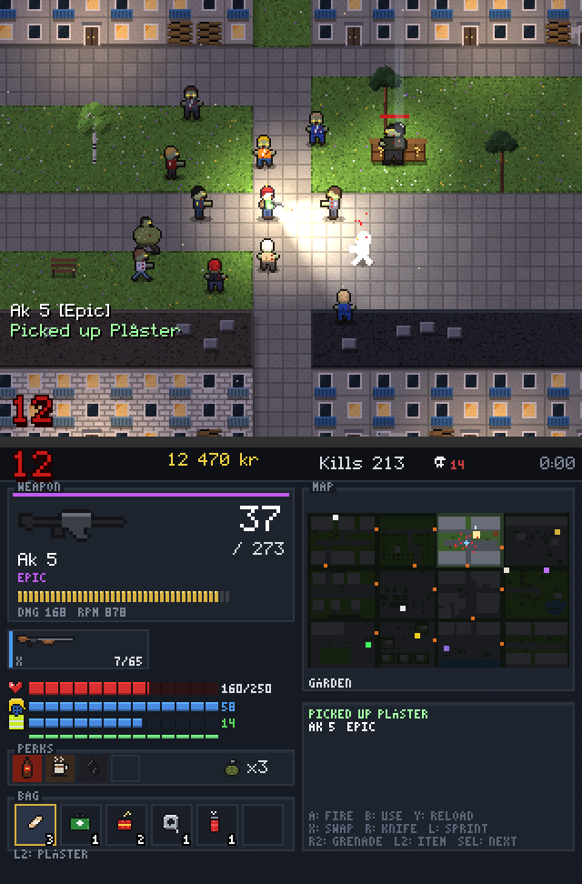
  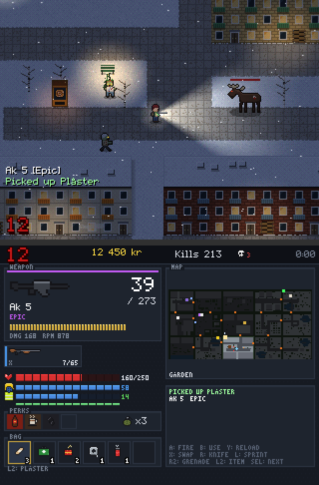
  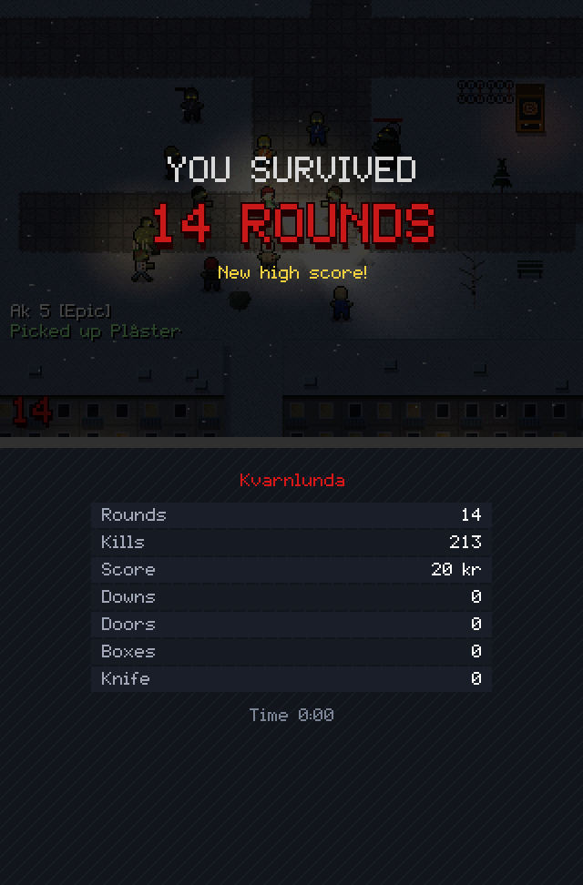
</p>
<p align="center">
  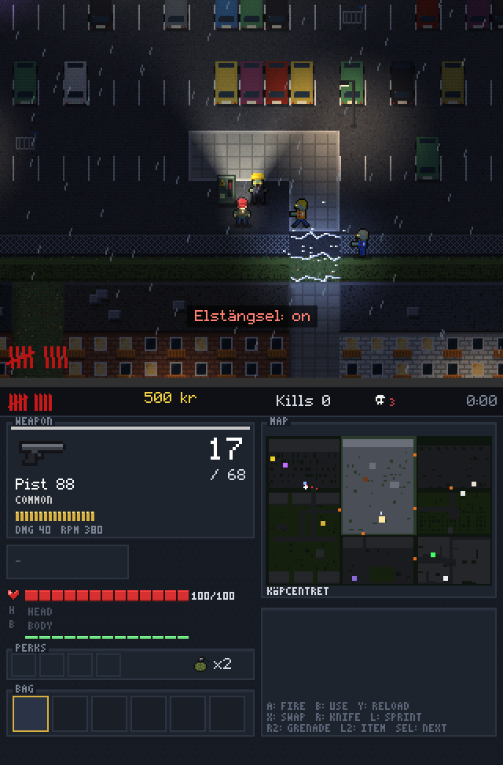
  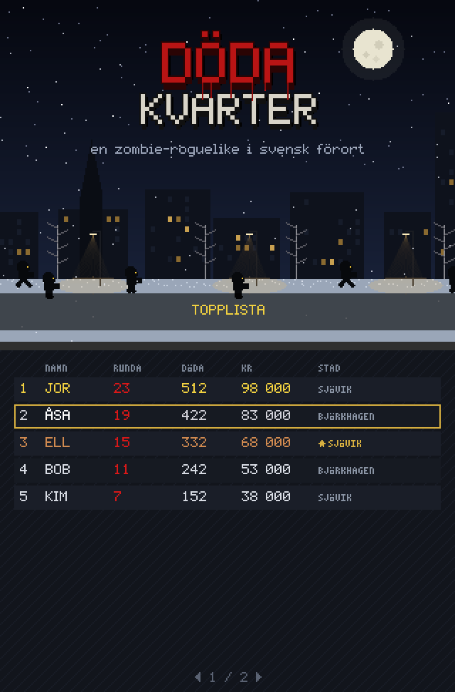
</p>
<p align="center">
  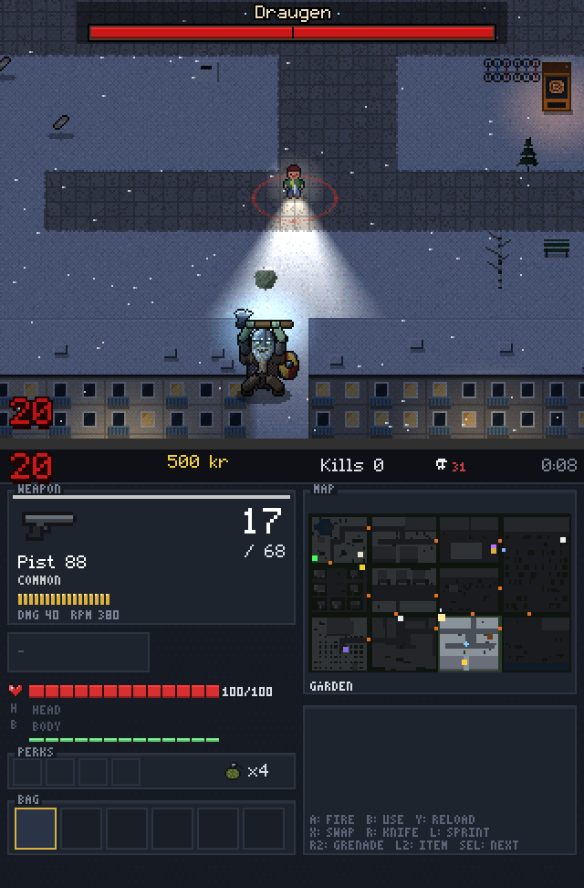
  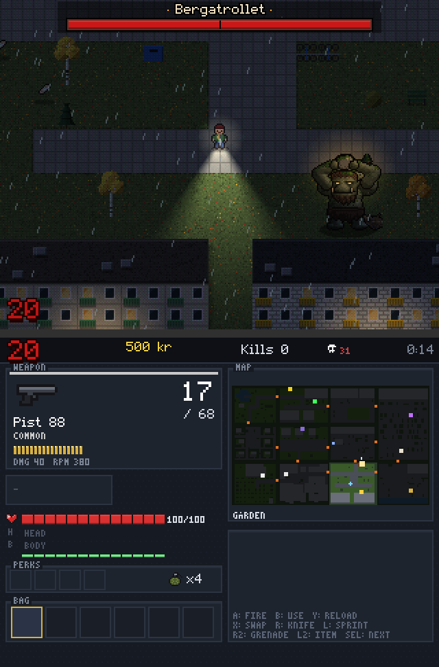
  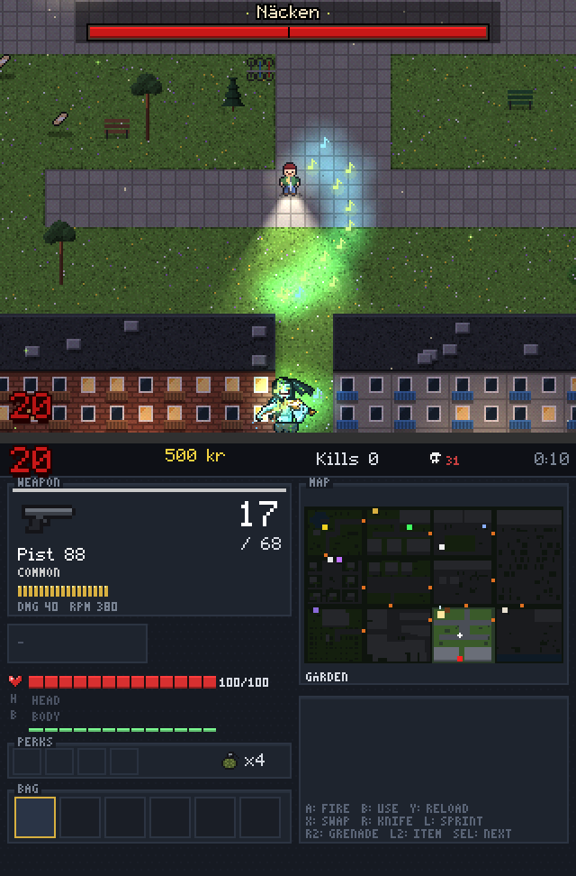
  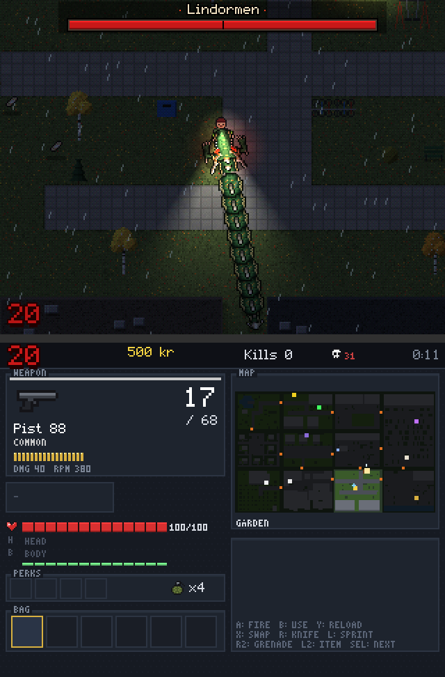
</p>
<p align="center">
  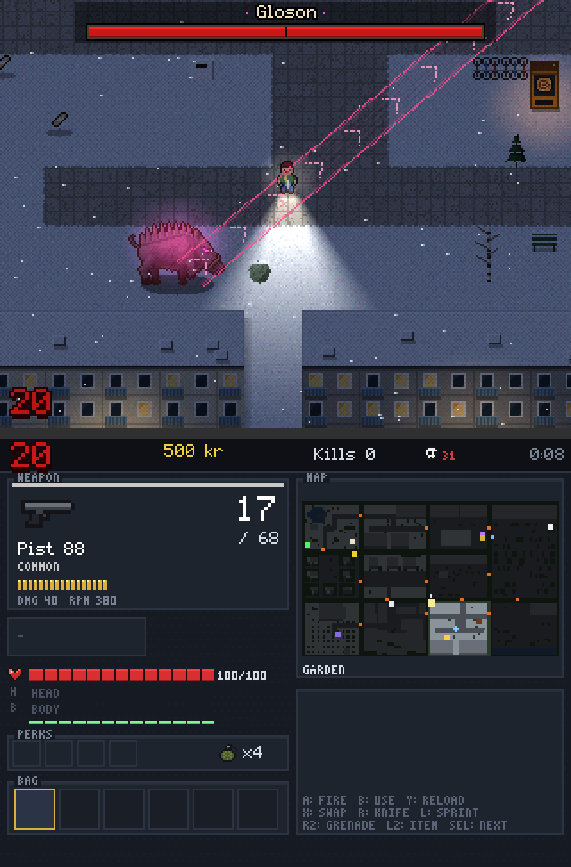
  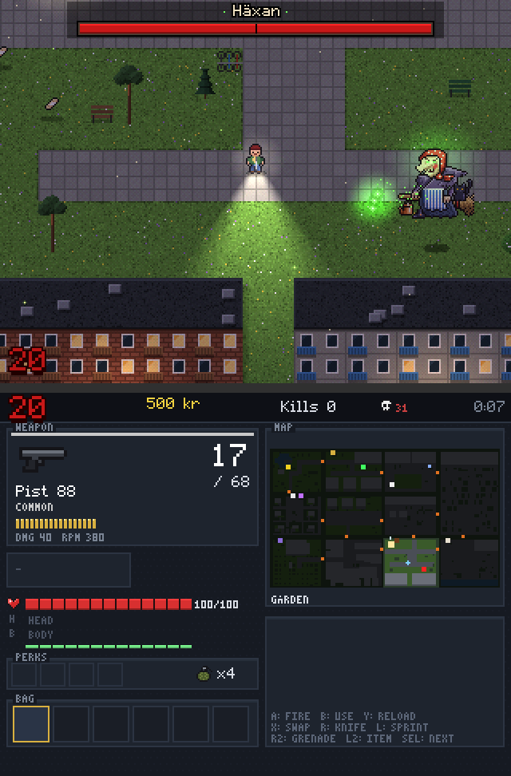
  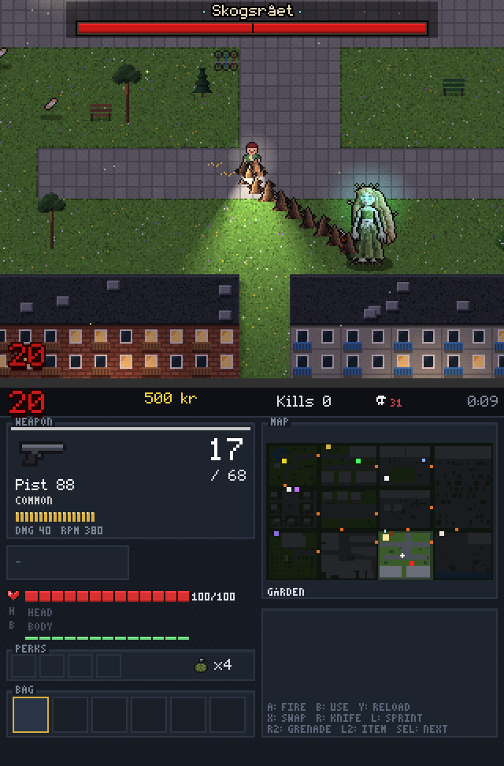
  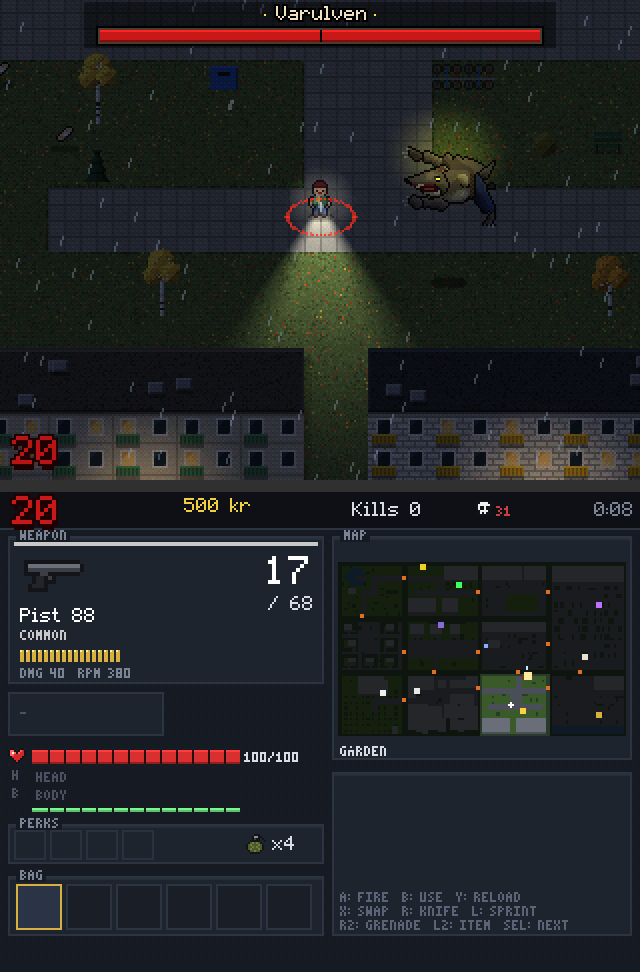
</p>

It runs natively: a C program that draws every pixel itself and puts both screens straight onto the panels through
DRM/KMS (no compositor, no GL), the way ROCKNIXDS runs DS games, at 60 frames a second. Pixel art at the panels'
full resolution: 320x240 drawn at exactly 2x on the RG DS's 640x480 panels, 341x256 at 3x on the RG DS Plus'
1024x768 ones.

## Playing

On ROCKNIXDS it has **a tile of its own on the menu's home page** (ROCKNIXDS Pixel, from 1.6: the zombie's head; A on
the tile starts it), and is in **Ports > Döda Kvarter** on anything older (the installer puts it there; `--no-game`
leaves it out). Starting it
switches the panels over to the game like a DS game does, and quitting brings the menu back. ROCKNIX's exit hotkey
works too.

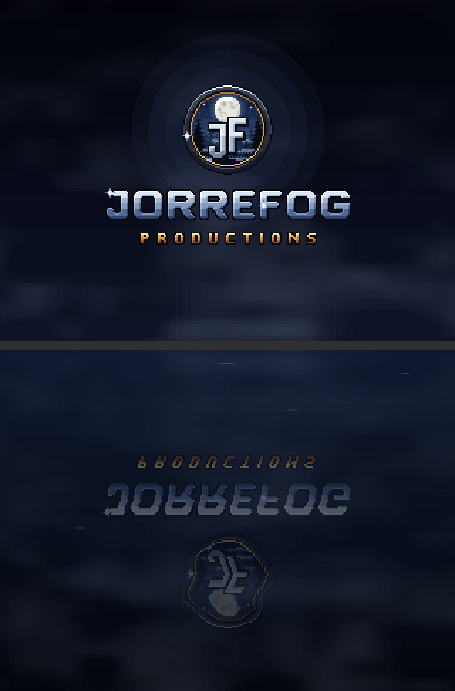

It opens with the studio's splash, **JorreFog productions**: fog drifts in over the night, the emblem comes up out of
it on a deep note, the name falls into place a letter at a time and a light runs over it, and on the bottom screen
all of it lies again in dark water. Any button (or a touch) skips it; then the title.

| | Classic (the default) | Twin buttons |
|---|---|---|
| Move | D-pad (or the left stick) | D-pad |
| Fire | **A**. Holding it keeps you facing the way you fired: walk backwards and shoot | **X Y A B** fire up, left, right, down; two of them for the diagonals |
| Aim | where you walk, with aim assist; the right stick if there is one | the face buttons |
| Lock on | hold **R2**: the aim stays locked on the nearest zombie in sight until you let go. Let go and hold it again at once for the next nearest. When the one you locked on falls, the aim moves to the nearest by itself | - |
| Use, buy, take | **B** (hold it to repair a window or search a bin) | **R** |
| Reload | **Y** | **SELECT** (it reloads by itself when the magazine is empty) |
| Switch weapon | **X** | **R2** |
| Knife | **R** | by itself, when you fire at a zombie right next to you |
| Sprint | hold **L** (or click the left stick) | hold **L** (or click the left stick) |
| Grenade | **L2** | **L2** |
| Bag | **SELECT** picks the next item, held it uses it; or tap it | tap it on the bottom screen |
| Pause (save and quit, or give up) | **START** | **START** |

Those are the defaults. **Settings > Buttons** has the layout, and a row for each action with its button: select a
row, press the new button, and the action that had it takes the old one (so one button never does two things). The
help lines on the bottom screen and the prompts follow. *Menus* there picks whether A or B confirms in the menus.
The touchscreens work: tap a bag item to pick it (tap again to use it), tap a weapon to switch to it, and touch the
top screen to fire where you touch (*Touch aiming* in the settings).
On a computer: arrows or WASD, J or Z to fire, K or X to use, U reload, I switch, E knife, Q sprint, 1 grenade,
3 lock on, Tab next item (held: use it), Enter pause; the mouse aims (left button fires) and clicks the bottom screen.

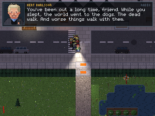

**Kert Barlsson on the radio** (0.3). You wake up in a world the forces of evil have taken: the dead walk, and Mörkret
has woken the old ones from the stories, eight Väktare that hold the land. A voice comes over the radio: Kert Barlsson,
an old businessman broadcasting from a warehouse, who talks you through taking it back, district by district,
Väktare by Väktare. His box comes up on the top screen now and then: the story as you go (the run starting, the first
door, the power, round milestones, a boss coming and each one falling, eight in all), a word when you're bleeding or
out of ammo, and between rounds a tip, a new one each time across your runs. His introduction plays once; after that
he just says hello. *Settings > Radio (Kert)* turns him off. The lines are in `src/radio.c` (English and Swedish);
his portrait is `art/kert.txt`.

**Music** (0.3): songs for the title, under the play, for the bosses and for game over (`music/`, built into the
game; *Settings > Music* turns them off). The Mystery Box's tune, the perk jingles and the gnomes' song are still
synthesized, like every sound.

**Settings > Difficulty**: *Easy*, *Medium* (the default) or *Hard*, taken by a run when it starts. Hard is the game
as 0.1 had it (Black Ops' own numbers); Medium takes 30% off what the dead (and the bosses) do to you, 20% off their
health and 15% off how many come in a round, and they turn into runners and sprinters more slowly; Easy takes 55%,
40% and 30%, and slower still. The high score list shows each run's difficulty after its round (E, M, H).

**Settings > Game updates**: the game updates itself, without a ROCKNIXDS update. On the title it looks once for a
newer version (with Wi-Fi on; the title says when there is one); the row updates it (from the title, not in the
middle of a run): it downloads it, checks it, puts it in place and starts it. High scores and settings stay; a run
saved in the old version doesn't carry over (the row asks first). Over ssh: `/storage/.config/rocknixds/dodakvarter/update.sh
check` or `install`. The ROCKNIXDS Store (on the menu's home page, [../store](../store)) updates it as well, and
installs it on a handheld that left it out (`--no-game`). New versions are pre-releases tagged `dodakvarter-v<version>` on GitHub
(`.github/workflows/dodakvarter-release.yml`, from the `VERSION` file and `bin/dodakvarter-aarch64`; `tools/package.sh`
makes the package); ROCKNIXDS's own installer never puts back an older game than the one there.

*Today's town* on the title is the same town (and season) for everyone on the same day; its runs get a star in the
high score list. The list's second page (left or right) adds up everything you've played: runs, zombies, rounds,
the best round, the time, the kronor, boxes, critical hits, downs.

Quitting never loses a run: *Save and quit* in the pause menu, ROCKNIX's exit hotkey, or a shutdown while it runs
keep it in `run.sav`, and the title offers *Continue* (back where you were, paused). The run is also
kept after every round, so even a flat battery costs one round at most. A run that ends (or *Give up*) is gone, and
counted the moment it ends: quitting right after dying keeps its score (with the initials chosen so far). *New run*
and *Today's town* ask for a second press while a run is saved: that gives the saved run up as *Give up* does (its
game over, a high score if it earned one), and then the new run starts.

## How it works

Everything in this section follows Black Ops' own rules where it has them; the numbers come from the game's
decompiled scripts and are in [docs/research.md](docs/research.md).

**Rounds.** Round 1 has 6 zombies, round 5 has 24, round 10 33, round 20 60, round 30 105 (Black Ops' solo
formula), at most 24 alive at a time, coming faster every round (2 s apart in round 1, 1.26 s in round 10).
Their health is 150 in round 1, 100 more every round up to 950 in round 9, then 10% more each round (1045, 2701 at
round 20, 7000 at round 30). Each one rolls its speed: walkers first, runners from round 2, sprinters from round 6,
only sprinters from round 10; from round 4 the last zombie of a round always runs. A grenade or a rocket that
doesn't kill a walker may take its legs: it crawls on, slow and low (and, as in Call of Duty, a crawler left alive
is a breather: it never runs). Ten seconds between rounds, the
round in red chalk marks in the corner, and when you fall: *YOU SURVIVED 7 ROUNDS*.

**Kronor.** You start with 500 kr. Every hit that doesn't kill is +10, a kill +60, a critical hit +100 (the
top-down headshot), the knife +130. Every board you nail back on a window is +10 (up to 50 kr per round, 500 at
most). You spend them on:

- **Barricades** between districts (750–2000 kr, more the further from the start): police barriers, a construction
  fence, a wrecked car. Districts are walled off from each other; buying your way through opens the town.
- **Wall buys**, chalk outlines of guns on the walls: Pist 88 500, Revolver 900, Kpist m/45 1000, Ak 5 1200,
  Hagelgevär 1500, Ak 4 1800 kr; ammo for half the price (4500 once upgraded). A gun that has run dry hands
  over to one that hasn't when you pull the trigger. Also the Yxa (axe: a one-hit knife
  for a long time) for 3000 and grenades for 250.
- **Lådan**, the Mystery Box (950 kr): a random weapon you don't have, often a good one, from all twelve, including
  the wonder weapons (Strålpistol, Åskvigg, Snöblåsare). After four pulls a **Dalahäst** may come out instead of a gun:
  your money back, and the box flies to another spot (its beam of light shows where). The odds are Black Ops' bear's.
- **Perks**, at vending machines once the power is on, four at most, lost when you go down. Stand by one and
  now and then it plays its jingle (a little tune of its own each, made up for the game) and a note rises from it:

  | Perk | kr | Does (Black Ops' perk) |
  |---|---|---|
  | Julmust | 2500 | 250 health instead of 100: five hits instead of two (Juggernog) |
  | Snabbkaffe | 3000 | reloads in half the time, repairs faster (Speed Cola) |
  | Salmiak | 2000 | fires a third faster and hits harder (Double Tap 2.0) |
  | Kanelbulle | 500 | gets you back up when you fall; works without power, three times a run (solo Quick Revive) |
  | Blåbärssoppa | 2000 | faster, and twice the sprint (Stamin-Up) |
  | Lingondricka | 2000 | reloading sends out an electric shock, stronger the emptier the magazine (Electric Cherry) |
  | Kaviar | 4000 | carry a third weapon (Mule Kick) |

- **Smedjan**, the Pack-a-Punch (5000 kr, needs the power): twice the damage, half again the magazine and the
  reserve, a little faster and through one more zombie, and a new name (Ak 5 becomes Ragnarök, the Strålpistol
  Norrskenet).
- **Elstängsel** (1000 kr, needs the power and its gap cleared), the trap: a cabinet by one or two of the gaps
  between districts. It shocks everything that crosses the gap for 25 s (you too, if you stand in it); those kills
  count but pay nothing, as in Call of Duty. Then it charges for a minute.
- **A song**: as on every Call of Duty map, one is hidden in every town. Three garden gnomes might know more.
- **The power**: find the switchgear (Elcentral), usually far from the start. Then the perk machines and Smedjan
  work, and the lights come on across the town in a ring spreading from the switch: street lamps, shop windows,
  the windows of the houses.

**Power-ups** drop from the dead (3% a kill, plus one each time your total earnings pass a mark that moves further
away every time; four a round at most): Fullt förråd (Max Ammo), Instadöd (Insta-Kill), Dubbla kronor (Double
Points), Kaboom (every zombie, +400 kr), Snickare (Carpenter: every window boarded up, +200 kr), Rea (Fire Sale:
the box costs 10 kr for 30 s). They last 30 s, and lie on the ground for 15 s before they start to blink.

**The others.** *Vargnatt*: the first wolf night comes in round 5, 6 or 7, then every four or five rounds: a darker
round of fast wolves, the last one bringing a Max Ammo (the hellhound rounds). *Älgen*: from round 9 to 11, and every
four or five rounds after, a zombie moose with 5000 health and more each time, which lowers its antlers and charges
(Black Ops' Panzer Soldat). The doorman from the centrum takes three times the bullets; the bloated one bursts into a
cloud you shouldn't stand in.

**The bosses.** Every twentieth round one of the old stories comes up out of the ground of the suburb, its name and a
health bar across the top of the screen, its own music, and a marker on the map (an arrow at the screen's edge when
it's out of sight). There are eight, and they come in an order drawn for the town (the same town, the same order: a
daily town's is everyone's). They are far bigger than the dead and drawn in more detail, and each has its own moves:

| Boss | Moves |
|---|---|
| **Draugen**, the dead Viking chieftain | cleaves with his Dane axe; leaps onto you (a shockwave where he lands); blows his war horn and the dead rise around him |
| **Bergatrollet**, the mountain troll | smashes with its tree-trunk club; pounds the ground three times (three rings of shock); throws boulders (where they'll land is marked) |
| **Näcken**, the fiddler in the water | plays: fans of glowing notes sweeping across you; beckons: you are drawn to him; sinks into his pool and comes up again beside you |
| **Lindormen**, the lindworm | bites; spits venom that pools on the ground; burrows under the asphalt and bursts up beneath you (a mound runs at you first) |
| **Gloson**, the ghost sow | gores with her tusks; charges down a lane she marks first (into a wall, and she's dazed); her razor bristles fly out in a ring |
| **Häxan**, the Easter witch on her way to Blåkulla | flies over the houses on her broomstick; curses that turn after you; a flask of brew that burns where it breaks; swoops down past you |
| **Skogsrået**, the lady of the forest | roots tear along the ground at you; thorns come up where you stand and hold you fast; she becomes a tree and is somewhere else, with likenesses of herself |
| **Varulven**, the werewolf | pounces, and again, and again; rakes with its claws; howls, and wolves come out of the dark |

It comes up where you'll see it (the witch comes down out of the sky), greets you (a roar, a shockwave you only see;
Näcken plays, the witch cackles), and comes for you. Felled, its fall is slowed down a moment, and each goes its own
way: Draugen to frost and dust, the troll to stone that crumbles, Näcken down into his pool, the lindworm thrashing in
its venom, the ghost sow to light, the witch off her broom, Skogsrået to wood and leaves, the werewolf with a last howl.

After the eighth, the same again (from round 180), stronger each time. At half health a boss is enraged (a red wave goes out from it): faster, and quicker to strike.
Insta-Kill doesn't kill them, Kaboom only takes a tenth, firecrackers don't fool them, the elstängsel only burns them,
and the wonder weapons, blasts and fire do a third to a half of their damage (as in Call of Duty).
A boss round has half the usual zombies, and ends when the boss is down; it leaves a legendary weapon, a Max Ammo and
2000 kr for every twenty rounds. The list's statistics count the bosses slain.

**Loot** (the roguelike part). Search bins, cars, mailboxes, recycling bins, containers and sheds (hold B); the dead
drop things too; every new round fills searched places again and leaves things on the ground. Everything has a rarity,
grey, green, blue, purple, gold, and the odds climb with the round: a gold Ak 4 hits almost twice as hard as a grey
one, with a bigger magazine and a faster reload. Armour takes hits for you: a helmet (mössa, cykelhjälm,
hockeyhjälm, kravallhjälm) takes 30% of each hit and a vest or jacket (reflexväst, täckjacka, skinnjacka,
skyddsväst, kravallrustning) 60%, until it breaks. The bag holds six kinds of things: plåster, förbandslåda,
granater, smällare (firecrackers: every zombie comes to listen, then they go off, as the Monkey Bomb), brandbomb
(a fire on the ground), silvertejp (mends armour) and a termos of coffee (fast for 20 s).

Health comes back by itself 2.4 s after the last hit (5 s when you're below a fifth). A zombie's hit is 60.

## The town

A new town every run, with its own name (Björkhagen, Sjövik, Tallsta...), in one of three seasons (autumn rain,
winter snow, or the bright midsummer night), made of districts: usually twelve, four by three, sometimes nine big
ones, fifteen narrow ones or sixteen in four rows; a district bigger than usual gets more of its own things.
Some of the dead dress for the season: in winter the nurse walks as Lucia with her crown of candles lit (they
light the snow around her), at midsummer some wear flower wreaths and fireflies blink over the grass, in the
autumn rain yellow sydvästar, and now and then lightning lights the whole town for an instant before the thunder. The districts:

| District | What's in it |
|---|---|
| Gården | miljonprogram lamellhus around a yard: coloured balconies, the stairwell doors, a playground, the tvättstuga, recycling, bike racks, birches |
| Torget | the centrum: a row of shops (Livs, Pizzeria, Apotek, Frisör, Konditori, Bibliotek, Vårdcentral...), the tunnelbana entrance with its blue T, a kiosk, Plattan's black and white triangles in the middle, torghandel stalls of fruit under striped awnings, a fountain, a bus stop by the road |
| Villorna | Falu red (and some yellow) houses with white trim, hedges and picket fences, flagpoles with the flag or the long pennant, trampolines, apple trees, the row of mailboxes, a moose sign |
| Gamla stan | narrow cobbled gränder between ochre, rust and yellow plastered houses, a little square with its well |
| Kolonilotterna | allotments: fenced plots, a cottage on each, beds, compost, rain barrels; on the common ground the flag, the notice board, wheelbarrows |
| Parken | a lake with a jetty, lily pads, reeds, a livboj and a red sauna, glacier-smoothed bedrock, birch, pine and spruce; a midsommarstång in summer, a frozen lake in winter |
| Skolan | a brick school, the schoolyard with a hopscotch, an artificial-turf pitch |
| Kyrkan | a white church with a green copper spire, a red bell tower, the graveyard (they come up through the graves) |
| Hamnen | warehouses, shipping containers, fish crates, the quay with its bollards, lifebuoys and boats |
| Stationen | the pendeltåg station on the tracks, the bus terminal |
| Köpcentret | a big-box store and its car park, recycling stations |

Every district is walled off (hedges, fences, stone walls, forest) and joined to its neighbours through gaps with a
barricade in them; there are always loops to lead a horde around. The dead come through boarded windows and
stairwell doors (they pull the boards off; you nail them back for money, but stand right at the gap and they swipe
at you through it; shoot or knife them through the boards), up through manholes, graves and the ground. Each town
has five spots for the box, seven perk machines, Smedjan, the power switch and the wall buys, all placed where you
can reach them, and with the barricades shut no district can be walked out of (tests/test_map.c checks 500 towns
on every run).

## Inside

C, about 11,000 lines (and 1,000 of tests), no libraries but libc, libm and libdrm (SDL2 and libasound are loaded only
if there), and minimp3 (`src/third_party/minimp3.h`, public domain, CC0) for the songs.

| | |
|---|---|
| `src/plat_kms.c` | both panels through atomic KMS commits: a pair of dumb buffers per panel, each frame scaled up by whole pixels into the free one and flipped on the next vblank, both panels in one commit; a screen that didn't change isn't sent. Takes the display the way SuperDrastic does (DRM master, a modeset, the display controller's underrun check) |
| `src/input_evdev.c` | the gamepad (d-pad as buttons or a hat, sticks if any), both touchscreens (the bottom one is on `fe5e0000.i2c`), a USB keyboard; nothing grabbed, so ROCKNIX's hotkeys still work |
| `src/radio.c` | Kert Barlsson on the radio: the story and the tips (English and Swedish), when he says what, his box on the top screen |
| `src/audio_alsa.c`, `src/audio.c`, `src/music.c` | a mixer on its own thread into ALSA's default device (PipeWire); every sound synthesised at start, the songs (`src/music.c`, `music/`: MP3s built in, decoded as they play, cross-faded), and as before the synthesized title music *Vem kan segla förutan vind?* (traditional) as a music box, a music box figure for the Mystery Box and a chorale for the game over (both original), and the night under the play, made as it plays: autumn rain, winter wind, crickets and birds at midsummer |
| `src/plat_sdl.c`, `src/plat_headless.c` | a window for a computer; no display at all for the tests |
| `src/render.c` | the top screen: the painted town, everything standing sorted by its feet, and the night: per-season ambient light, street lamps and windows once the power is on (spreading from the switch), the torch on your gun (stopped by walls), muzzle flashes; zombie eyes, Lucia's candles, the trap's arcs and fireflies glow after the light |
| `src/mapgen.c`, `src/world.c`, `src/props.c` | the town: districts, buildings with their facades, everything standing in it, painted once into one big bitmap |
| `src/game.c`, `weapons.c`, `zombies.c`, `loot.c`, `inter.c` | the player, guns and what they hit, rounds and the dead (they find you along a flow field), loot and power-ups, buying things |
| `src/hud.c`, `src/menu.c` | the bottom screen, the title, pause, settings, how to play, game over, the high scores and the statistics |
| `src/save.c` | settings, scores and statistics as text; the run in progress (`run.sav`): the game's state behind a header tied to the build and a checksum, written atomically, between rounds by a helper thread |
| `src/selftest.c` | `--selftest`: which panel is which, touches, buttons, sticks and a beep, for checking a handheld |
| `tests/` | `test_map.c` (towns: reachable, sealed, repaints), `test_rules.c` (the trap, windows, crawlers, a dry gun, the tomtar), `test_save.c` (a run saved and loaded goes on byte for byte the same), `sounds.c` (every sound to WAV), `scene.c` and `mapview.c` (pictures); `run.sh` runs them all and the bot |
| `art/*.txt`, `art/build_art.py` | every sprite, drawn as text (one character a pixel); the script writes `src/art_data.c` |

A frame takes about 1 ms on a desktop core (the night's lighting, the heaviest part, runs eight pixels at a time
with NEON on the handheld); `DK_PROFILE=1` writes the time per frame to the log every 10 s, to see it on the
handheld, and `DK_PROFILE=2` every frame over 2 ms. *Effects* in the settings is *Auto* at first: should frames ever
take over 11 ms on the handheld, it changes to *Light* for the rest of the run (the night's light worked out at half
the resolution, under the same dithering, and half the particles; about a quarter less work a frame, and hard to tell
apart). *Full* and *Light* fix it either way. Settings, the high score list (`scores.txt`) and the log (`dodakvarter.log`) are in
`/storage/.config/rocknixds/dodakvarter/data` on the device (`DK_DATA` elsewhere).

**On the RG DS.** `device/` has the menu entry (`Doda Kvarter.sh`), `launch.sh` (starts the session in a systemd
unit, like ROCKNIXDS's DS launcher, or waits for it in fast-switch mode), `session.sh` (stops ES and sway or switches
the VT, puts the GPU at its lowest clock and the CPU on schedutil, aims ROCKNIX's exit hotkey at the game, runs it,
then hands everything back through ROCKNIXDS's `restore.sh`), `selftest.sh` and `gamelist.py` (its entry and
pictures in the menu's list: `/storage/.config/rocknixds/apps/dodakvarter` where ROCKNIXDS lists the game as a
system of its own, `es_systems_rocknixds.cfg`, else `/storage/roms/ports`). By hand, over ssh: `systemctl stop essway sway; /storage/.config/rocknixds/dodakvarter/dodakvarter; systemctl start sway essway`.

**Checking a handheld.** Over ssh, `/storage/.config/rocknixds/dodakvarter/selftest.sh` takes the screens as the game
would and shows on each panel which one it is (TOP, BOTTOM) with its size, a grid and colour bars; touches draw a
cross where they land, the buttons light up as you press them and a beep plays every second. START and SELECT end
it, ES comes back, and it prints what it found: the panels, the pad, both touchscreens, the sound.

## Building

```sh
sh build.sh                      # this computer: build/dodakvarter (a window, or --backend headless)
sh build.sh aarch64 <sysroot>    # the RG DS: build/dodakvarter-aarch64 (the sysroot recipe is in build.sh)
sh tests/run.sh                  # the tests: 500 towns, the rules, the bot playing whole runs and a monkey pressing
                                 # everything, under the sanitizers; saving; the sounds
python3 art/build_art.py         # after changing art/*.txt (--preview sheet.png to look at it)
python3 tools/screenshots.py     # the README's pictures and the Ports entry's, rendered by the game
./build/sounds build/sounds      # every sound, the music and the ambience as WAV files (tests/run.sh builds it)
```

`bin/dodakvarter-aarch64` is the build the installer puts on the device. `./build/dodakvarter --bot` lets the
computer play (`--monkey N` lets it press buttons at random), `--seed N` replays a run (the town and its season), `--start` skips the title. For testing deep
rounds: `DK_DEBUG_ROUND=N`, `DK_DEBUG_KR=N`, `DK_DEBUG_POWER=1`, `DK_DEBUG_OPEN=1` (every barricade gone),
`DK_DEBUG_GOD=1` (nothing hurts) and `DK_DEBUG_ZLOG=1` (where every zombie is, every 10 s, in the log).

## Credits

Inspired by Call of Duty: Zombies (Treyarch, Activision); this is a fan's homage and isn't affiliated with or endorsed
by them. Names of guns are the Swedish Armed Forces' designations; shop signs are generic. The research behind the
rules and the town is in [docs/research.md](docs/research.md). *Vem kan segla förutan vind?* is a traditional Swedish
folk song. A JorreFog production, made for [ROCKNIXDS](../README.md) on [ROCKNIX](https://rocknix.org); MIT licensed like the rest of it.
