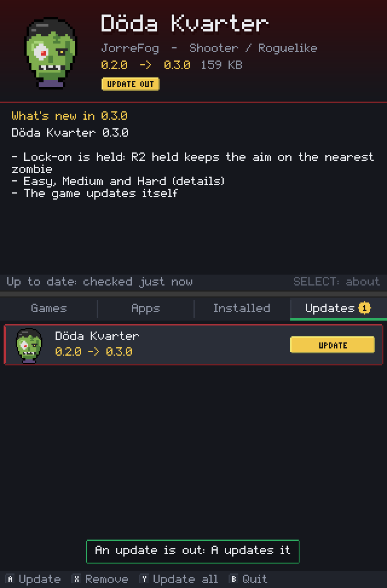
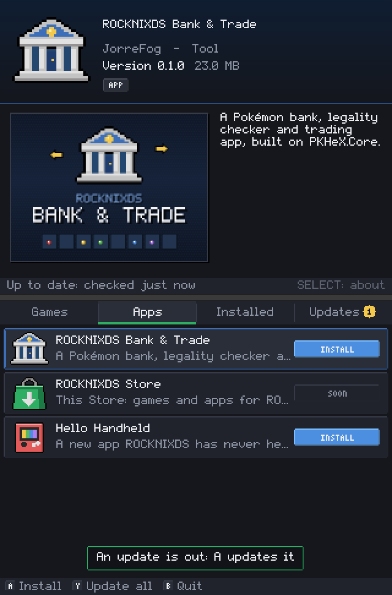

# ROCKNIXDS Store

**Games and apps for ROCKNIXDS, installed and updated from the menu.** Döda Kvarter, ROCKNIXDS Bank & Trade and every
app that comes later are one press away: no ssh, no commands, and no waiting for a ROCKNIXDS release to get a new app or
an update to one. Every app gets a tile of its own on the menu's shelf.

<p align="center">
   0.3.0, UPDATE OUT, and What's new in 0.3.0 from its release notes. Bottom screen: the Updates tab with Döda Kvarter and a yellow UPDATE button, and a note: An update is out: A updates it">
  
</p>
<p align="center"><sub>The Updates tab with what's new in the update, and the Apps tab ("Hello Handheld" is the tests'
example of an app ROCKNIXDS has never heard of). Rendered by the Store's headless test run.</sub></p>

## Using it

The Store is the green shopping bag on the menu's home page (ROCKNIXDS 1.6 on; **Ports > ROCKNIXDS Store** before
that). It takes over both screens, as Döda Kvarter does, and gives them back to the menu when you leave. Wi-Fi on: it
checks for new apps and updates when it opens.

| | |
|---|---|
| **Left / right**, **L / R** | Games, Apps, Installed, Updates (a yellow number: how many are out) |
| **Up / down** | the app; its details on the top screen (for an update: what's new in it) |
| **A** | install it, or update it |
| **X** | remove it (it asks first; what it keeps, like saves and settings, stays on the card) |
| **Y** | update everything that has an update (the Store's own last) |
| **SELECT** | the whole description on the top screen |
| **START** | check again |
| **B** | back to the menu |

The touchscreen works too: tap a tab, an app, then its button. A new app's tile is on the home page once you leave the
Store (the menu reads its list of systems when it starts).

### Updates

- **The Updates tab** lists every installed app with a newer version out, with what's new in it (its release notes) on
  the top screen. The Store opens on it when updates are waiting. A updates the one under the cursor, Y all of them.
- **An update keeps what the app keeps**: Döda Kvarter's high scores and settings, the bank's boxes (they're in
  `/storage/roms/rocknixds-bank`). A download that doesn't match its checksum changes nothing.
- **The Store looks by itself** a few minutes after the handheld starts and every 6 hours after
  (`rocknixds-store-check.timer`), and the menu says so once per new update: *An update in the Store: Döda Kvarter
  0.3.0*. It follows the menu's *Updates & downloads > ROCKNIXDS > Check for updates automatically* switch, as
  ROCKNIXDS's own update check does.
- **The Store updates itself** the same way: it restarts into the new version.

Over ssh, the same as root:

```sh
S=/storage/.config/rocknixds/store/rocknixds-store
$S refresh            # the catalog, the newest versions, the pictures
$S status             # what's installed, what can be updated
$S install bank       # install or update one (--version X for a given one)
$S update             # update everything (or: update bank)
$S notify             # check, and tell the menu about updates out (what the timer runs)
$S remove bank
$S relink             # put the tiles of apps installed from the Store back (install.sh does this itself)
```

## How it works

```
store/catalog.json  ──fetched from main──▶  rocknixds-store  ──GitHub releases──▶  <id>-<version>-aarch64.tar.gz + .sha256
 (every app: what it is,                    (the package manager,                    (checked against the .sha256
  where its releases are,                    python3, on the handheld)                before anything changes)
  how its package looks)                          │
                                                  ├─▶ /storage/.config/rocknixds/<id>/            the app (VERSION: its version)
                                                  ├─▶ /storage/.config/rocknixds/apps/<id>/       its tile: entry script, gamelist.xml, pictures
                                                  ├─▶ es_systems_rocknixds-store.cfg              its ES system, if ROCKNIXDS doesn't list it
                                                  └─▶ ROCKNIXDS Pixel's rnds/systems.cfg + icon   its icon, colour and [app], if the theme doesn't name it
```

- **`device/rocknixds-store`**: the package manager (Python 3, as ROCKNIX ships it; downloads with curl). Everything
  the app does is one of its commands; long jobs print `STEP <what>` lines and end with `DONE <version>` or
  `FAIL <why>`. An install unpacks next to the old copy, moves what the app keeps over, then swaps the folders, so a
  failure leaves the old version working. An app is *installed* when its folder holds its check file, whoever put it
  there: the copies ROCKNIXDS's `install.sh` and `install-bank.sh` install count, and the Store updates them in place.
- **`src/`**: the app, in C, drawing both screens on Döda Kvarter's platform layer (`../dodakvarter/src`: the panels
  through DRM/KMS, a window through SDL2, or headless PNGs for the tests). It runs the package manager in a thread and
  shows what it says. `--script` drives it without a person (the tests and the pictures above).
- **`device/launch.sh`, `session.sh`, `restore.sh`**: its session, Döda Kvarter's less the fast-switch path: ES is
  always stopped, so it starts again with the new tiles.
- **Tiles without a ROCKNIXDS release.** ROCKNIXDS's own `es_systems_rocknixds.cfg` and the theme's `systems.cfg` name
  Döda Kvarter, the bank and the Store. An app they don't name gets its system in `es_systems_rocknixds-store.cfg`
  and a line (its icon as `icons/store-<id>.png`, its accent colour, `[app]`) in a marked block at the end of the
  theme's `systems.cfg`, both written by `rocknixds-store relink`; `install.sh` runs it after it puts the theme back.
  ROCKNIXDS before 1.6 has no tiles: apps go to Ports.

## Publishing an app

An app is a folder, as it will be on the handheld, with an `app.json`:

```json
{
 "id": "myapp",
 "check": "myapp",
 "executable": ["myapp"],
 "keep": ["data"],
 "entry": "My App.sh",
 "icon": "icon.png",
 "media": { "image": "media/myapp-image.png", "thumbnail": "media/myapp-thumb.png", "marquee": "media/myapp-marquee.png" }
}
```

`template/myapp` is one that installs. Then:

1. **Package it**: `sh store/tools/package-app.sh path/to/myapp` writes `dist/myapp-<version>-aarch64.tar.gz` and its
   `.sha256` (the version is the folder's `VERSION`).
2. **Release it**: attach both to a GitHub release tagged `<prefix><version>` (say `myapp-v1.0.0`, in any repository;
   in this one, make it a pre-release, as `dodakvarter-v*`, `bank-v*` and `store-v*` are, so ROCKNIXDS's own updater
   never takes it for a ROCKNIXDS release). Or host the file anywhere and pin its URL and sha256 in the catalog.
3. **List it**: add an entry to `store/catalog.json` on `main`. Every handheld sees it at its next check.

```json
{
 "id": "myapp", "name": "My App", "tile": "My App", "kind": "app", "developer": "You",
 "genre": "Tool", "players": "1", "accent": "#b07ef0",
 "summary": "One line for the list.",
 "description": "A paragraph for the top screen and the menu.",
 "icon": "../myapp/icon.png",
 "screenshots": ["../myapp/media/myapp-image.png"],
 "devices": ["rgds", "rgds-plus"],
 "requires": { "rocknixds": "1.6" },
 "release": { "github": "You/myapp", "tag_prefix": "myapp-v", "asset": "myapp-{version}-aarch64.tar.gz" }
}
```

The fields:

| Catalog | |
|---|---|
| `id` | lower case letters, digits and `-`, 32 at most: the app's folder name and, by default, its ES system |
| `name`, `tile` | the full name; the shorter one on its tile |
| `kind` | `game` (the Games tab) or `app` |
| `summary`, `description`, `developer`, `genre`, `players`, `releasedate` | shown in the Store, written to the menu's game list |
| `accent` | its colour (`#rrggbb`): the Store's header, its tile in ROCKNIXDS Pixel |
| `icon`, `screenshots` | 32x32 PNG; 4:3 PNGs (the first is shown). Relative to the catalog, or URLs. 8-bit, not interlaced |
| `devices` | `rgds`, `rgds-plus` (left out: both) |
| `requires.rocknixds` | the oldest ROCKNIXDS it runs on |
| `release` | `github` + `tag_prefix` + `asset` (the newest release by version, its `.sha256` beside it), or `url` + `version` + `sha256` |
| `hidden` | listed for updates only, not shown |

| Package (`app.json`, or `package` / `menu` in the catalog for a package without one) | Default |
|---|---|
| `root` | the package's one folder | the id |
| `dest` | where it's installed (under `/storage`) | `/storage/.config/rocknixds/<id>` |
| `check` | the file that says it's installed | `VERSION` |
| `keep` | files and folders an update or a remove leaves (saves, settings) | none |
| `executable` | files made executable (every `.sh` is) | none |
| `entry` | the script that starts it, in the package: copied to its tile | none (no tile) |
| `media` | `image`, `thumbnail`, `marquee` for the menu | none |
| `icon` | 32x32 PNG for its tile (else the catalog's) | none |
| `system`, `folder` | its ES system and the tile's folder | the id; `/storage/.config/rocknixds/apps/<id>` |
| `post_install`, `pre_remove` | scripts run after an install, before a remove | none |
| `ports` | without tiles (before 1.6), a line in Ports | true |
| `unit` | the systemd unit it runs in (as `dodakvarter-game`): no install or remove while it's up | none |

An app that draws on both panels can do what Döda Kvarter does (`../dodakvarter/device/launch.sh` and `session.sh`: a
systemd unit that stops the menu and takes the display through KMS), or open a window under sway as the bank does
(`../bank/device/rocknixds-bank.sh`).

## Building and testing

```sh
sh store/build.sh                                    # this computer: build/store (needs libdrm and SDL2 headers)
sh store/build.sh aarch64 <sysroot>                  # the handheld: build/store-aarch64 (as Döda Kvarter's build.sh)
sh store/tests/run.sh                                # the app, headless under ASan/UBSan, on a handheld in a folder
(cd tests && python3 -m unittest test_store -v)      # the package manager
python3 store/tests/sandbox.py /tmp/hh               # a handheld in a folder to try it on: prints the environment
sh store/tools/package.sh                            # the Store's own package (bin/store-aarch64): dist/
```

A Store release: bump `VERSION`, rebuild and commit `bin/store-aarch64`, tag `store-v<version>`
(`.github/workflows/store-release.yml` publishes it as a pre-release; every Store updates itself from it).
`install.sh` installs the committed copy with ROCKNIXDS, and never puts back an older Store than the one there.
